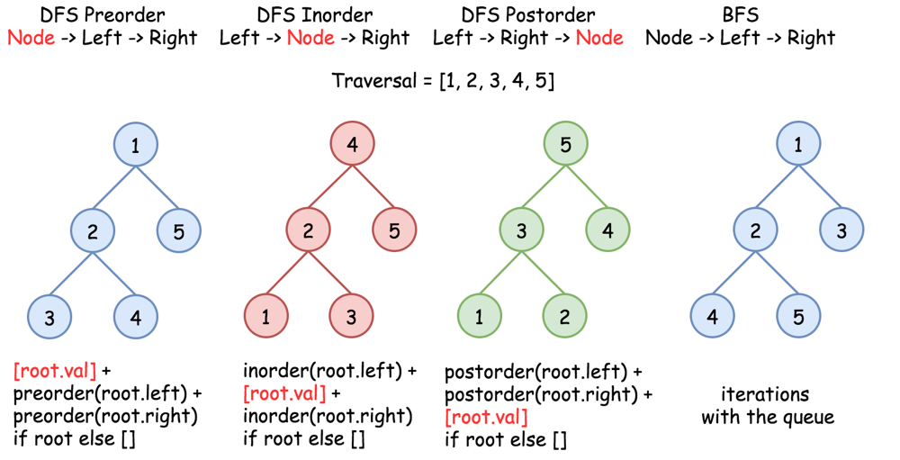

# Some helpful ides

## All DFS traversals (preorder, inorder, postorder) in Python in 1 line


```python
def preorder(root):
  return [root.val] + preorder(root.left) + preorder(root.right) if root else []
def inorder(root):
  return  inorder(root.left) + [root.val] + inorder(root.right) if root else []
def postorder(root):
  return  postorder(root.left) + postorder(root.right) + [root.val] if root else []
```

[Link to original post](https://leetcode.com/problems/binary-tree-inorder-traversal/discuss/283746/all-dfs-traversals-preorder-inorder-postorder-in-python-in-1-line)

## All DFS traversals (preorder, postorder, inorder) in Java in 5 lines



### Preorder: Node -> Left -> Right
```java
public void preorder(TreeNode root, List<Integer> nums) {
  if (root == null) return;
  nums.add(root.val);
  preorder(root.left, nums);
  preorder(root.right, nums);
}
```

### Inorder : Left -> Node -> Right
```java
public void inorder(TreeNode root, List<Integer> nums) {
  if (root == null) return;
  inorder(root.left, nums);
  nums.add(root.val);
  inorder(root.right, nums);
}
```
### Postorder : Left -> Right -> Node
```java
public void postorder(TreeNode root, List<Integer> nums) {
  if (root == null) return;
  postorder(root.left, nums);
  postorder(root.right, nums);
  nums.add(root.val);
}
```

[Link to original post](https://leetcode.com/problems/binary-tree-inorder-traversal/discuss/328601/all-dfs-traversals-preorder-postorder-inorder-in-java-in-5-lines)