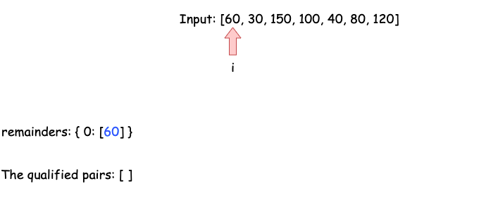
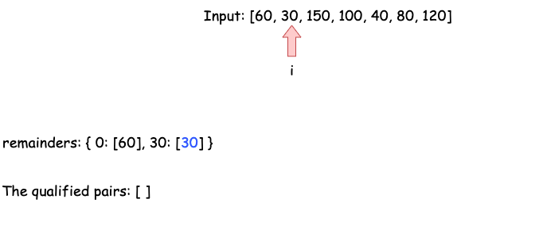
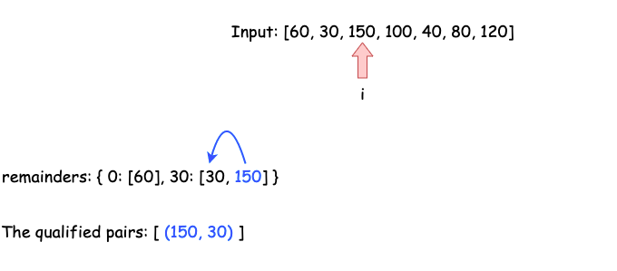
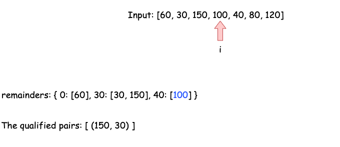
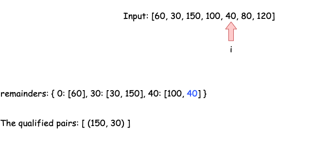
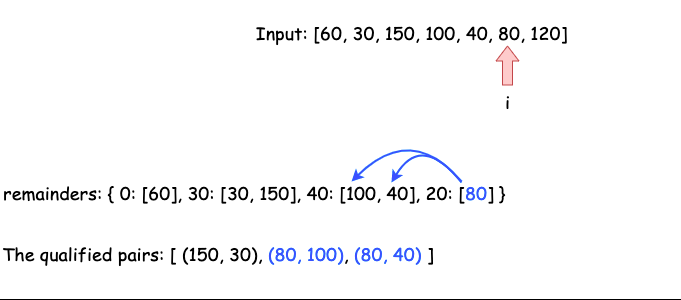
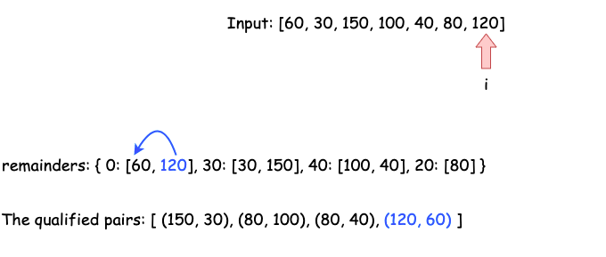

# LeetCode Medium 1010. Pairs of Songs With Total Durations Divisible by 60 Solution
## Approach 1: Brute Force
One of the most straightforward approaches would be iterating through the entire array using a nested loop to examine that, for each element `a` in `time`, whether there is another element `b` such that `(a + b) % 60 == 0`. Note that this approach might be too brutal to pass an interview.

### Java
```java
class Solution {
    public int numPairsDivisibleBy60(int[] time) {
        int count = 0, n = time.length;
        for (int i = 0; i < n; i++) {
            // j starts with i+1 so that i is always to the left of j
            // to avoid repetitive counting
            for (int j = i + 1; j < n; j++) {
                if ((time[i] + time[j]) % 60 == 0) {
                    count++;
                }
            }
        }
        return count;
    }
}
```

### Python3
```python
class Solution:
    def numPairsDivisibleBy60(self, time: List[int]) -> int:
        ret, n = 0, len(time)
        for i in range(n):
            # j starts with i+1 so that i is always to the left of j
            # to avoid repetitive counting
            for j in range(i + 1, n):
                ret += (time[i] + time[j]) % 60==0
        return ret
```

### Complexity Analysis

* Time complexity: ***O(n^2)***, when `n` is the length of the input array. For each item in `time`, we iterate through the rest of the array to find a qualified complement taking ***O(n)*** time.
* Space complexity: ***O(1)***.

## Approach 2: Hashmap
### Intuition

Let's dive deep into the condition `(time[i] + time[j]) % 60 == 0` to examine the relation between `time[i]` and `time[j]`. Assuming that `a` and `b` are two elements in the input array `time`, we have:

(a+b)%60=0 => ((a%60)+(b%60))%60=0
Therefore, either a%60 = 0, b%60 = 0, or (a%60)+(b%60)=60

You can learn more about the modulo operation [here](https://en.wikipedia.org/wiki/Modulo_operation#Properties_(identities)).

Hence, all we need would be finding the pairs of elements in `time` so they meet these conditions.

### Algorithm

We would iterate through the input array `time` and for each element `a`, we want to know the number of elements `b` such that:

1. `b % 60 = 0`, if `a % 60 = 0`
2. `b % 60 = 60 - a % 60`, if `a % 60 != 0`

We can use Approach 1 to implement this logic by repeatedly examining the rest of `time` again and again for each element `a`. However, we are able to improve the time complexity by consuming more space - we can store the frequencies of the remainder `a % 60`, so that we can find the number of the complements in ***O(1)*** time.

### 1


### 2


### 3


### 4


### 5


### 6


### 7


We would initiate an array `remainders` with size 6060 to record the frequencies of each remainder - as the range of remainders is `[0,59]`. Then we can loop through the array once and for each element `a` we would:

1. if `a % 60 = 0`, add `remainders[0]` to the result; else, add `remainders[60 - t % 60]` to the result;
2. update `remainders[a % 60]`.

### Java
```java
class Solution {
    public int numPairsDivisibleBy60(int[] time) {
        int remainders[] = new int[60];
        int count = 0;
        for (int t: time) {
            if (t % 60 == 0) { // check if a%60==0 && b%60==0
                count += remainders[0];
            } else { // check if a%60+b%60==60
                count += remainders[60 - t % 60];
            }
            remainders[t % 60]++; // remember to update the remainders
        }
        return count;
    }
}
```

### Python3
```python
class Solution:
    def numPairsDivisibleBy60(self, time: List[int]) -> int:
        remainders = collections.defaultdict(int)
        ret = 0
        for t in time:
            if t % 60 == 0: # check if a%60==0 && b%60==0
                ret += remainders[0]
            else: # check if a%60+b%60==60
                ret += remainders[60-t%60]
            remainders[t % 60] += 1 # remember to update the remainders
        return ret
```

### Complexity Analysis

* Time complexity: ***O(n)***, when `n`is the length of the input array, because we would visit each element in `time` once.
* Space complexity: ***O(1)***, because the size of the array `remainders` is fixed with `60`.