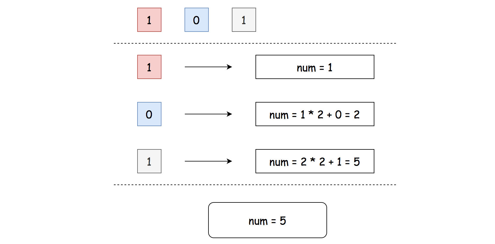

# LeetCode 1290. Convert Binary Number in a Linked List to Integer Solution
## Overview
Here we have two subproblems:

* To parse non-empty linked list and to retrieve the digit sequence which represents a binary number.

* To convert this sequence into the number in decimal representation.

The first subproblem is easy because the linked list is guaranteed to be non-empty.

### Java
```java
class Solution {
    public int getDecimalValue(ListNode head) {
        while (head.next != null) {
            head = head.next;
            // TODO    
        }
    }
}
```

### Python
```python
class Solution:
    def getDecimalValue(self, head: ListNode) -> int:
        while head.next:
            head = head.next
            # TODO
```

The second subproblem is to convert (101)<sub>2</sub> into 1 x 2<sup>2</sup> + 0 x 2<sup>1</sup> + 1 x 2<sup>0</sup>  = 5. It could be solved in two ways. To use classical arithmetic is more straightforward


*Figure 1. Approach 1: num = num * 2 + x*

and to use bitwise operators is faster


*Figure 2. Approach 2: num = (num << 1) | x*

***

## Approach 1: Binary Representation

*Figure 3. Approach 1: num = num * 2 + x*

* Initialize result number to be equal to head value: `num = head.val`. This operation is safe because the list is guaranteed to be non-empty.

* Parse linked list starting from the head: `while head.next`:

    * The current value is `head.next.val`. Update the result by shifting it by one to the left and adding the current value: `num = num * 2 + head.next.val`.

* Return num.

### Implementation
#### Java
```java
class Solution {
    public int getDecimalValue(ListNode head) {
        int num = head.val;
        while (head.next != null) {
            num = num * 2 + head.next.val;
            head = head.next;    
        }
        return num;
    }
}
```

#### Python
```python
class Solution:
    def getDecimalValue(self, head: ListNode) -> int:
        num = head.val
        while head.next:
            num = num * 2 + head.next.val
            head = head.next
        return num
```

### Complexity Analysis

* Time complexity: ***O(N)***.

* Space complexity: ***O(1)***.

***

## Approach 2: Bit Manipulation


*Figure 4. Approach 2: num = (num << 1) | x*

* Initialize result number to be equal to head value: `num = head.val`. This operation is safe because the list is guaranteed to be non-empty.

* Parse linked list starting from the head: `while head.next`:

    * The current value is `head.next.val`. Update the result by shifting it by one to the left and adding the current value using logical OR: `num = (num << 1) | head.next.val`.

* Return `num`.

### Implementation

#### Java
```java
class Solution {
    public int getDecimalValue(ListNode head) {
        int num = head.val;
        while (head.next != null) {
            num = (num << 1) | head.next.val;
            head = head.next;    
        }
        return num;
    }
}
```

#### Python
```python
class Solution:
    def getDecimalValue(self, head: ListNode) -> int:
        num = head.val
        while head.next:
            num = (num << 1) | head.next.val
            head = head.next
        return num
```

### Complexity Analysis

* Time complexity: ***O(N)***.

* Space complexity: ***O(1)***.