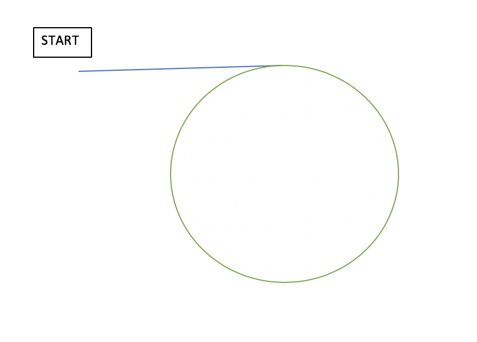

# LeetCode 142. Linked List Cycle II Solution
## [Python] 2 pointers approach, explained

This is very classical problem for two pointers approach: we use slow and fast pointers: slow which moves one step at a time and fast, which moves two times at a time. To find the place where loop started, we need to do it in two iterations: first we wait until fast pointer gains slow pointer and then we move slow pointer to the start and run them with the same speed and wait until they concide.

**Complexity:** time complexity is `O(n)`, because we traverse our linked list twice, space complexity is `O(1)`, because we do not create any additional variables.

```python
class Solution:
    def detectCycle(self, head):
        slow = fast = head
        while fast and fast.next:
            fast = fast.next.next
            slow = slow.next
            if slow == fast: break
                
        if not fast or not fast.next: return None
        slow = head
        while slow != fast:
            slow = slow.next
            fast = fast.next
        return slow
```

**PS** see also Problem 287. Find the Duplicate Number: https://leetcode.com/problems/find-the-duplicate-number/discuss/704693/Python-2-solutions%3A-Linked-List-Cycle-O(n)-and-BS-O(n-log-n)-explained which uses the same idea.

[Link to original post](https://leetcode.com/problems/linked-list-cycle-ii/discuss/912276/Python-2-pointers-approach-explained)

## A mechanics based visualization (+ Floyds algo explained)

Although my approach is very similar to Floyds algorithm, I felt that my analogy was a bit more easier for me to reason about its validity and visualize the solution. I have added it below and hope it helps others trying to get a deeper understanding of the solution.

{PART1}
Analogy: Imagine 2 cars running around a straight + circular race track [Image below] with different speeds.



Both cars start at the same time from START but one car is always faster than the other, and they travel at their respective constant speeds.

Given this speed differential, the faster car will eventually overtake the other car and would have travelled a distance of exactly one loop more than the other car. [Note: This does not mean that the slower car might not have completed any loops, but we are only taking into consideration their distance difference]

Based on this analysis, we can deduce:
A point of intersection within the loop, and the length of the loop (L) . Lets now use them to our advantage.

Get the 2 cars back up to the start of the track, this time lets send one car first up so that it is exactly at a distance L from the other car, which is still at the starting line.

Now start moving both the cars and this time both will travel at the same speed, so that the distance between them remains constant (L)

Both the cars will now meet at the origin of the loop, since we have kept the front car ahead a distance of L.

Heres an implementation that uses the above idea -

```go
func detectCycle(head *ListNode) *ListNode {
    slow, fast := head, head 
    for fast!= nil && fast.Next!= nil{
        slow = slow.Next
        fast = fast.Next.Next
        if fast == slow {
            break
        }
    }
    if fast != slow || head == nil || head.Next == nil {
        return nil 
    }
    count := 1
    curr := fast.Next
    for curr!= fast {
        curr = curr.Next
        count++
    }
	//count === len of the loop 
    front,rear := head, head
    for i:=0;i<count;i++{
        front = front.Next //get a distance of L between them 
    }
    for front!=rear { //keep moving both at same rate until they meet
        front = front.Next
        rear  = rear.Next
    }
    return rear //or front
    
}
```

{PART2}
Although this approach works it still doesnt really explain why Floyds algo works and why we choose one to move twice as fast as other. Below is my understanding of the algorithm and some mathematical basis for its correctness.

Here are some notations that we are going to use:

x[i] - ith positioned node in our linked list, with i>=1
L - length of the loop
k - Integer >= 0
t - pos for the first element of the loop in the list

Now given that the loop exists,
it will have the property that a node x[i+kL] wil be same node as x[i] for every i >=t [property A]

This means for an i, where i = kL, x[i] is same as x[2i]. This makes i interesting since it is a multiple of the length of our loop and is the key for understanding why we need to keep our fast pointer running twice as much as the slower one.

By making sure that one node has travelled twice as much as the other, when we first find a matching node at 'i' , this will mean x[i] == x[2i] and will imply that i = kL.

Lets keep one pointer at this special point with i= kL [front pointer], and keep one at the start line [rear pointer]

Now if we move both the pointers one step at a time, after 't' steps our rear pointer will be at x[t] and our front pointer will be at x[t+kL] and they thus would be at the same node [see A]

This will the first instance where the two pointers meet and hence will be the entry point of our loop. :)

If you continued reading till here, thanks and hope you had as much fun thinking and reasoning about this problem as I did.

Please do feel free to point any mistakes that I made in my analysis. Lets improve this further!

[Link to original post](https://leetcode.com/problems/linked-list-cycle-ii/discuss/726011/A-mechanics-based-visualization-(%2B-Floyds-algo-explained))