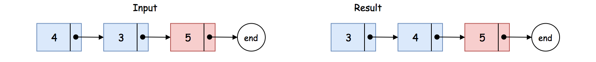
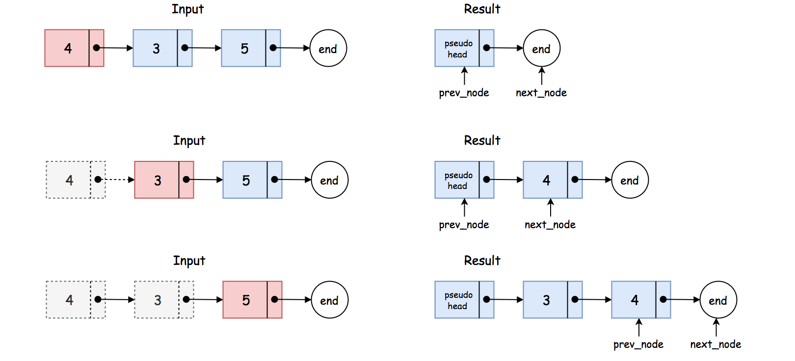

# LeetCode 147. Insertion Sort List Solution
## Overview
[Insertion sort](https://en.wikipedia.org/wiki/Insertion_sort) is an intuitive sorting algorithm, although it is much less efficient than the more advanced algorithms such as quicksort or merge sort.

Often that we perform the sorting algorithm on an [Array](https://leetcode.com/explore/learn/card/fun-with-arrays) structure, this problem though asks us to perform the insertion sort on a **linked list** data structure, which makes the implementation a bit challenging.

In this article, we will present some tricks to manipulate the linked list, which would help us to simplify the logics of implementation.

## Approach 1: Insertion Sort
### Intuition

Let us first review the idea of insertion sort algorithm, which can be broke down into the following steps:

* First of all, we create an empty list which would be used to hold the results of sorting.

* We then iterate through each element in the *input* list. For each element, we need to find a proper position in the resulting list to insert the element, so that the order of the resulting list is maintained.

* As one can see, once the iteration in the above step terminates, we will obtain the resulting list where the elements are *ordered*.

Now, let us walk through a simple example, by applying the above intuition.

Given the input list `input=[4, 3, 5]`, we have initially an empty resulting list `result=[]`.

* We then iterate over the input list. For the first element `4`, we need to find a proper position in the resulting list to place it. Since the resulting list is still empty, we then simply *append* it to the resulting list, *i.e.* `result=[4]`.


* Now for the second element (*i.e.* `3`) in the input list, similarly we need to insert it properly into the resulting list. As one can see, we need to insert it right before the element `4`. As a result, the resulting list becomes `[3, 4]`.


* Finally, for the last element (*i.e.* `5`) in the input list, as it turns out, the proper position to place it is the *tail* of the resulting list. With this last iteration, we obtain a *sorted* list as `result=[3, 4, 5]`.



## Algorithm

To translate the above intuition into the implementation, we applied two **tricks**.

>The first trick is that we will create a `pseudo_head` node which serves as a pointer pointing to the resulting list.

More precisely, this node facilitates us to always get a *hold* on the resulting list, especially when we need to insert a new element to the head of the resulting list. One will see later in more details how it can greatly simplify the logic.

In a *singly-linked list*, each node has only one pointer that points to the next node. If we would like to insert a new node (say `B`) before certain node (say `A`), we need to know the node (say `C`) that is currently before the node `A`, i.e. `C -> A`. With the reference in the node `C`, we could now insert the new node, *i.e.* `C -> B -> A`.

Given the above insight, in order to insert a new element into a singly-linked list, we apply another trick.

>The idea is that we use a ***pair of pointers*** (namely `prev_node -> next_node`) which serve as place-holders to guard the position where in-between we would insert a new element (*i.e.* `prev_node -> new_node -> next_node`).

With the same example before, *i.e.* `input=[4, 3, 5]`, we illustrate what the above helper pointers look like at the moment of insertion, in the following graph:



Here are some sample implementations based on the above ideas:

### Java
```java
class Solution {
    public ListNode insertionSortList(ListNode head) {

        ListNode pseudoHead = new ListNode();
        ListNode curr = head, prevNode, nextNode;

        while (curr != null) {
            // At each iteration, we insert an element into the resulting list.
            prevNode = pseudoHead;
            nextNode = pseudoHead.next;

            // find the position to insert the current node
            while (nextNode != null) {
                if (curr.val < nextNode.val)
                    break;
                prevNode = nextNode;
                nextNode = nextNode.next;
            }
            ListNode nextIter = curr.next;
            // insert the current node to the new list
            curr.next = nextNode;
            prevNode.next = curr;

            // moving on to the next iteration
            curr = nextIter;
        }

        return pseudoHead.next;
    }
}
```

### Python3
```python
class Solution:
    def insertionSortList(self, head: ListNode) -> ListNode:
        pseudo_head = ListNode()

        curr = head
        while curr:
            # At each iteration, we insert an element into the resulting list.
            prev_node = pseudo_head
            next_node = prev_node.next
            # find the position to insert the current node
            while next_node:
                if curr.val < next_node.val:
                    break
                prev_node = next_node
                next_node = next_node.next

            next_iter = curr.next
            # insert the current node to the new list
            curr.next = next_node
            prev_node.next = curr

            # moving on to the next iteration
            curr = next_iter

        return pseudo_head.next
```

### Complexity Analysis

Let ***N*** be the number of elements in the input list.

* Time Complexity: ***O(N^2)***

    * First of all, we run an iteration over the input list.

    * At each iteration, we insert an element into the resulting list. In the worst case where the position to insert is the tail of the list, we have to walk through the entire resulting list.

    * As a result, the total steps that we need to walk in the worst case would be ∑<sub>i=1</sub><sup>N</sup> i = N(N+1)/2.

    * To sum up, the overall time complexity of the algorithm is ***O(N^2)***.

* Space Complexity: ***O(1)***

* We used some pointers within the algorithm. However, their memory consumption is constant regardless of the input.

* **Note**, we did not create new nodes to hold the values of input list, but simply *reorder* the existing nodes.