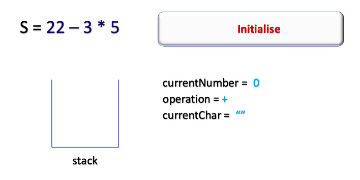
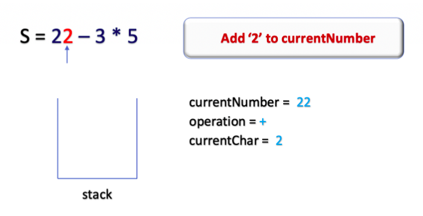
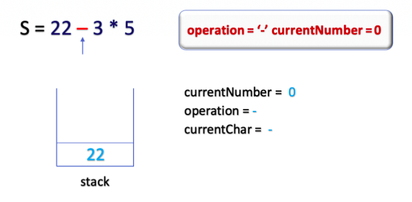
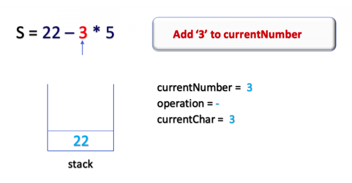
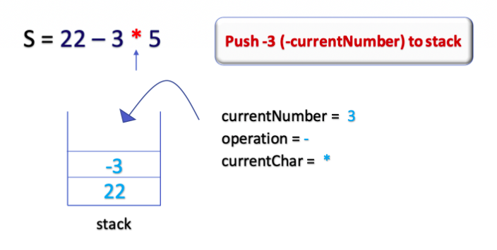
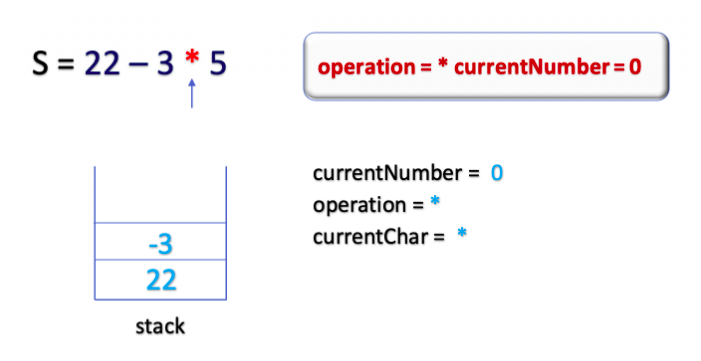
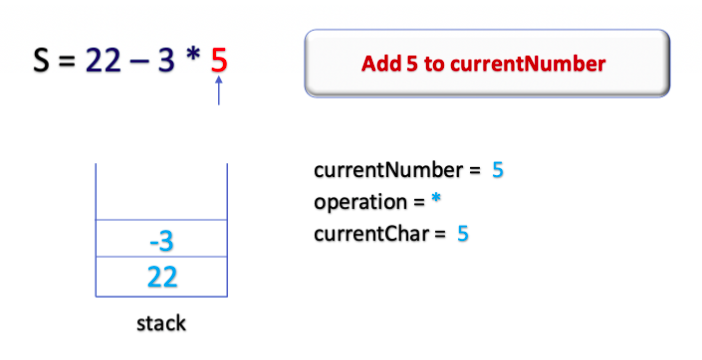
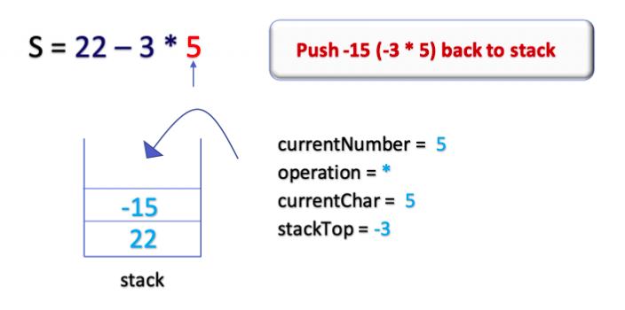
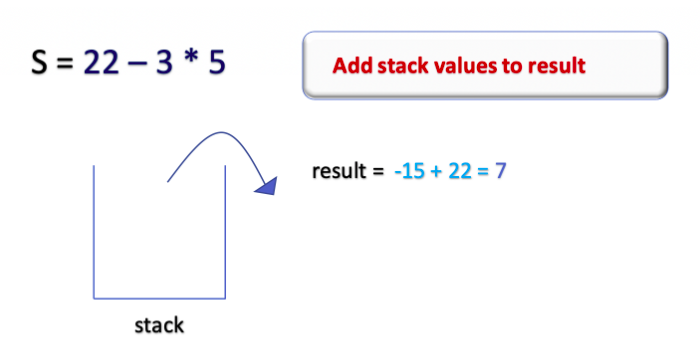

# LeetCode Medium 227. Basic Calculator II Solution
## Overview
There are multiple variations of this problem like [Basic Calculator](https://leetcode.com/problems/basic-calculator/) and [Basic Calculator III](https://leetcode.com/problems/basic-calculator-iii/). This problem is relatively simpler to solve, as we don't have to take care of the parenthesis.

The aim is to evaluate the given mathematical expression by applying the basic mathematical rules. The expressions are evaluated from left to right and the order of evaluation depends on the [Operator Precedence](https://en.wikipedia.org/wiki/Order_of_operations). Let's understand how we could implement the problem using different approaches.

## Approach 1: Using Stack
### Intuition

We know that there could be 4 types of operations - addition `(+)`, subtraction `(-)`, multiplication `(*)` and division `(/)`. Without parenthesis, we know that, multiplication `(*)` and `(\)` operations would always have higher precedence than addition `(+)` and subtraction `(-)` based on operator precedence rules.


If we look at the above examples, we can make the following observations -

* If the current operation is addition `(+)` or subtraction `(-)`, then the expression is evaluated based on the precedence of the next operation.

In example 1, `4+3` is evaluated later because the next operation is multiplication `(3*5)` which has higher precedence. But, in example 2, `4+3` is evaluated first because the next operation is subtraction `(3-5)` which has equal precedence.

* If the current operator is addition `(*)` or subtraction `(/)`, then the expression is evaluated irrespective of the next operation. This is because in the given set of operations `(+,-,*,/)`, the * and `/` operations have the highest precedence and therefore must be evaluated first.

In the above example 2 and 3, `4*3` is always evaluated first irrespective of the next operation.

Using this intuition let's look at the algorithm to implement the problem.

### Algorithm

Scan the input string `s` from left to right and evaluate the expressions based on the following rules

1. If the current character is a digit `0-9` ( operand ), add it to the number `currentNumber`.
2. Otherwise, the current character must be an operation `(+,-,*, /)`. Evaluate the expression based on the type of operation.
3. Addition `(+)` or Subtraction `(-)`: We must evaluate the expression later based on the next operation. So, we must store the `currentNumber` to be used later. Let's push the currentNumber in the Stack.

>[Stack data structure](https://leetcode.com/explore/learn/card/queue-stack/230/usage-stack/) follows Last In First Out (LIFO) principle. Hence, the last pushed number in the stack would be popped out first for evaluation. In addition, when we pop from the stack and evaluate this expression in the future, we need a way to determine if the operation was Addition `(+)` or Subtraction `(-)`. To simplify our evaluation, we can push `-currentNumber` in a stack if the current operation is subtraction `(-)` and assume that the operation for all the values in the stack is addition `(+)`. This works because (`a - currentNumber`) is equivalent to (`a + (-currentNumber)`).

* Multiplication `(*)` or Division `(/)`: Pop the top values from the stack and evaluate the current expression. Push the evaluated value back to the stack.
Once the string is scanned, pop from the stack and add to the result.

Once the string is scanned, pop from the stack and add to the `result`.

#### 1


#### 2


#### 3


#### 4


#### 5


#### 6


#### 7


#### 8


#### 9


#### 10


#### 11


#### 12


### Implementation

#### C++
```cpp

class Solution {
public:
    int calculate(string s) {
        int len = s.length();
        if (len == 0) return 0;
        stack<int> stack;
        int currentNumber = 0;
        char operation = '+';
        for (int i = 0; i < len; i++) {
            char currentChar = s[i];
            if (isdigit(currentChar)) {
                currentNumber = (currentNumber * 10) + (currentChar - '0');
            }
            if (!isdigit(currentChar) && !iswspace(currentChar) || i == len - 1) {
                if (operation == '-') {
                    stack.push(-currentNumber);
                } else if (operation == '+') {
                    stack.push(currentNumber);
                } else if (operation == '*') {
                    int stackTop = stack.top();
                    stack.pop();
                    stack.push(stackTop * currentNumber);
                } else if (operation == '/') {
                    int stackTop = stack.top();
                    stack.pop();
                    stack.push(stackTop / currentNumber);
                }
                operation = currentChar;
                currentNumber = 0;
            }
        }
        int result = 0;
        while (stack.size() != 0) {
            result += stack.top();
            stack.pop();
        }
        return result;
    }
};
```

#### Java
```java
class Solution {
    public int calculate(String s) {

        if (s == null || len == 0) return 0;
        int len = s.length();
        Stack<Integer> stack = new Stack<Integer>();
        int currentNumber = 0;
        char operation = '+';
        for (int i = 0; i < len; i++) {
            char currentChar = s.charAt(i);
            if (Character.isDigit(currentChar)) {
                currentNumber = (currentNumber * 10) + (currentChar - '0');
            }
            if (!Character.isDigit(currentChar) && !Character.isWhitespace(currentChar) || i == len - 1) {
                if (operation == '-') {
                    stack.push(-currentNumber);
                }
                else if (operation == '+') {
                    stack.push(currentNumber);
                }
                else if (operation == '*') {
                    stack.push(stack.pop() * currentNumber);
                }
                else if (operation == '/') {
                    stack.push(stack.pop() / currentNumber);
                }
                operation = currentChar;
                currentNumber = 0;
            }
        }
        int result = 0;
        while (!stack.isEmpty()) {
            result += stack.pop();
        }
        return result;
    }
}
```

### Complexity Analysis

* Time Complexity: ***O(n)***, where ***n*** is the length of the string ***s***. We iterate over the string ***s*** at most twice.

* Space Complexity: ***O(n)***, where ***n*** is the length of the string ***s***.

## Approach 2: Optimised Approach without the stack
### Intuition

In the previous approach, we used a stack to track the values of the evaluated expressions. In the end, we pop all the values from the stack and add to the result. Instead of that, we could add the values to the result beforehand and keep track of the last calculated number, thus eliminating the need for the stack. Let's understand the algorithm in detail.

### Algorithm

The approach works similar to *Approach 1* with the following differences :

* Instead of using a `stack`, we use a variable `lastNumber` to track the value of the last evaluated expression.
* If the operation is Addition `(+)` or Subtraction `(-)`, add the `lastNumber` to the result instead of pushing it to the stack. The `currentNumber` would be updated to `lastNumber` for the next iteration.
* If the operation is Multiplication `(*)` or Division `(/)`, we must evaluate the expression `lastNumber * currentNumber` and update the `lastNumber` with the result of the expression. This would be added to the result after the entire string is scanned.

### Implementation

#### C++
```cpp
class Solution {
public:
    int calculate(string s) {
        int length = s.length();
        if (length == 0) return 0;
        int currentNumber = 0, lastNumber = 0, result = 0;
        char sign = '+';
        for (int i = 0; i < length; i++) {
            char currentChar = s[i];
            if (isdigit(currentChar)) {
                currentNumber = (currentNumber * 10) + (currentChar - '0');
            }
            if (!isdigit(currentChar) && !iswspace(currentChar) || i == length - 1) {
                if (sign == '+' || sign == '-') {
                    result += lastNumber;
                    lastNumber = (sign == '+') ? currentNumber : -currentNumber;
                } else if (sign == '*') {
                    lastNumber = lastNumber * currentNumber;
                } else if (sign == '/') {
                    lastNumber = lastNumber / currentNumber;
                }
                sign = currentChar;
                currentNumber = 0;
            }
        }
        result += lastNumber;
        return result;  
    }
};
```

#### Java
```java
class Solution {
    public int calculate(String s) {
        if (s == null || length == 0) return 0;
        int length = s.length();
        int currentNumber = 0, lastNumber = 0, result = 0;
        char operation = '+';
        for (int i = 0; i < length; i++) {
            char currentChar = s.charAt(i);
            if (Character.isDigit(currentChar)) {
                currentNumber = (currentNumber * 10) + (currentChar - '0');
            }
            if (!Character.isDigit(currentChar) && !Character.isWhitespace(currentChar) || i == length - 1) {
                if (operation == '+' || operation == '-') {
                    result += lastNumber;
                    lastNumber = (operation == '+') ? currentNumber : -currentNumber;
                } else if (operation == '*') {
                    lastNumber = lastNumber * currentNumber;
                } else if (operation == '/') {
                    lastNumber = lastNumber / currentNumber;
                }
                operation = currentChar;
                currentNumber = 0;
            }
        }
        result += lastNumber;
        return result;
    }
}
```

### Complexity Analysis

* Time Complexity: ***O(n)***, where ***n*** is the length of the string ***s***.

* Space Complexity: ***O(1)***, as we use constant extra space to store `lastNumber`, `result` and so on.


