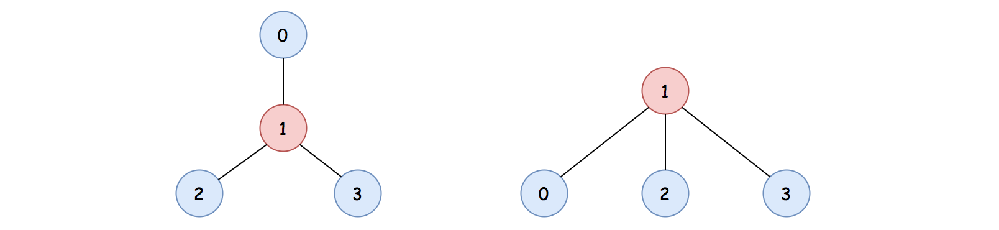
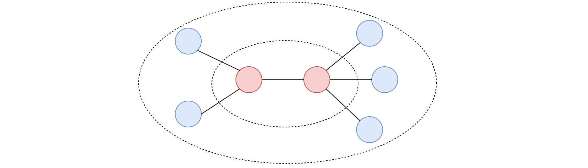

# LeetCode Medium 310. Minimum Height Trees Solution
## Overview
As the hints suggest, this problem is related to the [graph](https://en.wikipedia.org/wiki/Graph_(abstract_data_type)) data structure. Moreover, it is closely related to the problems of [Course Schedule](https://leetcode.com/problems/course-schedule/) and [Course Schedule II](https://leetcode.com/problems/course-schedule-ii/). This relationship is not evident, yet it is the key to solve the problem, as one will see later.

First of all, as a ***straight-forward*** way to solve the problem, we can simply follow the requirements of the problem, as follows:

* Starting from each node in the graph, we treat it as a ***root*** to build a tree. Furthermore, we would like to know the distance between this root node and the rest of the nodes. The maximum of the distance would be the ***height*** of this tree.

* Then according to the definition of **Minimum Height Tree (MHT)**, we simply filter out the roots that have the minimal height among all the trees.

The first step we describe above is actually the problem of [Maximum Depth of N-ary Tree](https://leetcode.com/problems/maximum-depth-of-n-ary-tree/), which is to find the maximum distance from the root to the leaves nodes. For this, we can either apply the [Depth-First Search](https://leetcode.com/explore/learn/card/queue-stack/232/practical-application-stack/) (**DFS**) or [Breadth-First Search](https://leetcode.com/explore/learn/card/queue-stack/231/practical-application-queue/) (**BFS**) algorithms.

Without a rigid proof, we can see that the above straight-forward solution is correct, and it would work for most of the test cases.

However, this solution is not efficient, whose time complexity would be ***O(N^2)*** where ***N*** is the number of nodes in the tree. As one can imagine, it will result in ***Time Limit Exceeded*** exception in the online judge.

As a spoiler alert, in this article, we will present a [*topological sorting*](https://en.wikipedia.org/wiki/Topological_sorting) alike algorithm with time complexity of ***O(N)***, which is also the algorithm to solve the well-known course schedule problems.

## Approach 1: Topological Sorting
### Intuition

First of all, let us clarify some concepts.

>The ***distance*** between two nodes is the number of edges that connect the two nodes.

Note, normally there could be multiple paths to connect nodes in a graph. In our case though, since the input graph can form a tree from any node, as specified in the problem, there could only be ***one path*** between any two nodes. In addition, there would be no cycle in the graph. As a result, there would be no ambiguity in the above definition of distance.

>The ***height*** of a tree can be defined as the maximum distance between the root and all its leaves nodes.

With the above definitions, we can rephrase the problem as finding out the nodes that are overall close to all other nodes, especially the leaves nodes.

>If we view the graph as an area of circle, and the leaves nodes as the peripheral of the circle, then what we are looking for are actually the [*centroids*](https://en.wikipedia.org/wiki/Centroid) of the circle, *i.e.* nodes that is close to all the peripheral nodes (leaves nodes).



For instance, in the above graph, it is clear that the node with the value 1 is the centroid of the graph. If we pick the node 1 as the root to form a tree, we would obtain a tree with the *minimum height*, compared to other trees that are formed with any other nodes.

Before we proceed, here we make one assertion which is essential to the algorithm.

>For the tree-alike graph, the number of centroids is no more than 2.

If the nodes form a chain, it is intuitive to see that the above statement holds, which can be broken into the following two cases:

* If the number of nodes is even, then there would be two centroids.
* If the number of nodes is odd, then there would be only one centroid.


For the rest of cases, we could prove by ***contradiction***. Suppose that we have 3 centroids in the graph, if we remove all the non-centroid nodes in the graph, then the 3 centroids nodes must form a *triangle* shape, as follows:


Because these centroids are equally important to each other, and they should equally close to each other as well. If any of the edges that is missing from the triangle, then the 3 centroids would be reduced down to a single centroid.

However, the triangle shape forms a cycle which is ***contradicted*** to the condition that there is no cycle in our tree-alike graph. Similarly, for any of the cases that have more than 2 centroids, they must form a cycle among the centroids, which is contradicted to our condition.

Therefore, there cannot be more than 2 centroids in a tree-alike graph.

## Algorithm

>Given the above intuition, the problem is now reduced down to looking for all the ***centroid*** nodes in a tree-alike graph, which in addition are no more than two.

The idea is that we *trim* out the leaves nodes layer by layer, until we reach the *core* of the graph, which are the centroids nodes.



Once we trim out the first layer of the leaves nodes (nodes that have only one connection), some of the non-leaf nodes would become leaves nodes.

The trimming process continues until there are only two nodes left in the graph, which are the *centroids* that we are looking for.

The above algorithm resembles the *topological sorting* algorithm which generates the order of objects based on their dependencies. For instance, in the scenario of course scheduling, the courses that have the least dependency would appear first in the order.

In our case, we trim out the leaf nodes first, which are the **farther** away from the centroids. At each step, the nodes we trim out are closer to the centroids than the nodes in the previous step. At the end, the trimming process terminates at the **centroids** nodes.

### Implementation

Given the above algorithm, we could implement it via the *Breadth First Search* (BFS) strategy, to trim the leaves nodes layer by layer (*i.e.* level by level).

* Initially, we would build a graph with the [*adjacency list*](https://en.wikipedia.org/wiki/Adjacency_list) from the input.

* We then create a queue which would be used to hold the leaves nodes.

* At the beginning, we put all the current leaves nodes into the queue.

* We then run a loop until there is only two nodes left in the graph.

* At each iteration, we remove the current leaves nodes from the queue. While removing the nodes, we also remove the edges that are linked to the nodes. As a consequence, some of the non-leaf nodes would become leaves nodes. And these are the nodes that would be trimmed out in the next iteration.

* The iteration terminates when there are no more than two nodes left in the graph, which are the desired *centroids* nodes.

Here are some sample implementations that are inspired from the post of [dietpepsi](https://leetcode.com/problems/minimum-height-trees/discuss/76055/Share-some-thoughts) in the discussion forum.

### Java
```java
class Solution {
    public List<Integer> findMinHeightTrees(int n, int[][] edges) {

        // base cases
        if (n < 2) {
            ArrayList<Integer> centroids = new ArrayList<>();
            for (int i = 0; i < n; i++)
                centroids.add(i);
            return centroids;
        }

        // Build the graph with the adjacency list
        ArrayList<Set<Integer>> neighbors = new ArrayList<>();
        for (int i = 0; i < n; i++)
            neighbors.add(new HashSet<Integer>());

        for (int[] edge : edges) {
            Integer start = edge[0], end = edge[1];
            neighbors.get(start).add(end);
            neighbors.get(end).add(start);
        }

        // Initialize the first layer of leaves
        ArrayList<Integer> leaves = new ArrayList<>();
        for (int i = 0; i < n; i++)
            if (neighbors.get(i).size() == 1)
                leaves.add(i);

        // Trim the leaves until reaching the centroids
        int remainingNodes = n;
        while (remainingNodes > 2) {
            remainingNodes -= leaves.size();
            ArrayList<Integer> newLeaves = new ArrayList<>();

            // remove the current leaves along with the edges
            for (Integer leaf : leaves) {
                for (Integer neighbor : neighbors.get(leaf)) {
                    neighbors.get(neighbor).remove(leaf);
                    if (neighbors.get(neighbor).size() == 1)
                        newLeaves.add(neighbor);
                }
            }

            // prepare for the next round
            leaves = newLeaves;
        }

        // The remaining nodes are the centroids of the graph
        return leaves;
    }
}
```

### Python3
```python
class Solution:
    def findMinHeightTrees(self, n: int, edges: List[List[int]]) -> List[int]:

        # base cases
        if n <= 2:
            return [i for i in range(n)]

        # Build the graph with the adjacency list
        neighbors = [set() for i in range(n)]
        for start, end in edges:
            neighbors[start].add(end)
            neighbors[end].add(start)

        # Initialize the first layer of leaves
        leaves = []
        for i in range(n):
            if len(neighbors[i]) == 1:
                leaves.append(i)

        # Trim the leaves until reaching the centroids
        remaining_nodes = n
        while remaining_nodes > 2:
            remaining_nodes -= len(leaves)
            new_leaves = []
            # remove the current leaves along with the edges
            while leaves:
                leaf = leaves.pop()
                for neighbor in neighbors[leaf]:
                    neighbors[neighbor].remove(leaf)
                    if len(neighbors[neighbor]) == 1:
                        new_leaves.append(neighbor)

            # prepare for the next round
            leaves = new_leaves

        # The remaining nodes are the centroids of the graph
        return leaves
```

### Complexity Analysis

Let |V|∣V∣ be the number of nodes in the graph, then the number of edges would be |V| - 1∣V∣−1 as specified in the problem.

* Time Complexity: ***O(∣V∣)***

    * First, it takes ***∣V∣−1*** iterations for us to construct a graph, given the edges.

    * With the constructed graph, we retrieve the initial leaves nodes, which takes ***∣V∣*** steps.

    * During the BFS trimming process, we will trim out almost all the nodes (***|V|***) and edges (***∣V∣−1***) from the edges. Therefore, it would take us around ***∣V∣+∣V∣−1*** operations to reach the centroids.

    * To sum up, the overall time complexity of the algorithm is ***O(∣V∣)***.

* Space Complexity: ***O(∣V∣)***

* We construct the graph with adjacency list, which has ***∣V∣*** nodes and ***∣V∣−1*** edges. Therefore, we would need ***∣V∣+∣V∣−1*** space for the representation of the graph.

* In addition, we use a queue to keep track of the leaves nodes. In the worst case, the nodes form a star shape, with one centroid and the rest of the nodes as leaves nodes. In this case, we would need ***∣V∣−1*** space for the queue.

* To sum up, the overall space complexity of the algorithm is also ***O(∣V∣)***.