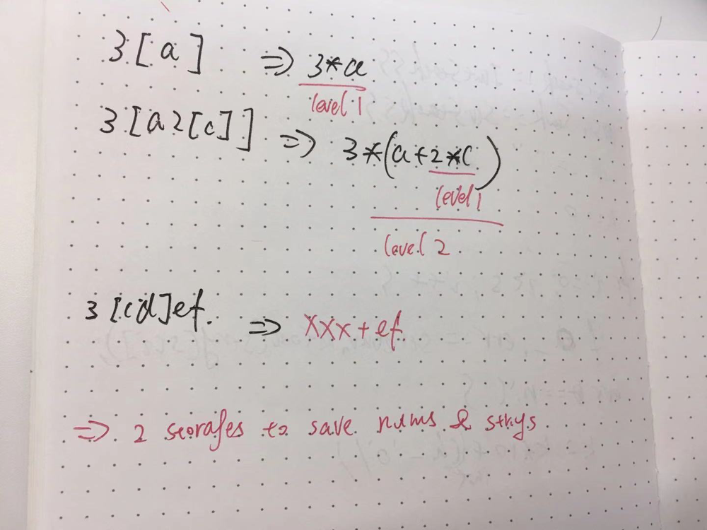
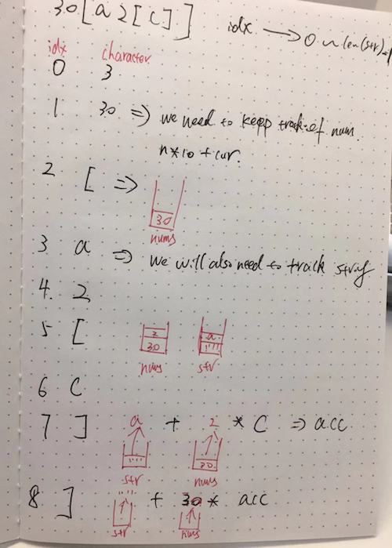

# LeetCode Medium 394. Decode String Solution
## [Python] Stack solution, explained

For me it was not medium problem, more like hard, I am not very good at all these parser problems. However if you spend some time on this problem, logic will be not very difficult. The idea is to read symbol by symbol and check options:

1. If we see digit, it means that we need to form number, so just do it: multiply already formed number by `10` and add this digit.
2. If we see open bracket `[`, it means, that we just right before finished to form our number: so we put it into our stack. Also we put in our stack empty string.
3. If we have close bracket `]`, it means that we just finished `[...]` block and what we have in our stack: on the top it is solution for what we have inside bracktes, before we have number of repetitions of this string `rep` and finally, before we have string built previously: so we concatenate `str2` and `str1 * rep`.
4. Finally, if we have some other symbol, that is letter, we add it the the last element of our stack.

For better understanding the process, let us consider example `s = 3[a5[c]]4[b]`:

1. `['']` at first we have stack with empty string.
2. `['', 3, '']`, open bracket: now we have stack with 3 elements: empty string, number `3` and empty string.
3. `['', 3, 'a']`: build our string
4. `['', 3, 'a', 5, '']`, open bracket: add number and empty string
5. `['', 3, 'a', 5, 'c']` build string
6. `['', 3, 'accccc']` : now we have closing bracket, so we remove last `3` elements and put `accccc` into our stack
7. `['acccccacccccaccccc']` we again have closing bracket, so we remove last 3 elements and put new one.
8. `['acccccacccccaccccc', 4, '']`: open bracket, add number and empty string to stack
9. `['acccccacccccaccccc', 4, 'b']` build string
10. `['acccccacccccacccccbbbb']` closing bracket: remove last 3 elements and put one new.

Finally, return joined strings from our stack.

**Complexity:** we can say, that time and space complexity is `O(m)`, where `m` is size of our answer. Potentially it can be very big, for strings like `999999999999999[a]`, but I do not think leetcode will have such tests.

```python
class Solution:
    def decodeString(self, s):
        it, num, stack = 0, 0, [""]
        while it < len(s):
            if s[it].isdigit():
                num = num * 10 + int(s[it])
            elif s[it] == "[":
                stack.append(num)
                num = 0
                stack.append("")
            elif s[it] == "]":
                str1 = stack.pop()
                rep = stack.pop()
                str2 = stack.pop()
                stack.append(str2 + str1 * rep)
            else:
                stack[-1] += s[it]              
            it += 1           
        return "".join(stack)
```

[Link to original post](https://leetcode.com/problems/decode-string/discuss/941309/Python-Stack-solution-explained)

## Golang solution using 2 stacks with my thoughts and notes

From the example `s = "3[a]2[bc]", return "aaabcbc"`. , it seems that we can use a iteration to solve it, but things are getting tricky in the example `s = "3[a2[c]]", return "accaccacc"`. , for we see nested string, which leads to the tought of using stack/recursion.



Run through an example:



We can tell from the process:

1. nums should be saved, same as characters we met
2. `[` is the time for pushing nums and strings into stacks
3. `]` is the time for popping stacks. Using `strStack.Pop()` + `numStack.Pop()` * `curStr`

Since my code failed on passing tests, I'll just use `this post` as a reference. Thanks to the author.

```go
import (
	"strconv"
	"strings"
)

func decodeString(s string) string {
	intStack := Stack{}
	strStack := Stack{}
	cur := ""
	k := 0
	for i := 0; i < len(s); i++ {
		if n, err := strconv.Atoi(string(s[i])); err == nil {
			// handle cases like 100[leetcode]
			k = k*10 + n
		} else if s[i] == '[' {
			intStack.Push(k)
			strStack.Push(cur)
			cur = ""
			k = 0
		} else if s[i] == ']' {
			tmp := cur
			cur = strStack.Pop().(string)
			cur += strings.Repeat(tmp, intStack.Pop().(int))
		} else {
			cur += string(s[i])
		}
	}
	return cur
}

type Stack []interface{}

func (s *Stack) Push(x interface{}) {
	*s = append(*s, x)
}

func (s *Stack) Pop() interface{} {
	if len(*s) == 0 {
		return nil
	}
	tail := (*s)[len(*s)-1]
	*s = (*s)[:len(*s)-1]
	return tail
}
```
[Link to original post](https://leetcode.com/problems/decode-string/discuss/346216/Golang-solution-using-2-stacks-with-my-thoughts-and-notes)

## Golang solution using recursion with my analysis
After my [previous post](https://leetcode.com/problems/decode-string/discuss/346216/Golang-solution-using-2-stacks-with-my-thoughts-and-notes), I thought what if we can't came up with a solution using stacks, then could we use recursion to solve the problem? The answer is yes.

We need to see the pattern of the encoded string.
`s = "3[a2[c]]", return "accaccacc"`.
When we meet a `[`, we will go deep into next level, which is where a recursion starts. When should we return from the recursion? That’s the time when we meet `]`.

```go
func decodeString(s string) string {
	r, _ := helper(s, 0)
	return r
}

func helper(s string, start int) (cur string, end int) {
	if len(s) == 0 {
		return "", 0
	}
	k := 0
	i := start
	for i < len(s) {
		ch := string(s[i])
		if n, err := strconv.Atoi(ch); err == nil {
			k = k*10 + n
		} else if ch == "[" {
			decoded, end := helper(s, i+1)
			cur += strings.Repeat(decoded, k)
			i = end
			k = 0
		} else if ch == "]" {
			// this is the base case
			return cur, i
		} else {
			cur += ch
		}
		i++
	}
	return cur, i
}
```

At this point, I would prefer recursion.

[Link to original post](https://leetcode.com/problems/decode-string/discuss/346959/Golang-solution-using-recursion-with-my-analysis)