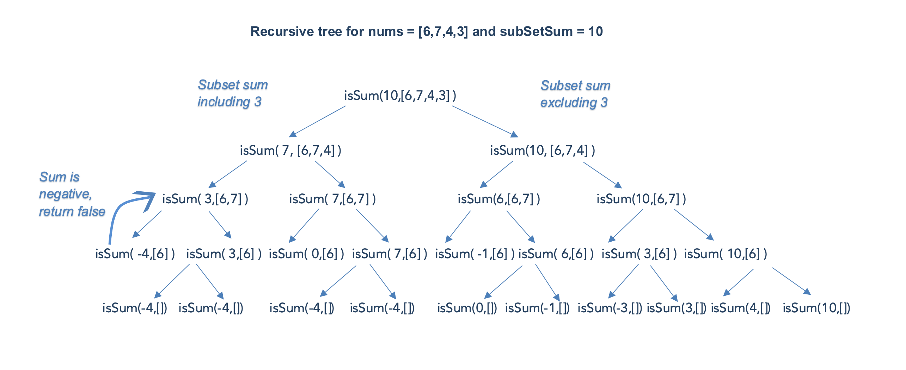

# LeetCode Medium 416. Partition Equal Subset Sum Solution
## Overview
The problem is similar to the classic *Knapsack* problem. The basic idea is to understand that to partition an array into two subsets of equal sum say ***subSetSum***, the ***totalSum*** of given array must be twice the ***subSetSum***

***totalSum = subSetSum ∗ 2***

This could also be written as, ***subSetSum = totalSum / 2***

*Example* Assume ***totalSum*** of an array is ***20*** and if we want to partition it into 2 subsets of equal sum, then the ***subSetSum*** must be (20/2) = 10(20/2)=10.

Now, the problem to find the subset with a sum equals a given target. Here target is ***subSetSum***.

It must be noted that the total sum of an array must be *even*, only then we can divide it into 2 equal subsets. For instance, we cannot have an equal ***subSetSum*** for an array with total sum as ***21***.

### Note:

>Finding a subset with a sum equal to a given target is different than [Subarray sum equals k](https://leetcode.com/problems/subarray-sum-equals-k/). Subarray is a contiguous sequence of array elements, whereas the subset could consist of any array elements regardless of the sequence. But each array element must belong to exactly one subset.

Let's discuss different algorithms to find the subset with a given sum.

## Approach 1: Brute Force
### Intuition

We have to find a subset in an array where the sum must be equal to ***subSetSum*** that we calculated above. The brute force approach would be to generate all the possible subsets of an array and return true if we find a subset with the required sum.

### Algorithm

Assume, there is an array ***nums*** of size ***n*** and we have to find if there exists a subset with total ***sum = subSetSum***. For a given array element ***x***, there could be either of 2 possibilities:

1. Case 1) ***x*** is included in subset sum. ***subSetSum = subSetSum − x***

2. Case 2) ***x*** is not included in subset sum, so we must take previous sum without ***x***. ***subSetSum = subSetSum***

We can use *depth first search* and recursively calculate the ***subSetSum*** for each case and check if either of them is true. This can be formulated as

```
isSum (subSetSum, n) = isSum(subSetSum- nums[n], n-1) ||  isSum(subSetSum, n-1)
```

*Base Cases*

* If ***subSetSum*** is ***0***, return t*rue* ( Since we found a subset with sum subSetSum )
* If ***subSetSum*** is less than ***0***, return *false*


#### C++
```c++
class Solution {
public:
    bool canPartition(vector<int> &nums) {
        int totalSum = 0;
        // find sum of all array elements
        for (int num : nums) {
            totalSum += num;
        }
        // if totalSum is odd,it cannot be partitioned into equal sum subset
        if (totalSum % 2 != 0) return false;
        int subSetSum = totalSum / 2;
        int n = nums.size();
        return dfs(nums, n - 1, subSetSum);
    }

    bool dfs(vector<int> &nums, int n, int subSetSum) {
        // Base Cases
        if (subSetSum == 0)
            return true;
        if (n == 0 || subSetSum < 0)
            return false;
        bool result = dfs(nums, n - 1, subSetSum - nums[n - 1]) || dfs(nums, n - 1, subSetSum);
        return result;
    }
};
```

#### Java
```java
class Solution {
    public boolean canPartition(int[] nums) {
        int totalSum = 0;
        // find sum of all array elements
        for (int num : nums) {
            totalSum += num;
        }
        // if totalSum is odd,it cannot be partitioned into equal sum subset
        if (totalSum % 2 != 0) return false;
        int subSetSum = totalSum / 2;
        int n = nums.length;
        return dfs(nums, n - 1, subSetSum);
    }

    public boolean dfs(int[] nums, int n, int subSetSum) {
        // Base Cases
        if (subSetSum == 0)
            return true;
        if (n == 0 || subSetSum < 0)
            return false;
        return dfs(nums, n - 1, subSetSum - nums[n - 1]) || dfs(nums, n - 1, subSetSum);
    }
}
```

### Complexity Analysis

* Time Complexity : ***O(2^n)***, where ***n*** is equal to number of array elements. The recursive solution takes the form of a binary tree where there are 2 possibilities for every array element and the maximum depth of the tree could be ***n***. The time complexity is exponential, hence this approach is exhaustive and results in *Time Limit Exceeded (TLE)*.

* Space Complexity: ***O(N)*** This space will be used to store the recursion stack. We can’t have more than ***n*** recursive calls on the call stack at any time.

## Approach 2: Top Down Dynamic Programming - Memoization
### Intuition

In the above approach, we observe that the same subproblem is computed and solved multiple times.

Example :



In the above recursion tree, we could see that ***isSum(3,[6])*** is computed twice and the result is always the same. Since the same subproblem is computed again and again, the problem has *Overlapping Subproblem* property and can be solved using *Dynamic Programming*.

### Algorithm

We could have stored the results of our computation for the first time and used it later. This technique of computing once and returning the stored value is called memoization. We use a two dimensional array ***memo*** and follow the following steps for each recursive call :

* Check if subSetSum for a given ***n*** exists in ***memo*** to see if we can avoid computing the answer and return the result stored in memo.
* Save the results of any calculations to ***memo***.

#### C++
```c++
class Solution {
public:
    bool canPartition(vector<int> &nums) {
        int totalSum = 0;
        // find sum of all array elements
        for (int num : nums) {
            totalSum += num;
        }
        // if totalSum is odd, it cannot be partitioned into equal sum subset
        if (totalSum % 2 != 0) return false;
        int subSetSum = totalSum / 2;
        int n = nums.size();
        vector<vector<optional<bool>>> memo(n + 1, vector<optional<bool>>(subSetSum + 1, nullopt));
        return dfs(nums, n - 1, subSetSum, memo);
    }

    bool dfs(vector<int> &nums, int n, int subSetSum, vector<vector<optional<bool>>> &memo) {
        // Base Cases
        if (subSetSum == 0)
            return true;
        if (n == 0 || subSetSum < 0)
            return false;
        // check if subSetSum for given n is already computed and stored in memo
        if (memo[n][subSetSum] != nullopt) {
            return (memo[n][subSetSum] == true);
        }
        bool result = dfs(nums, n - 1, subSetSum - nums[n - 1], memo) ||
                dfs(nums, n - 1, subSetSum, memo);
        memo[n][subSetSum] = result;
        return result;
    }
};
```

#### Java
```java
class Solution {
    public boolean canPartition(int[] nums) {
        int totalSum = 0;
        // find sum of all array elements
        for (int num : nums) {
            totalSum += num;
        }
        // if totalSum is odd, it cannot be partitioned into equal sum subset
        if (totalSum % 2 != 0) return false;
        int subSetSum = totalSum / 2;
        int n = nums.length;
        Boolean[][] memo = new Boolean[n + 1][subSetSum + 1];
        return dfs(nums, n - 1, subSetSum, memo);
    }

    public boolean dfs(int[] nums, int n, int subSetSum, Boolean[][] memo) {
        // Base Cases
        if (subSetSum == 0)
            return true;
        if (n == 0 || subSetSum < 0)
            return false;
        // check if subSetSum for given n is already computed and stored in memo
        if (memo[n][subSetSum] != null)
            return memo[n][subSetSum];
        boolean result = dfs(nums, n - 1, subSetSum - nums[n - 1], memo) ||
                dfs(nums, n - 1, subSetSum, memo);
        // store the result in memo
        memo[n][subSetSum] = result;
        return result;
    }
}
```

### Complexity Analysis

Let ***n*** be the number of array elements and ***m*** be the ***subSetSum***.

* Time Complexity : \mathcal{O}(m \cdot n)O(m⋅n).

    * In the worst case where there is no overlapping calculation, the maximum number of entries in the `memo` would be ***m⋅n***. For each entry, overall we could consider that it takes constant time, *i.e.* each invocation of `dfs()` at most emits one entry in the `memo`.

    * The overall computation is proportional to the number of entries in `memo`. Hence, the overall time complexity is ***O(m⋅n)***.

* Space Complexity: ***O(m⋅n)***. We are using a 2 dimensional array ***memo*** of size ***(m⋅n)*** and ***O(n)*** space to store the recursive call stack. This gives us the space complexity as ***O(n) + O(m⋅n) = O(m⋅n)***

## Approach 3: Bottom Up Dynamic Programming
### Intuition

This is another approach to solving the Dynamic Programming problems. We use the iterative approach and store the result of subproblems in bottom-up fashion also known as Tabulation.

### Algorithm

We maintain a 2D array , ***dp[n][subSetSum]*** For an array element ***i*** and sum ***j*** in array ***nums***,

***dp[i][j]=true*** if the sum ***j*** can be formed by array elements in subset ***nums[0]..nums[i]***,otherwise ***dp[i][j]=false***

***dp[i][j]*** is ***true*** it satisfies one of the following conditions :

* Case 1) sum ***j*** can be formed without including ***i<sup>th</sup>*** element,

***if dp[i−1][j]==true***

* Case 2) sum ***j*** can be formed including ***i<sup>th</sup>*** element,

***if dp[i−1][j−nums[i]]==true***


#### C++
```c++
class Solution {
public:
    bool canPartition(vector<int> &nums) {
        int totalSum = 0;
        // find sum of all array elements
        for (int num : nums) {
            totalSum += num;
        }
        // if totalSum is odd,it cannot be partitioned into equal sum subset
        if (totalSum % 2 != 0) return false;
        int subSetSum = totalSum / 2;
        int n = nums.size();
        bool dp[n + 1][subSetSum + 1];
        memset(dp, 0, (n + 1) * (subSetSum + 1) * sizeof(bool));
        dp[0][0] = true;
        for (int i = 1; i <= n; i++) {
            int curr = nums[i - 1];
            for (int j = 0; j <= subSetSum; j++) {
                if (j < curr)
                    dp[i][j] = dp[i - 1][j];
                else
                    dp[i][j] = dp[i - 1][j] || (dp[i - 1][j - curr]);
            }
        }
        return dp[n][subSetSum];
    }
};
```

#### Java
```java
class Solution {
    public boolean canPartition(int[] nums) {
        int totalSum = 0;
        // find sum of all array elements
        for (int num : nums) {
            totalSum += num;
        }
        // if totalSum is odd,it cannot be partitioned into equal sum subset
        if (totalSum % 2 != 0) return false;
        int subSetSum = totalSum / 2;
        int n = nums.length;
        boolean dp[][] = new boolean[n + 1][subSetSum + 1];
        dp[0][0] = true;
        for (int i = 1; i <= n; i++) {
            int curr = nums[i - 1];
            for (int j = 0; j <= subSetSum; j++) {
                if (j < curr)
                    dp[i][j] = dp[i - 1][j];
                else
                    dp[i][j] = dp[i - 1][j] || (dp[i - 1][j - curr]);
            }
        }
        return dp[n][subSetSum];
    }
}
```

### Complexity Analysis

* Time Complexity : ***O(m⋅n)***, where mm is the ***subSetSum***, and ***n*** is the number of array elements. We iteratively fill the array of size ***m⋅n***.

* Space Complexity : ***O(m⋅n)*** , where ***n*** is the number of array elements and ***m*** is the ***subSetSum***. We are using a 2 dimensional array ***dp*** of size ***m⋅n***

## Approach 4: Optimised Dynamic Programming - Using 1D Array
### Intuition

We could further optimize *Approach 3*. We must understand that for any array element *i*, we need results of the previous iteration (i-1) only. Hence, we could achieve the same using a one-dimensional array as well.

#### C++
```c++
class Solution {
public:
    bool canPartition(vector<int> &nums) {
        int totalSum = 0;
        // find sum of all array elements
        for (int num : nums) {
            totalSum += num;
        }
        // if totalSum is odd,it cannot be partitioned into equal sum subset
        if (totalSum % 2 != 0) return false;
        int subSetSum = totalSum / 2;
        int n = nums.size();
        vector<bool> dp(subSetSum + 1, false);
        dp[0] = true;
        for (int curr : nums) {
            for (int j = subSetSum; j >= curr; j--) {
                dp[j] = dp[j] || dp[j - curr];
            }
        }
        return dp[subSetSum];
    }
};
```

#### Java
```java
class Solution {
    public boolean canPartition(int[] nums) {
        if (nums.length == 0)
            return false;
        int totalSum = 0;
        // find sum of all array elements
        for (int num : nums) {
            totalSum += num;
        }
        // if totalSum is odd,it cannot be partitioned into equal sum subset
        if (totalSum % 2 != 0) return false;
        int subSetSum = totalSum / 2;
        boolean dp[] = new boolean[subSetSum + 1];
        dp[0] = true;
        for (int curr : nums) {
            for (int j = subSetSum; j >= curr; j--) {
                dp[j] |= dp[j - curr];
            }
        }
        return dp[subSetSum];
    }
}
```

### Complexity Analysis

* Time Complexity : ***O(m⋅n)***, where ***m*** is the subSetSum, and ***n*** is the number of array elements. The time complexity is the same as *Approach 3*.

* Space Complexity: ***O(m)***, As we use an array of size ***m*** to store the result of subproblems.

### Note:

The overall performance of *Approach 2* is better than all the approaches discussed above. This is because we terminate our search as soon as we find a subset with the required sum. Hence, it performs better in most cases except for the worst case.