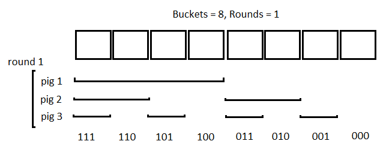
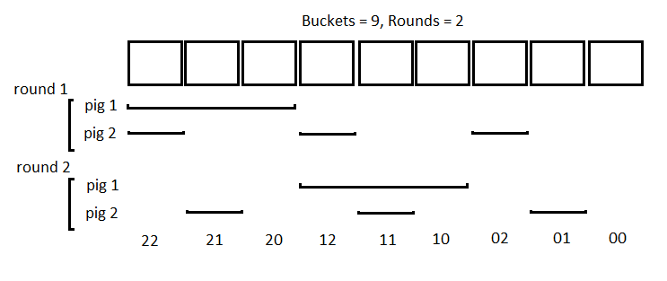

# LeetCode Hard 458. Poor Pigs Solution
## Two diagrams to help understanding
Especially with the last hint in the question the solution is pretty straigtforward. In fact, when the number of rounds = 1, the each pig correspond to 1 bit of information. We can show how the solution is constructed. Consider the diagram below. Here we have 8 buckets, and the number of rounds = 1 (for example when both `x=15` and `y=15`). The first pig drinks the first four buckets, the second pig drinks buckets of size 2, interleaving two buckets, and the last pig drinks buckets of size 1, interleaving 1 bucket. If a pig dies it is encoded as `1`, otherwise `0`. We can see that 3 pigs encode all 8 cases here. Encoded string are shown at the bottom. Hence for `b=8`, `x=15`, `y=15` the answer is `3`.



As the number of rounds increase, each pig can represent more information; but this is rather difficult to grasp at the beginning. We now consider the following diagram. Here we have 9 buckets and the number of rounds = 2 (for example when both `x=30` and `y=15`). You see how the pigs drink from buckets at round 1 and 2. If a pig dies in round 1, no problem! You set its value to `2`! If it dies in round 2, set it to `1`. Otherwise set it to `0`. You can see that 2 pigs encode all 9 cases here. Encoded string are shown at the bottom. Hence for `b=9`, `x=30`, `y=15` the answer is `2`.



```python
class Solution:
    def poorPigs(self, b, y, x):
        T = x//y
        x = 0
        while (T+1)**x < b:
            x += 1
        return x
```

[Link to original post](https://leetcode.com/problems/poor-pigs/discuss/935172/Two-diagrams-to-help-understanding)

## [Python] Math solution, detailed expanations
What matters is number of tests `T` and number of pigs `x`. Let us ask inverse question: how many states can we generate with `x` pigs and `T` tests to cover `N` scenarios? This is **estimation + example** problem, where we need to 1) prove, that we can not make `N` bigger than some number and 2) give an example, where this `N` is possible.

**Estimation:** The number of states is exactly `(T+1)^x` and here is why. For each pig during `T` tests, it has exactly `T+1` states: dies at some test `#i`, where `1<= i <= T`) or still alive eventually. For `x` pigs, obviously the maximum possible number of states we could have is `(T+1)^x` since each is independent and one pig can not influence on another one.

**Example:** From other side, we can construct the example, using `(T+1)` based numbers: at first test for `i`-th pig choose all numbers, where `i`-th digit is `0`. If all pigs are dead, we can immediately say what bucket was poisoned. If `k` pigs are alive, there will be `T^k` possible options for `T-1` days and `k` pigs, which can be solved, using induction. For better understanding, imaging the special case: let us have `x=3` pigs and `T=2` tests. Then our plan is the following:

We have `27` different positions:
`000 001 002` `100 101 102` `200 201 202`
`010 011 012` `110 111 112` `210 211 212`
`020 021 022` `120 121 122` `220 221 222`

On the first test, first pig will drink from first `9` bucktes: `000`, `001`, `002`, `010`, `011`, `012`, `020`, `021`, `022`, if it is not dead, on the second test it drink from the second `9` buckets `100`, `101`, `102`, `110`, `111`, `112`, `120`, `121`, `122`. Why we choose this bucktes? Because for the first group it always starts with `0` and second always starts with `1`. What can be our results?

1. This pig dies after first test, so we can conclude, that our bucket has form `0**`.
2. This pig dies after second test, so we can conclude, that our bucket has form `1**`.
3. It will not die at all (lucky bastard), then our bucket has form `2**`.

So, what was the purpuse of first pig? To understand the first digit in our bucket number.

No, let us look at the second pig: we do very similar procedure for it: on the first test it will drink from the `9` buckets from first line: `000`, `001`, `002`, `100`, `101`, `102`, `200`, `201`, `202`: all buckets with second number equal to `0`, on the second test, it will drink from `010, 011, 012, 110, 111, 112, 210, 211, 212`: from all buckets with second number equel to `1`. We again can do the following inference:

1. This pig dies after first test, so we can conclude, that our bucket has form `*0*`.
2. This pig dies after second test, so we can conclude, that our bucket has form `*1*`.
3. It will not die at all (lucky bastard), then our bucket has form `*2*`.

Finally, we have the third pig, which help us to understand if we have `**0`, `**1` or `**2`.

Looking at all information we have now about the frist, the second and the third digits in our bucket number we can say what bucket we have!

**Complexity**: it is just `O(1)` time and space if we assume that we can evaluate `log` in `O(1)` time.

```python
class Solution:
    def poorPigs(self, buckets, minutesToDie, minutesToTest):
        return ceil(log(buckets)/log(minutesToTest//minutesToDie + 1))
```

[Link to original post](https://leetcode.com/problems/poor-pigs/discuss/935112/Python-Math-solution-detailed-expanations)

## [C++/Python/Picture] 1-line greedy solution with N-dimension puzzle cube scan
### Idea:
Example 1: What is the minimal number of pigs are needed to test 9 bucteks within 2 rounds:
1 2 3
4 5 6
7 8 9
Answer: 2.
Why?
Pig 1 scan horizontally row by row and will spot the row contains poinson after 2 round. Assume row i has posion
Pig 2 scan vertically column by column and will spot the column contains poinson after 2 round. Assume column j has posion
Then, point will be in position markted by 'row i, column j'.

Example 2: What is the minimal number of pigs are needed to test 27 bucteks within 2 rounds?
Answer: 3.
Why?
Assume the 27 buckets are arranged as following 3X3X3 puzzle cube:


Or mathmatically,
[1 2 3
4 5 6
7 8 9]

[10 11 12
13 14 15
16 17 18]

[19 20 21
22 23 24
25 26 27]

3 pigs can scan 3-axis one by one. After 2 rounds, the poinson will be pinpointed.

Credit: https://www.cnblogs.com/grandyang/p/7664088.html

**C++ Solution:**
```c++
class Solution {
public:
    int poorPigs(int buckets, int minutesToDie, int minutesToTest) {
        // min_pig_count determined by equation: buckets =max_sub_job_load ** min_pig_count
		// max_sub_job_load  = minutesToTest / minutesToDie + 1
        // min_pig_count = ceil(log(buckets) / log(minutesToTest / minutesToDie + 1));
        return ceil(log(buckets) / log(minutesToTest / minutesToDie + 1));
    }
};
```

**Python Solution:**
```python
class Solution:
    def poorPigs(self, buckets: int, minutesToDie: int, minutesToTest: int) -> int:
        return ceil(log(buckets) / log(minutesToTest / minutesToDie + 1));
```

[Link to original post](https://leetcode.com/problems/poor-pigs/discuss/935581/C%2B%2BPythonPicture-1-line-greedy-solution-with-N-dimension-puzzle-cube-scan)

## JavaScript Solution with Detail Explanation
### Solution Explanation
Let's simulate with a few examples.

### Example 1
Let's say we have 3 rounds to test and need to test 4 buckets. To find out the poisonous bucket we need 1 pig.

### Simulation
```
Round 1: Pig 1 drink 1st bucket. 
		If it dies then, Bucket 1 is the poisonous bucket. 
Round 2: If Pig 1 survive Round 1 lets test 2nd Bucket
		If it dies then, Bucket 2 is the poisonous bucket. 
Round 3: If Pig 1 survive Round 2 lets test 3rd Bucket
		If it dies then, Bucket 3 is the poisonous bucket. 

If the pig survive round 3 then `Bucket 4` is the poisonous
```

We do not need to test anymore. Eighter the pig die or live we can say after `Round 3` which bucket is poisonous.

### Conclusion
We can test `n + 1` buckets with 1 pig. where n is the number of rounds we can test.

### Example 2
Let's say we have 2 rounds to test and need to test 9 buckets. To find out the poisonous bucket we need a minimum of 2 pigs.

Let’s rearrange the buckets in `Row x Col` fashion.
```
  | 0 | 1 | 2 | ---> Col
--+---+---+---+
0 | 1 | 2 | 3 |
--+---+---+---+
1 | 4 | 5 | 6 |
--+---+---+---+
2 | 7 | 8 | 9 |
--+---+---+---+
```

Here Row and Col indicates Round and Pigs `(0 indexed)`.

### Simulation
```
Round 1: Pig 1 drink Bucket 1, 2, 3. And Pig 2 drink Bucket 1 4 7
		If both Pigs died then It’s Bucket 1 (common bucket). If Pig 1 die and Pig 2 survive
		Then it’s Bucket 2 or 3 (if it’s 1 then Pig 2 also died). 
Round 2: Now Pig 2 drink Bucket 2.
		If it dies then Bucket 2 poisonous or if survive Bucket 3 is poisonous.
Same Goes for Pig 1. If Pig 2 die in Round 1 and Pig 1 Survive. Then it’s Bucket 4 or 7 (if it’s 1 then Pig 1 also died). 

Round 2: Now Pig 1 drink Bucket 4.
		If it dies then Bucket 4 poisonous or if survive Bucket 7 is poisonous.
```

So far we describe If Both or one of the pig died in `Round 1`.
Let's Now simulate if Both pigs survive `Round 1`.

```
If both pigs survive `Round 1` then It's definitely not 1 2 3 4 7 Bucket. So answer lies within Bucket 5 6 8 9

Round 2: Pig 1 drink Bucket 5 6. And Pig 2 drink Bucket 5 8
		If both Pigs died then It’s Bucket 5 (common bucket). If Pig 1 die and Pig 2 survive
		Then it’s Bucket 6 (if it’s 5 then Pig 2 also died). 
		
Same goes for Pig 1. If Pig 2 die in Round 2 and Pig 1 Survive. Then it’s Bucket 8 (if it’s 5 then Pig 1 also died). 

If both survive Round 2 then, Bucket 9 is poisonous.
```

### Conclusion
We can test `(n + 1) ^ 2` buckets with 2 pig. where n is the number of rounds we can test.

By simulating these 2 examples we can say `if there is n round then we can test (n + 1) ^ p buckets`

We know the number of buckets and rounds so we can easily solve the above equation to find the minimum number of pigs.

Big question WHY n + 1?
To be honest I can't mathematically prove why we need n + 1. But I can say if there are 2 buckets and 1 round available we just had to drink 1 bucket and then we can easily decide which bucket is poisonous after observing the pig survive Round 1 or not.

*If anyone has a mathematical explanation please me know. I love to learn that*.

### Big Thanks To
https://leetcode.com/sanzee/
https://leetcode.com/problems/poor-pigs/discuss/935581/C%2B%2BPythonPicture-Straightforward-solution-with-N-dimension-puzzle-cube-scan
https://www.cnblogs.com/grandyang/p/7664088.html

### Amortized Analysis
Time Complexity: O(1)
Space Complexity: O(1)

Runtime: 76 ms
Memory Usage: 38.2 MB

### Code
```js
/**
 * @param {number} buckets
 * @param {number} minutesToDie
 * @param {number} minutesToTest
 * @return {number}
 */
var poorPigs = function(buckets, minutesToDie, minutesToTest) {
  let answer = 1;
  let n = minutesToTest / minutesToDie >> 0;
  n += 1;
  
  // calculation with loop
  // while(n ** answer <= buckets) {
  //   answer++;
  // }
  
  return Math.ceil(Math.log(buckets) / Math.log(n));
};
```

[Link to original post](https://leetcode.com/problems/poor-pigs/discuss/936303/JavaScript-Solution-with-Detail-Explanation)