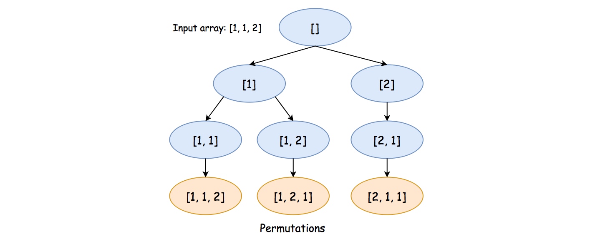
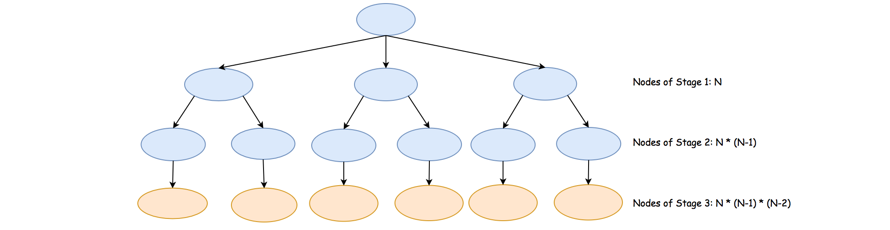

# LeetCode Medium 47. Permutations II solution
## Overview
As the name of the problem suggests, this problem is an extension of the [Permutation](https://leetcode.com/problems/permutations/) problem. The problem is different from the previous permutation problem on the condition that the input array can contain ***duplicates***.

The key to solve the problem is still the ***backtracking*** algorithm. However, we need some adaptation to ensure that the *enumerated* solutions generated from our backtracking exploration do not have any duplicates.

>As a reminder, [backtracking](https://leetcode.com/explore/learn/card/recursion-ii/472/backtracking/) is a general algorithm for finding all (or some) solutions to some problems with constraints. It incrementally builds candidates to the solutions, and abandons a candidate as soon as it determines that the candidate cannot possibly lead to a solution.

In this article, we will present a yet another backtracking solution to solve the problem.

## Approach 1: Backtracking with Groups of Numbers
### Intuition

First of all, let us review the general idea of permutation with an example.

Given the input array `[1, 1, 2]`, to generate a permutation of the array, we could follow the *Depth-First Search* (DFS) approach, or more precisely the backtracking technique as one will see later.

>The idea is that we pick the numbers one by one. For a permutation of length ***N***, we would then need ***N*** stages to generate a valid permutation. At each stage, we need to pick one number into the permutation, out of the remaining available numbers. Later at the same stage, we will try out all available choices. By trying out, we progressively build up candidates to the solution, and revert each choice with another alternative until there is no more choice.

Let us walk through the example with paper and pencil, as follows:

* Given the input of `[1, 1, 2]`, at the first stage, we have 2 choices to pick a number as the first number in the final permutation, *i.e.* `1` and `2`. Suppose that we pick the number `1`, now the remaining numbers would become `[1, 2]`. **Note:** The reason that we have only 2 choices instead of 3, is that there is a duplicate in the given input. Picking any of the duplicate numbers as the first number of the permutation would lead us to the same permutation at the end. Should the numbers in the array be all unique, we would then have the same number of choices as the length of the array.

* At the second stage, we now then have again 2 choices, *i.e.* `[1, 2]`. Let us pick again the number `1`, which leaves us the only remaining number `2`.

* Now at the third stage, we have only one candidate number left, *i.e.* [2]. We then pick the last remaining number, which leads to a final permutation sequence of `[1, 1, 2]`.

* Moreover, we need to ***revisit*** each of the above stages, and make a different choice in order to try out all possibilities. The reversion of the choices is what we call ***backtracking***.

We illustrate all potential exploration in the following graph where each node represents a choice at a specific stage:



>A key insight to avoid generating any ***redundant*** permutation is that at each step rather than viewing each number as a candidate, we consider each ***unique*** number as the true candidate. For instance, at the very beginning, given in the input of `[1, 1, 2]`, we have only two true candidates instead of three.

### Algorithm

Given the above insight, in order to find out all the unique numbers at each stage, we can build a ***hash table*** (denoted as `counter`), with each unique number as the key and its occurrence as the corresponding value.

To implement the algorithm, first we define a function called `backtrack(comb, counter)` which generates all permutations, starting from the current combination (`comb`) and the remaining numbers (`counter`).

Once the function is implemented, it suffices to invoke the function with the initial empty combination and the hash table we built out of the input array, to solve the problem.

Here are some sample implementations.

### Java
```java
class Solution {

    public List<List<Integer>> permuteUnique(int[] nums) {
        List<List<Integer>> results = new ArrayList<>();

        // count the occurrence of each number
        HashMap<Integer, Integer> counter = new HashMap<>();
        for (int num : nums) {
            if (!counter.containsKey(num))
                counter.put(num, 0);
            counter.put(num, counter.get(num) + 1);
        }

        LinkedList<Integer> comb = new LinkedList<>();
        this.backtrack(comb, nums.length, counter, results);
        return results;
    }

    protected void backtrack(
            LinkedList<Integer> comb,
            Integer N,
            HashMap<Integer, Integer> counter,
            List<List<Integer>> results) {

        if (comb.size() == N) {
            // make a deep copy of the resulting permutation,
            // since the permutation would be backtracked later.
            results.add(new ArrayList<Integer>(comb));
            return;
        }

        for (Map.Entry<Integer, Integer> entry : counter.entrySet()) {
            Integer num = entry.getKey();
            Integer count = entry.getValue();
            if (count == 0)
                continue;
            // add this number into the current combination
            comb.addLast(num);
            counter.put(num, count - 1);

            // continue the exploration
            backtrack(comb, N, counter, results);

            // revert the choice for the next exploration
            comb.removeLast();
            counter.put(num, count);
        }
    }
}
```

### Python3
```python
class Solution:
    def permuteUnique(self, nums: List[int]) -> List[List[int]]:
        results = []
        def backtrack(comb, counter):
            if len(comb) == len(nums):
                # make a deep copy of the resulting permutation,
                # since the permutation would be backtracked later.
                results.append(list(comb))
                return

            for num in counter:
                if counter[num] > 0:
                    # add this number into the current combination
                    comb.append(num)
                    counter[num] -= 1
                    # continue the exploration
                    backtrack(comb, counter)
                    # revert the choice for the next exploration
                    comb.pop()
                    counter[num] += 1

        backtrack([], Counter(nums))

        return results
```

**Note:** for a backtracking algorithm, usually there are some explorations that would lead to a *dead end*, and we have to abandon those explorations in the middle.

However, due to the specificity of this problem and our exploration strategy, each exploration will result in a valid permutation, *i.e.* none of the efforts is in vain. This insight would prove to be useful in the following complexity analysis.

### Complexity Analysis

Let ***N*** be the length of the input array. Hence, the number of permutations would be at maximum ***N!***, *i.e.* ***N⋅(N−1)⋅(N−2)...1***, when each number in the array is unique.

* Time Complexity: where ***O(∑<sub>k=1</sub><sup>N</sup>P(N,k))*** where ***P(N, k) = N!/(N - k)! = N (N - 1) ... (N - k + 1)*** is so-called *[k-permutations_of_N or partial permutation](https://en.wikipedia.org/wiki/Permutation#k-permutations_of_n)*.

    * As one can see in the exploration graph we have shown earlier, the execution of the backtracking algorithm will unfold itself as a tree, where each node is an invocation of the recursive function `backtrack(comb, counter)`. The total number of steps to complete the exploration is *exactly* the number of nodes in the tree. Therefore, the time complexity of the algorithm is linked directly with the size of the tree.

    * It now boils down to estimating the number of nodes in the tree. As we know now, each level of the tree corresponds to a specific stage of the exploration. At each stage, the number of candidates to explore is **bounded**. For instance, at the first stage, at most we would have ***N*** candidates to explore, i.e. the number of nodes at this level would be ***N***. Moving on to the next stage, for each of the nodes in the first stage, we would have ***N−1*** child nodes. Therefore, the number of nodes at this stage would be ***N⋅(N−1)***. So on and so forwards.

    * 

    * By summing up all the nodes across the stages, we would then obtain the total number of nodes as ***∑<sub>k=1</sub><sup>N</sup>P(N,k)*** where ***P(N, k) = N!/(N - k)! = N (N - 1) ... (N - k + 1)***. As a result, the exact time complexity of the algorithm is ***O(∑<sub>k=1</sub><sup>N</sup>P(N,k))***.

    * The above complexity might appear a bit too abstract to comprehend. Here we could provide another ***loose upper bound*** on the complexity.

    * It takes ***N*** steps to generate a single permutation. Since there are in total ***N!*** possible permutations, at most it would take us ***N⋅N!*** steps to generate all permutations, simply assuming that there is no overlapping effort (which is not true).

* Space Complexity: ***O(N)***

    * First of all, we build a hash table out of the input numbers. In the worst case where each number is unique, we would need ***O(N)*** space for the table.

    * Since we applied recursion in the algorithm which consumes some extra space in the function call stack, we would need another ***O(N)*** space for the recursion.

    * During the exploration, we keep a candidate of permutation along the way, which takes yet another ***O(N)***.

    * To sum up, the total space complexity would be ***O(N)+O(N)+O(N)=O(N)***.

    * Note, we did not take into account the space needed to hold the results. Otherwise, the space complexity would become ***O(N⋅N!)***.

## [C++] 4 different solutions with explanations and tips
### First solution
Starting with the simplest solution using `std::next_permutation`. This may not be acceptable in a 1:1 interview, but it's a good start. If you are doing a technical evaluation, this may be acceptable. Note that I'm sorting the elements as `std::next_permutation` returns `false` once it reaches the last lexicographically sorted permutation.
```c++
class Solution {
public:
    vector<vector<int>> permuteUnique(vector<int>& nums) {
        sort(begin(nums), end(nums));
		
        vector<vector<int>> output;
        output.emplace_back(nums);
        while (next_permutation(begin(nums), end(nums))) {
            output.emplace_back(nums);
        }
        return output;
    }
};
```

### Second Solution
In the previous solution, I used `std::sort` which increases the time complexity, but it's not entirely necessary. We could simply record the initial state of the array and keep generating the next permutation until we completed a cycle. To provide an acceptable solution for this approach, I implemented `next_permutation` myself. The great thing about this solution is that it solves 3 different problems: [Permutations I](https://leetcode.com/problems/permutations/), [Permutation II](https://leetcode.com/problems/permutations-ii/), and [Next Permutation](https://leetcode.com/problems/next-permutation/) problem so it's worth practicing it.
```c++
class Solution {
public:
    vector<vector<int>> permuteUnique(vector<int>& nums) {
        vector<int> initial_state(nums);
        vector<vector<int>> output;
        do {
            output.emplace_back(nums);
            nextPermutation(nums);
        } while (nums != initial_state);
        return output;
    }
private:
    void nextPermutation(vector<int>& nums) {
        if (size(nums) <= 1) return;
        auto pos = 0;
        for (int i = size(nums) - 2; i >= 0; --i) {
            if (nums[i] < nums[i + 1]) {
                pos = i;
                break;
            }
        }
        for (int i = size(nums) - 1; i >= pos; --i) {
            if (nums[pos] < nums[i]) {
                swap(nums[i], nums[pos]);
                ++pos;
                break;
            }
        }
        reverse(begin(nums) + pos, end(nums));
    }
};
```

### Third Solution
My intuition to solving this problem was using a similar solution to the [Permutations problem](https://leetcode.com/problems/permutations/) but skipping iterations for duplicate numbers. In order to do that I had to sort the array first. That approach on its own wasn't enough. Swapping numbers twice proved to be challenging. To prevent duplicates, I ended up removing the second swap and passing the array by value.
```c++
class Solution {
public:
    vector<vector<int>> permuteUnique(vector<int>& nums) {
        vector<vector<int>> output;
        sort(begin(nums), end(nums));
        generatePermutations(nums, output, 0);
        return output;
    }
private:
    void generatePermutations(vector<int> nums, vector<vector<int>>& output, int idx) {
        if (idx == size(nums)) {
            output.emplace_back(nums);
        }
        for (int i = idx; i < size(nums); ++i) {
            if (i != idx && nums[i] == nums[idx]) continue;
            swap(nums[i], nums[idx]);
            generatePermutations(nums, output, idx + 1);
        }
    }
};
```

### Fourth solution
Backtracking using a hash table. This is the same solution you'd find in the `Solution` tab. The key insight here is that by iterating through unique numbers, we can avoid duplication. If you practice the [Permutations problem](https://leetcode.com/problems/permutations/) first, identifying this solution might be challenging, but it's easy enough to understand when you consider it on its own.
```cpp
class Solution {
public:
    vector<vector<int>> permuteUnique(vector<int>& nums) {
        vector<vector<int>> output;
        vector<int> curr;
        unordered_map<int, int> counter;
        for (auto x : nums) ++counter[x];
        generatePermutations(counter, curr, output, size(nums));
        return output;
    }
private:
    void generatePermutations(unordered_map<int, int>& counter, vector<int>& curr, vector<vector<int>>& output, int n) {
        if (size(curr) == n) {
            output.emplace_back(curr);
            return;
        }
        for (auto [key, value] : counter) {
            if (value == 0) continue;
            curr.emplace_back(key); --counter[key];
            generatePermutations(counter, curr, output, n);
            curr.pop_back(); ++counter[key];
        }
    }
};
```
[Link to original post](https://leetcode.com/problems/permutations-ii/discuss/933190/C%2B%2B-4-different-solutions-with-explanations-and-tips)

## [Python] simple dfs/backtracking explained
Another classical backtracking problem. Let us try to built our sequence element by element, inserting new element in different places. Imagine, that we have `[1,3,1,2]`. Then our building process will look like:

1. `[1]` on the first step we have not choice, so here we have only one option.
2. Now, we need to insert next element somewhere, and we have two options: before and after, so we have `[1,3]` and `[3,1]` options here.
3. Now we need to insert new element `1`. The problem here is that when we insert it, we can have repeating answers, so the rule is: insert in only before the already existing occurrences of this element. So, in `[1,3]` we can only insert it before `1` and get `[1,1,3]` and in `[3,1]` we have two places to insert and we have `[1,3,1]` and `[3,1,1]`.
4. Finally, we want to insert `2` to the each of existing answers, and we have: `[2,1,1,3]`, `[1,2,1,3]`, `[1,1,2,3]`, `[1,1,3,2]`, `[2,1,3,1]`, `[1,2,3,1]`, `[1,3,2,1]`, `[1,3,1,2]`, `[2,3,1,1]`, `[3,2,1,1]`, `[3,1,2,1]`, `[3,1,1,2]`

**Complexity:** Time complexity is `O(Q n)`, where `Q` is number of desired permutations and `n` is length of `nums`, because every time we build our sequence we write it in our final answer, that is there will be no dead-ends. `Q` can be evaluated, using multinomial coefficients https://en.wikipedia.org/wiki/Multinomial_theorem. Space complexity is the same.
```python
class Solution:
    def permuteUnique(self, nums):
        def dfs(ind, built):
            if ind == len(nums):
                ans.append(built)
                return

            stop = built.index(nums[ind]) if nums[ind] in built else ind
            
            for i in range(stop+1):
                dfs(ind+1, built[:i]+[nums[ind]]+built[i:])

        ans = []
        dfs(0, [])  
        return ans
```
[Link to original post](https://leetcode.com/problems/permutations-ii/discuss/932924/Python-simple-dfsbacktracking-explained)