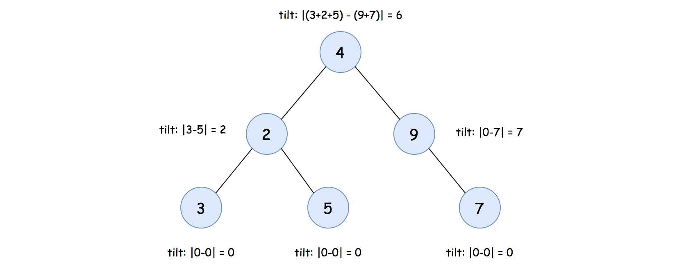

# LeetCode Easy 563. Binary Tree Tilt Solution
## Overview
First of all, let us clarify the concept of ***tilt*** for a given node in a tree.

In order to calculate the tilt value for a node, we need to know the sum of nodes in its left and right subtrees respectively.

Assume that we have a function `valueSum(node)` which gives the sum of all nodes, starting from the input node, then the sum of the node's left subtree would be `valueSum(node.left)`. Similarly, the sum of its right subtree would be `valueSum(node.right)`.

With the above functions, we can then define the tilt value of a node as follows: ***tilt(node)=∣valueSum(node.left)−valueSum(node.right)∣***

Given the above formula, we show an example on how the tilt value of each node looks like, in the following graph:



*Note: when a subtree is empty, its value sum is zero*. As a result, the tilt value for a leaf node would be zero, since both the left and right subtree of a leaf node are empty.

## Approach 1: Post-Order DFS Traversal
### Intuition

>The overall idea is that we *traverse* each node, and calculate the *tilt* value for each node. At the end, we sum up all the tilt values, which is the desired result of the problem.

There are in general two strategies to traverse a tree data structure, namely [Breadth-First Search](https://leetcode.com/explore/learn/card/queue-stack/231/practical-application-queue/) (***BFS***) and [Depth-First Search](https://leetcode.com/explore/learn/card/queue-stack/232/practical-application-stack/) (***DFS***).

Concerning the DFS strategy, it can further be divided into three categories: *Pre-Order*, *In-Order* and *Post-Order*, depending on the relative order of visit among the node and its children nodes.

Sometimes, both strategies could work for a specific problem. In other cases, one of them might be more adapted to the problem. In our case here, the *DFS* is a more optimized choice, as one will see later. More specifically, we could apply the ***Post-Order DFS*** traversal here.

### Algorithm

As we discussed before, in order to calculate the tilt value for a node, we need to calculate the sum of its left and right subtrees respectively.

Let us first implement the function `valueSum(node)` which returns the sum of values for all nodes starting from the given `node`, which can be summarized with the following recursive formula:

**valueSum(node)=node.val+valueSum(node.left)+valueSum(node.right)**

Furthermore, the tilt value of a node also depends on the value sum of its left and right subtrees, as follows:

**tilt(node)=∣valueSum(node.left)−valueSum(node.right)∣**
 
Intuitively, we could combine the above calculations within a single recursive function. In this way, we only need to traverse each node once and only once.

>More specifically, we will traverse the tree in the **post-order DFS**, *i.e.* we visit a node's left and right subtrees before processing the value of the current node.

Here are some sample implementations.

### Java
```java
class Solution {
    private int totalTilt = 0;

    protected int valueSum(TreeNode node) {
        if (node == null)
            return 0;

        int leftSum = this.valueSum(node.left);
        int rightSum = this.valueSum(node.right);
        int tilt = Math.abs(leftSum - rightSum);
        this.totalTilt += tilt;

        // return the sum of values starting from this node.
        return node.val + leftSum + rightSum;
    }

    public int findTilt(TreeNode root) {
        this.totalTilt = 0;
        this.valueSum(root);
        return this.totalTilt;
    }
}
```

### Python3
```python
class Solution:
    def findTilt(self, root: TreeNode) -> int:
        total_tilt = 0

        def valueSum(node):
            nonlocal total_tilt

            if not node:
                return 0

            left_sum = valueSum(node.left)
            right_sum = valueSum(node.right)
            tilt = abs(left_sum - right_sum)
            total_tilt += tilt

            return left_sum + right_sum + node.val

        valueSum(root)

        return total_tilt
```

### Complexity Analysis

Let ***N*** be the number of nodes in the input tree.

* Time Complexity: ***O(N)***

    * We traverse each node once and only once. During the traversal, we calculate the tilt value for each node.

* Space Complexity: ***O(N)***

    * Although the variables that we used in the algorithm are of constant-size, we applied recursion in the algorithm which incurs additional memory consumption in function call stack.

    * In the worst case where the tree is not well balanced, the recursion could pile up ***N*** times. As a result, the space complexity of the algorithm is ***O(N)***.