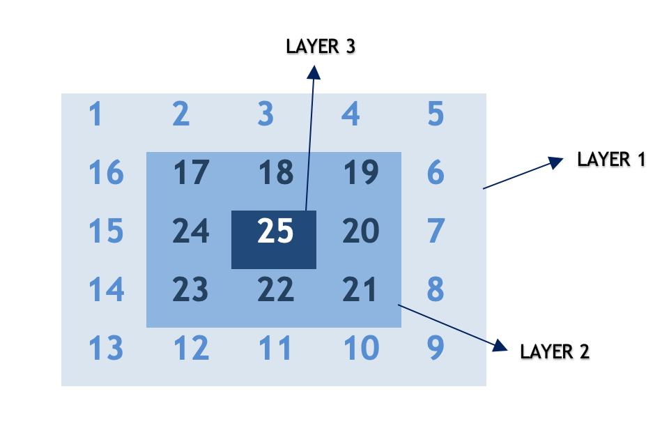
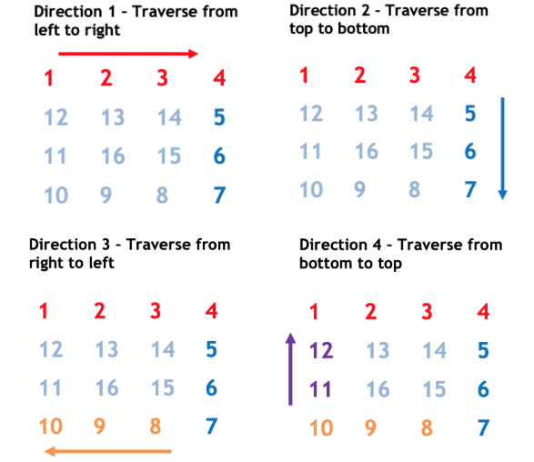
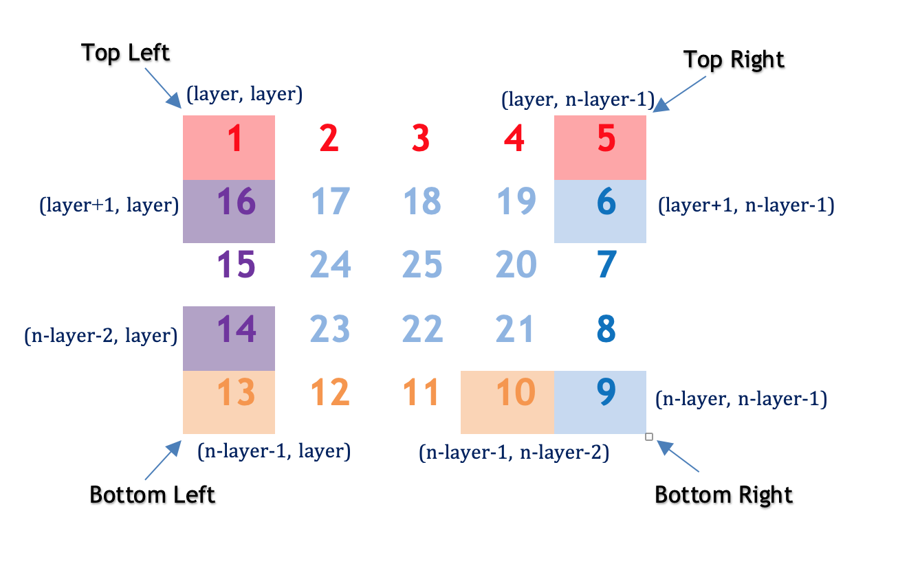

# LeetCode Medium 59. Spiral Matrix II
## Overview
There are various problems in spiral matrix series with some variations like [Spiral Matrix](https://leetcode.com/problems/spiral-matrix/) and [Spiral Matrix III](https://leetcode.com/problems/spiral-matrix-iii/).

In order to solve such questions, the core idea is to decode the underlying pattern. This can be done by simulating the pattern and finding a generic representation that would work for any given `n`. Let's discuss a few approaches.

## Approach 1: Traverse Layer by Layer in Spiral Form
### Intuition

If we try to build a pattern for a given `n`, we observe that the pattern repeats after completing one circular traversal around the matrix. Let's call this one circular traversal as *layer*. We start traversing from the outer layer and move towards inner layers on every iteration.



### Algorithm

Let's devise an algorithm for the spiral traversal:

* We can observe that, for any given `n`, the total number of layers is given by : `⌊(n+1)/2⌋` This works for both even and odd `n`.

*Example*

For `n = 3`, `layers = 2`

For `n = 6`, total `layers = 3`

* Also, for each layer, we traverse in *at most* 4 directions :



In every direction, either row or column remains constant and other parameter changes (increments/decrements).

*Direction 1: From top left corner to top right corner.*

The row remains constant as `layer` and column increments from `layer` to `n-layer-1`

*Direction 2: From top right corner to the bottom right corner.*

The column remains constant as `n-layer-1` and row increments from `layer+1` to `n−layer`.

*Direction 3: From bottom right corner to bottom left corner.*

The row remains constant as `n−layer−1` and column decrements from `n−layer−2` to `layer`.

*Direction 4: From bottom right corner to top left corner.*

The column remains constant as `layer` and column decrements from `n−layer−2` to `layer+1`.

This process repeats `(n+1)/2` times until all layers are traversed.



### C++
```c++
class Solution {
public:

    vector<vector<int>> generateMatrix(int n) {

        vector<vector<int>> result (n, vector<int>(n));
        int cnt = 1;
        for (int layer = 0; layer < (n + 1) / 2; layer++) {
            // direction 1 - traverse from left to right
            for (int ptr = layer; ptr < n - layer; ptr++) {
                result[layer][ptr] = cnt++;
            }
            // direction 2 - traverse from top to bottom
            for (int ptr = layer + 1; ptr < n - layer; ptr++) {
                result[ptr][n - layer - 1] = cnt++;
            }
            // direction 3 - traverse from right to left
            for (int ptr = n - layer - 2; ptr >= layer; ptr--) {
                result[n - layer - 1][ptr] = cnt++;
            }
            // direction 4 - traverse from bottom to top
            for (int ptr = n - layer - 2; ptr > layer; ptr--) {
                result[ptr][layer] = cnt++;
            }
        }

        return result;
    }
};
```

### Java
```java
class Solution {
    public int[][] generateMatrix(int n) {
        int[][] result = new int[n][n];
        int cnt = 1;
        for (int layer = 0; layer < (n + 1) / 2; layer++) {
            // direction 1 - traverse from left to right
            for (int ptr = layer; ptr < n - layer; ptr++) {
                result[layer][ptr] = cnt++;
            }
            // direction 2 - traverse from top to bottom
            for (int ptr = layer + 1; ptr < n - layer; ptr++) {
                result[ptr][n - layer - 1] = cnt++;
            }
            // direction 3 - traverse from right to left
            for (int ptr = layer + 1; ptr < n - layer; ptr++) {
                result[n - layer - 1][n - ptr - 1] = cnt++;
            }
            // direction 4 - traverse from bottom to top
            for (int ptr = layer + 1; ptr < n - layer - 1; ptr++) {
                result[n - ptr - 1][layer] = cnt++;
            }
        }
        return result;
    }
}
```

### Complexity Analysis

* Time Complexity: `O(n^2)`. Here, `n` is given input and we are iterating over `n⋅n` matrix in spiral form.
* Space Complexity: `O(1)` We use constant extra space for storing `cnt`.

## Approach 2: Optimized spiral traversal
### Intuition

Our main aim is to walk in a spiral form and fill the array in a particular pattern. In the previous approach, we used a separate loop for each direction. Here, we discuss another optimized to achieve the same result.

### Algorithm

* We have to walk in 4 directions forming a layer. We use an array `dir` that stores the changes in `x` and `y` co-ordinates in each direction.

*Example*

In left to right walk ( *direction #1* ), `x` co-ordinates remains same and `y` increments (`x = 0`, `y = 1`).

In right to left walk ( *direction #3* ), `x` remains same and `y` decrements (`x = 0`, `y = -1`).

Using this intuition, we pre-define an array `dir` having `x` and `y` co-ordinate changes for each direction. There are a total of 4 directions as discussed in the previous approach.

* The `row` and `col` variables represent the current `x` and `y` co-ordinates respectively. It updates based on the direction in which we are moving.

*How do we know when we have to change the direction?*

When we find the next row or column in a particular direction has a non-zero value, we are sure it is already traversed and we change the direction.

Let `d` be the current direction index. We go to next direction in array dirdir using `(d+1)%4`. Using this we could go back to direction 1 after completing one circular traversal from direction 1 to direction 4 .

>It must be noted that we use `floorMod` in Java instead of modulo `%` to handle mod of negative numbers. This is required because row and column values might go negative and using `%` won't give desired results in such cases.

### C++
```c++
class Solution {
public:

    int floorMod(int x, int y) {
        return ((x % y) + y) % y;
    }

    vector<vector<int>> generateMatrix(int n) {
        vector<vector<int>> result (n, vector<int>(n));
        int cnt = 1;
        int dir[4][2] = {{0, 1}, {1, 0}, {0, -1}, {-1, 0}};
       int d = 0;
        int row = 0;
        int col = 0;
        while (cnt <= n * n) {
            result[row][col] = cnt++;
            int r = floorMod(row + dir[d][0], n);
            int c = floorMod(col + dir[d][1], n);
            // change direction if next cell is non zero
            if (result[r][c] != 0) d = (d + 1) % 4;
            row += dir[d][0];
            col += dir[d][1];
        }
        return result;
    }
};
```
### Java
```java
class Solution {
    public int[][] generateMatrix(int n) {
        int[][] result = new int[n][n];
        int cnt = 1;
        int dir[][] = {{0, 1}, {1, 0}, {0, -1}, {-1, 0}};
        int d = 0;
        int row = 0;
        int col = 0;
        while (cnt <= n * n) {
            result[row][col] = cnt++;
            int r = Math.floorMod(row + dir[d][0], n);
            int c = Math.floorMod(col + dir[d][1], n);

            // change direction if next cell is non zero
            if (result[r][c] != 0) d = (d + 1) % 4;

            row += dir[d][0];
            col += dir[d][1];
        }
        return result;
    }
}
```


### Complexity Analysis

* Time Complexity: ***O(n^2)***. Here, `n` is given input and we are iterating over `n⋅n` matrix in spiral form.
Space Complexity: ***O(1)*** We use constant extra space for storing `cnt`.