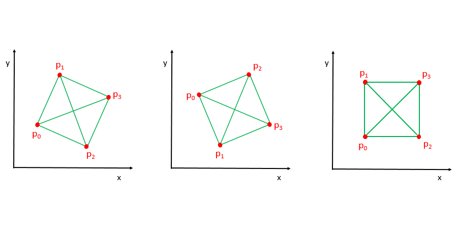
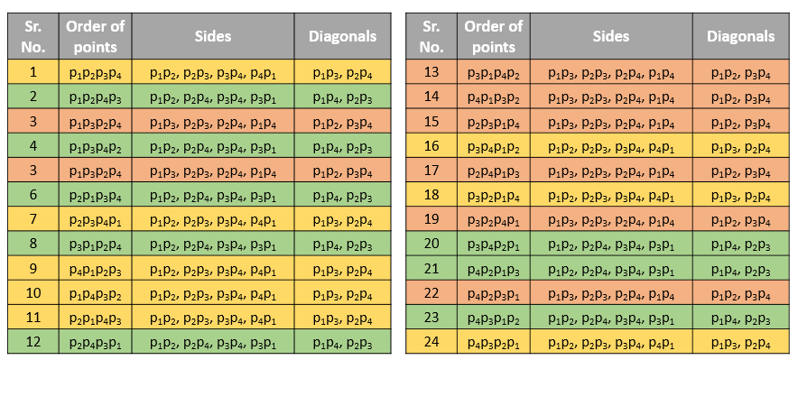

# LeetCode Medium 593. Valid Square Solution
## Approach #1 Brute Force [Accepted]
The idea behind determining whether 4 given set of points constitute a valid square or not is really simple. Firstly, we need to determine if the sides of the qaudrilateral formed by these 4 points are equal. But checking only this won't suffice. Since, this condition will be satisfied even in the case of a rhombus, where all the four sides are equal but the adjacent sides aren't perpendicular to each other. Thus, we also need to check if the lengths of the diagonals formed between the corners of the quadrilateral are equal. If both the conditions are satisfied, then only the given set of points can be deemed appropriate for constituting a square.

Now, the problem arises in determining which pairs of points act as the adjacent points on the square boundary. So, the simplest method is to consider every possible case. For the given 4 points, [*p_0, p_1, p_2, p_3*], there are a total of 4! ways in which these points can be arranged to be considered as the square's boundaries. We can generate every possible permutation and check if any permutation leads to the valid square arrangement of points.

## General Idea
Four points construct a valid sqare iff the distance between each two points give exactly two distinct values (which are sqare side and diagonal) and none of these values equals 0

### Java
```java
public class Solution {
    public double dist(int[] p1, int[] p2) {
        return (p2[1] - p1[1]) * (p2[1] - p1[1]) + (p2[0] - p1[0]) * (p2[0] - p1[0]);
    }
    public boolean check(int[] p1, int[] p2, int[] p3, int[] p4) {
        return dist(p1,p2) > 0 && dist(p1, p2) == dist(p2, p3) && dist(p2, p3) == dist(p3, p4) && dist(p3, p4) == dist(p4, p1) && dist(p1, p3) == dist(p2, p4);
    }
    public boolean validSquare(int[] p1, int[] p2, int[] p3, int[] p4) {
        int[][] p = {p1,p2,p3,p4};
        return checkAllPermutations(p, 0);
    }
    boolean checkAllPermutations(int[][] p, int l) {
        if (l == 4) {
            return check(p[0], p[1], p[2], p[3]);
        } else {
            boolean res = false;
            for (int i = l; i < 4; i++) {
                swap(p, l, i);
                res |= checkAllPermutations(p, l + 1);
                swap(p, l, i);
            }
            return res;
        }
    }
    public void swap(int[][] p, int x, int y) {
        int[] temp = p[x];
        p[x] = p[y];
        p[y] = temp;
    }
}
```

### Complexity Analysis

* Time complexity : ***O(1)***. Constant number of permutations(***4!***) are generated.

* Space complexity : ***O(1)***. Constant space is required.

## Approach #2 Using Sorting [Accepted]
Instead of considering all the permutations of arrangements possible, we can make use of maths to simplify this problem a bit. If we sort the given set of points based on their x-coordinate values, and in the case of a tie, based on their y-coordinate value, we can obtain an arrangement, which directly reflects the arrangement of points on a valid square boundary possible.

Consider the only possible cases as shown in the figure below:



In each case, after sorting, we obtain the following conclusion regarding the connections of the points:

1. *p<sub>0</sub>p<sub>1</sub>, p<sub>1</sub>p<sub>3</sub>, p<sub>3</sub>p<sub>2</sub>* and *p<sub>2</sub>p<sub>0</sub>* form the four sides of any valid square.

2. *p<sub>0</sub>p<sub>3</sub>* and *p<sub>1</sub>p<sub>2</sub>* form the diagonals of the square.

Thus, once the sorting of the points is done, based on the above knowledge, we can directly compare *p<sub>0</sub>p<sub>1</sub>, p<sub>1</sub>p<sub>3</sub>, p<sub>3</sub>p<sub>2</sub>* and *p<sub>2</sub>p<sub>0</sub>* for equality of lengths(corresponding to the sides); and *p<sub>0</sub>p<sub>3</sub>* and *p<sub>1</sub>p<sub>2</sub>* for equality of lengths(corresponding to the diagonals).

###  Java
```java
public class Solution {
    public double dist(int[] p1, int[] p2) {
        return (p2[1] - p1[1]) * (p2[1] - p1[1]) + (p2[0] - p1[0]) * (p2[0] - p1[0]);
    }
    public boolean validSquare(int[] p1, int[] p2, int[] p3, int[] p4) {
        int[][] p={p1,p2,p3,p4};
        Arrays.sort(p, (l1, l2) -> l2[0] == l1[0] ? l1[1] - l2[1] : l1[0] - l2[0]);
        return dist(p[0], p[1]) != 0 && dist(p[0], p[1]) == dist(p[1], p[3]) && dist(p[1], p[3]) == dist(p[3], p[2]) && dist(p[3], p[2]) == dist(p[2], p[0])   && dist(p[0],p[3])==dist(p[1],p[2]);
    }
}
```

### Complexity Analysis

* Time complexity : ***O(1)***. Sorting 4 points takes constant time.

* Space complexity : ***O(1)***. Constant space is required.

## Approach #3 Checking every case [Accepted]
### Algorithm

If we consider all the permutations descripting the arrangement of points as in the brute force approach, we can come up with the following set of 24 arrangements:



In this figure, the rows with the same shaded color indicate that the corresponding arrangements lead to the same set of edges and diagonals. Thus, we can see that only three unique cases exist. Thus, instead of generating all the 24 permutations, we check for the equality of edges and diagonals for only the three distinct cases.

### Java
```java
public class Solution {
    public double dist(int[] p1, int[] p2) {
        return (p2[1] - p1[1]) * (p2[1] - p1[1]) + (p2[0] - p1[0]) * (p2[0] - p1[0]);
    }
    public boolean check(int[] p1, int[] p2, int[] p3, int[] p4) {
        return dist(p1,p2) > 0 && dist(p1, p2) == dist(p2, p3) && dist(p2, p3) == dist(p3, p4) && dist(p3, p4) == dist(p4, p1) && dist(p1, p3) == dist(p2, p4);
    }
    public boolean validSquare(int[] p1, int[] p2, int[] p3, int[] p4) {
        return check(p1, p2, p3, p4) || check(p1, p3, p2, p4) || check(p1, p2, p4, p3);
    }
}
```

### Complexity Analysis

* Time complexity : ***O(1)***. A fixed number of comparisons are done.

* Space complexity : ***O(1)***. No extra space required.

## Approach #1

```c#
public class Solution
{
	public bool ValidSquare(int[] p1, int[] p2, int[] p3, int[] p4)
	{
		HashSet<int> distinct = new HashSet<int>();
		distinct.Add(Dist(p1, p2));
		distinct.Add(Dist(p1, p3));
		distinct.Add(Dist(p1, p4));
		distinct.Add(Dist(p2, p3));
		distinct.Add(Dist(p2, p4));
		distinct.Add(Dist(p3, p4));

		return distinct.Count == 2 && !distinct.Contains(0);
	}

	//not using Math.Pow to avoid double cast
	private int Dist(int[] p1, int[] p2) => (p1[0]-p2[0])*(p1[0]-p2[0]) + (p1[1]-p2[1])*(p1[1]-p2[1]);
}
```

## Approach #2 - without HashSet
HashSet<int> could be additional performance cost in case of such simple calculations, so we can replace it with a simple array as follows:

```c#
public class Solution
{
    public bool ValidSquare(int[] p1, int[] p2, int[] p3, int[] p4)
    {
        Check(Dist(p1, p2));
        Check(Dist(p1, p3));
        Check(Dist(p1, p4));
        Check(Dist(p2, p3));
        Check(Dist(p2, p4));
        Check(Dist(p3, p4));

        return last == 2 && arr[0] != 0 && arr[1] != 0;
    }

    private int Dist(int[] p1, int[] p2) => (p1[0] - p2[0]) * (p1[0] - p2[0]) + (p1[1] - p2[1]) * (p1[1] - p2[1]);

    int last=0;
    int[] arr = new int[6];
    private void Check(int val)
    {
        for(int i=0; i<last; i++)
            if(arr[i] == val)
                return;
        arr[last++] = val;
    }
}
```

[Link to original post](https://leetcode.com/problems/valid-square/discuss/931750/C-simple-to-understand-that-beats-95)