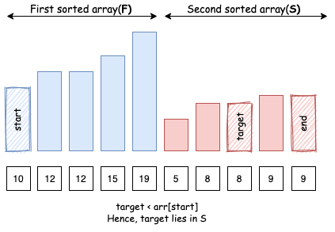
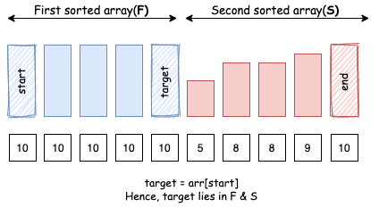
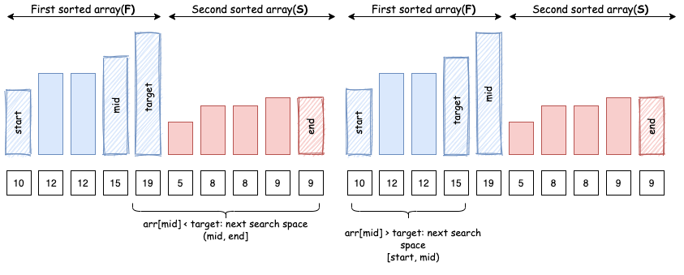
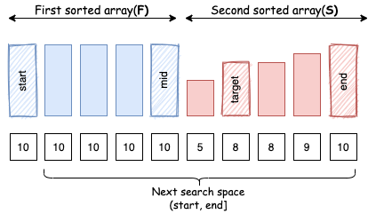

# LeetCode Medium 81. Search in Rotated Sorted Array II Solution
## Approach 1: Binary Search
This problem is an extension to [33. Search in Rotated Sorted Array](https://leetcode.com/problems/search-in-rotated-sorted-array/). The only difference is that this problem allows duplicate elements.

### Intuition

Recall that after rotating a sorted array, what we get is two sorted arrays appended to each other.


Let's refer to the first sorted array as `F` and second as `S`.


Also, we can observe that all the elements of the second array `S` will be smaller or equal to the first element `start` of `F`.


With this observation in mind, we can easily tell which of the 2 arrays (`F` or `S`) does a `target` element lie in by just comparing it with the first element of the array.

Let's say we are looking for element `target` in array `arr`:

* Case 1: If `target > arr[start]`: `target` exists in the first array `F`.


* Case 2: If `target < arr[start]`: `target` exists in the second array `S`.



* Case 3: If `target == arr[start]`: `target` obviously exists in the first array `F`, but it might also be present in the second array `S`.




Let's define a helper function that tells us which array a target element might be present in:

### C++
```c++
// returns true if element exists in first array, false if it exists in second
bool existsInFirst(vector<int>& nums, int start, int element) {
    return nums[start] <= element;
}
```

### Java
```java
// returns true if element `target` exists in the first sorted array.
private boolean existsInFirst(int[] arr, int start, int element) {
    return arr[start] <= element;
}
```

### Algorithm

Recall that in standard binary search, we keep two pointers (i.e. `start` and `end`) to track the search scope in an `arr` array. We then divide the search space in three parts `[start, mid)`, `[mid, mid]`, `(mid, end]`. Now, we continue to look for our `target` element in one of these search spaces.

By identifying the positions of both `arr[mid]` and `target` in `F` and `S`, we can reduce search space in the very same way as in standard binary search:

* Case 1: `arr[mid]` lies in `F`, `target` lies in `S`: Since `S` starts after `F` ends, we know that element lies here:`(mid, end]`.


* Case 2: `arr[mid]` lies in the `S`, `target` lies in `F`: Similarly, we know that element lies here: `[start, mid)`.


* Case 3: Both `arr[mid]` and `target` lie in `F`: since both of them are in same sorted array, we can compare `arr[mid]` and `target` in order to decide how to reduce search space.



* Case 4: Both `arr[mid]` and `target` lie in `S`: Again, since both of them are in same sorted array, we can compare `arr[mid]` and `target` in order to decide how to reduce search space.


But there is a catch, if `arr[mid]` equals `arr[start]`, then we know that `arr[mid]` might belong to both `F` and `S` and hence we cannot find the relative position of `target` from it.



### C++
```c++
// returns true if we can reduce the search space in current binary search space
bool isBinarySearchHelpful(vector<int>& nums, int start, int element) {
    return nums[start] != element;
}
```

### Java
```java
// returns true if we can reduce the search space in current binary search space
private boolean isBinarySearchHelpful(int[] arr, int left, int element) {
    return arr[left] != element;
}
```

In this case, we have no option but to move to next search space iteratively. Hence, there are certain search spaces that allow a binary search, and some search spaces that don't.

### C++
```c++
class Solution {
public:
    bool search(vector<int>& nums, int target) {
        int n = nums.size();
        if (n == 0) return false;
        int end = n - 1;
        int start = 0;

        while (start <= end) {
            int mid = start + (end - start) / 2;

            if (nums[mid] == target) {
                return true;
            }
            
            if (!isBinarySearchHelpful(nums, start, nums[mid])) {
                start++;
                continue;
            }
            
            // which array does pivot belong to.
            bool pivotArray = existsInFirst(nums, start, nums[mid]);

            // which array does target belong to.
            bool targetArray = existsInFirst(nums, start, target);
            if (pivotArray ^ targetArray) { // If pivot and target exist in different sorted arrays, recall that xor is true only when both the operands are distinct
                if (pivotArray) {
                    start = mid + 1; // pivot in the first, target in the second
                } else {
                    end = mid - 1; // target in the first, pivot in the second
                }
            } else { // If pivot and target exist in same sorted array
                if (nums[mid] < target) {
                    start = mid + 1;
                } else {
                    end = mid - 1;
                }
            }
        }
        return false;
    }
    
    // returns true if we can reduce the search space in current binary search space
    bool isBinarySearchHelpful(vector<int>& nums, int start, int element) {
        return nums[start] != element;
    }

    // returns true if element exists in first array, false if it exists in second
    bool existsInFirst(vector<int>& nums, int start, int element) {
        return nums[start] <= element;
    }
};
```

### Java
```java
class Solution {
    public boolean search(int[] nums, int target) {
        int n = nums.length;
        if (n == 0) return false;
        int end = n - 1;
        int start = 0;

        while (start <= end) {
            int mid = start + (end - start) / 2;

            if (nums[mid] == target) {
                return true;
            }
				
            if (!isBinarySearchHelpful(nums, start, nums[mid])) {
                start++;
                continue;
            }
            // which array does pivot belong to.
            boolean pivotArray = existsInFirst(nums, start, nums[mid]);

            // which array does target belong to.
            boolean targetArray = existsInFirst(nums, start, target);
            if (pivotArray ^ targetArray) { // If pivot and target exist in different sorted arrays, recall that xor is true when both operands are distinct
                if (pivotArray) {
                    start = mid + 1; // pivot in the first, target in the second
                } else {
                    end = mid - 1; // target in the first, pivot in the second
                }
            } else { // If pivot and target exist in same sorted array
                if (nums[mid] < target) {
                    start = mid + 1;
                } else {
                    end = mid - 1;
                }
            }
        }
        return false;
    }

    // returns true if we can reduce the search space in current binary search space
    private boolean isBinarySearchHelpful(int[] arr, int start, int element) {
        return arr[start] != element;
    }

    // returns true if element exists in first array, false if it exists in second
    private boolean existsInFirst(int[] arr, int start, int element) {
        return arr[start] <= element;
    }
}
```

### Complexity Analysis

* Time complexity : ***O(N)*** worst case, ***O(logN)*** best case, where ***N*** is the length of the input array.

Worst case: This happens when all the elements are the same and we search for some different element. At each step, we will only be able to reduce the search space by 1 since `arr[mid]` equals `arr[start]` and it's not possible to decide the relative position of `target` from `arr[mid]`. Example: [1, 1, 1, 1, 1, 1, 1], target = 2.

Best case: This happens when all the elements are distinct. At each step, we will be able to divide our search space into half just like a normal binary search.

1. This also answers the following follow-up question:

Would this (having duplicate elements) affect the run-time complexity? How and why?
As we can see, by having duplicate elements in the array, we often miss the opportunity to apply binary search in certain search spaces. Hence, we get ***O(N)*** worst case (with duplicates) vs ***O(logN)*** best case complexity (without duplicates).

* Space complexity : ***O(1)***.


## [Python] Binary search + dfs, explained with diagram

The idea here is to use both binary search and dfs: each time we compare `nums[mid]` and `nums[end]` and we can have several options:

1. `nums[mid] > nums[end]`, for example data can look like `3,4,5,6,7,1,2`. Then we need to check conditions:
a. If `nums[end] < target <= nums[mid]`, then it means, that we need to look in the left half of our data: see region `1` on the left image.
b. Else means, that we need to look in the right half of data.
2. `nums[mid] < nums[end]`, for example data can look like `6,7,1,2,3,4,5`. Then we need to check conditions:
a. `if nums[mid] < target <= nums[end]`, then it means, that we need to look in the right half of our data: see region `1` on the right image.
b. Else means, that we need to look in the left half of data.
3. In this problem it can happen, that `nums[mid] == nums[end]`, and in this case we do not know where to find our number, so we just look for it in both halves.

**Complexity:** if we do not have any duplicates, it is for sure `O(log n)`. If we have any, it can be potentially `O(n)` for cases like `111111111111121111`: where we do not know the place of `2` and we basically need to traverse all elements to find it.


```python
class Solution:
    def search(self, nums, target):
        def dfs(beg, end):
            if end - beg <= 1: return target in nums[beg: end+1]
            
            mid = (beg + end)//2
            if nums[mid] > nums[end]:   # eg. 3,4,5,6,7,1,2
                if nums[end] < target <= nums[mid]:
                    return dfs(beg, mid)
                else:
                    return dfs(mid + 1, end)
            elif nums[mid] < nums[end]: # eg. 6,7,1,2,3,4,5
                if nums[mid] < target <= nums[end]:
                    return dfs(mid + 1, end)
                else:
                    return dfs(beg, mid)
            else:
                return dfs(mid+1, end) or dfs(beg, mid)
    
        return dfs(0, len(nums)-1)
```

[Link to original post](https://leetcode.com/problems/search-in-rotated-sorted-array-ii/discuss/942575/Python-Binary-search-%2B-dfs-explained-with-diagram)

## Python [just return nums in target]
When duplicates are present in the array, there will be cases where we cannot decide which way to go.

`111111111111111111111121111111111111111111`
Say you land in a mid point where you get a `1`.

Where are you?

`11111111111111x111111121111111111111111111`
Maybe you are here.

`111111111111111111111211111111111111x11111`
Or here.

As marked by `x`. You cannot know in advance. So in this worst case the runtime will be `O(N)`. This is kinda the whole point of the question.

The condition when this might happen is when `nums[0]==nums[-1]`. You will be fine otherwise. You can filter this out via
`if nums[0]==nums[-1]: return x in nums`. But at that point I'm not motivated enough the code the rest of it. So just return `target in nums` will be my to-go solution with this one.

**Edit:** But just for the sake of good conscience, sth like this

```python
class Solution:
    def search(self, A, t):
        if not A: return False #Leetcode favorite
        if len(A)==1: return A[0]==t #Avoid length 1
        if A[0]==t or A[-1]==t: return True #Don't bother if end points contain t
        if A[0]==A[-1]: return t in A #Makes worst case O(N)
        
		#Use binary search to find offset point
		#The target will either be in A[start:finish] or absent
		#O(log N)
        if A[0]<A[-1]: #no offset in the array
            start, finish = 0, len(A)-1
        else: #there is offset in the array
            left, right = 0, len(A)-1
            while left<right-1:
                mid = (left+right)>>1
                if A[mid]>=A[0]:
                    left = mid
                else:
                    right = mid
            if A[right]<A[left]: left=right
            start, finish = (0, left-1) if A[0]<t else (left, len(A)-1)
        
		#Now you know the range to search for, just apply binary search again
		#O(log N)
        while start<finish-1:
            mid = (start+finish)>>1
            if A[mid]<t:
                start = mid
            else:
                finish = mid
        return A[start]==t or A[finish]==t
```
[Link to original post](https://leetcode.com/problems/search-in-rotated-sorted-array-ii/discuss/942601/Python-just-return-nums-in-target)