# LeetCode Medium 858. Mirror Reflection Solution
## Python [pure geometry illustrated]
Consider four reflections of the room. Based on the corners these are encoded as `A, B, C, D`. This is displayed in the figure below (first row).

As you can see we start from a room of type C. An easy way to incorporate reflections is to propagate them thru a stacked set of rooms based on the reflections. We hit a corner at an integer `k` such that `mod(k*q, p) = 0`. In the solution below we first calculate k. Depending on the even/odd values of `k` and `k*q//p` we find the answer.

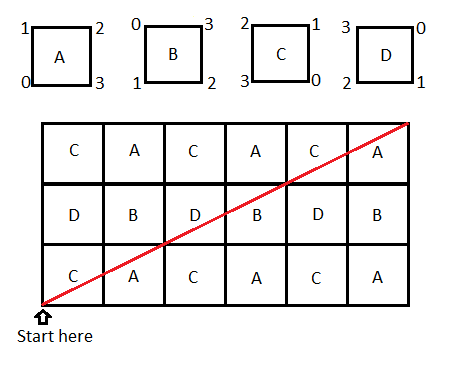

In this case the answer will be 2, as we intersect at k=2. I drew a larger diagram for illustrative purposes. (You don't need the rest of it for this one.)
```python
class Solution:
    def mirrorReflection(self, p, q):
        k = 1
        while k*q%p: k += 1
        if k%2==1 and (k*q//p)%2==0: return 0
        if k%2==1 and (k*q//p)%2==1: return 1
        if k%2==0 and (k*q//p)%2==1: return 2
```     

### Reduction
The if-conditionals can be compactified as
```python
class Solution:
    def mirrorReflection(self, p, q):
        k = 1
        while k*q%p: k += 1
        return 2 if k%2==0 else (k*q//p)%2
```

### More explanation from comments
- Hi, I did not understood about the room partitioning, A,B,C,D ??
Could you please help me with it?

- `k` shows how many blocks you advance horizontally, and `(k*q//p)` shows how many blocks you advance vertically. Based on even/odd values of these numbers you identify which type of room you are in when you hit the corner.
Consider the example they give in the question, here `k=2` and `(k*q//p) = 1`. So you go two units to right, one unit up. In the diagram above if you do that you get the room of type A and the answer is 2.

- ok i got this room arrangement. Thanks :)
But still how are we figuring out based on even and odd values of k?

- The room we start is a C type, based on the placements of corners. To go to the next room you need to reflect it thru the mirror. If you start from C and go right, it gets reflected along the y-axis and you get A. If you start from C and go up, if gets reflected along the x-axis and you get D. Similarly you get the structure in the diagram just by reflections.

[Link to original post](https://leetcode.com/problems/mirror-reflection/discuss/938821/Python-pure-geometry-illustrated)

## [Python] Oneliner solution with diagram, explained
The idea of this problem, instead of reflecting our ray, we will look at it from the point of view of our ray, which is straight line: see the following image for better understanding.

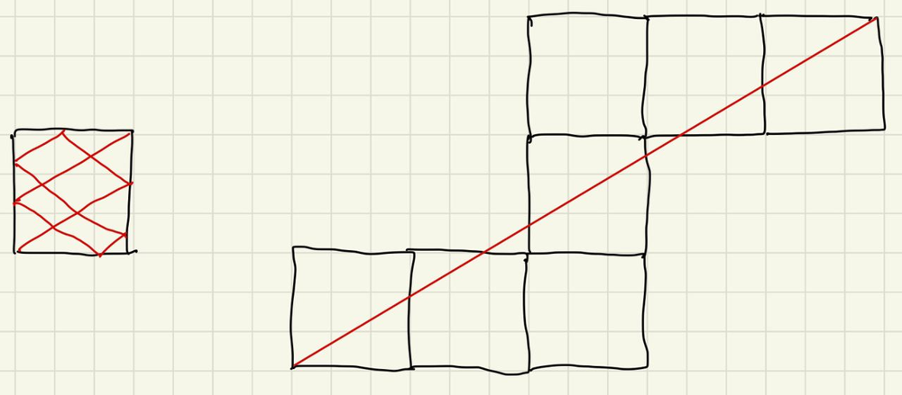

How we can find what we need to return: `0`, `1` or `2`:

1. If both number of reflections of our room are even, like in our image, we need to return `1`.
2. If horizontal line of reflections is odd and vertical is even, we need to return `0`.
3. If horizontal line of reflections is even and vertical is odd, we need to return `2`.
4. Note, that it can not happen that both number are even, than we have one angle before, if we divide these two numbers by 2.
Finally, all this can be written in oneliner as follow:

**Complexity:** time and space complexity is `O(1)` if we assume that we can find `gcd` in `O(1)` time (which is true for int32 numbers). If you want to be more mathematically correct, it is `O(log n)`.

```python
class Solution:
    def mirrorReflection(self, p, q):
        return (q//gcd(p,q)%2 - p//gcd(p,q)%2 + 1)
```

[Link to original post](https://leetcode.com/problems/mirror-reflection/discuss/938792/Python-Oneliner-solution-with-diagram-explained)

## [C++] Geometry mirror game

```c++
class Solution {
public:
    int mirrorReflection(int p, int q) {
        int m = 1; // extension count of room
        int n = 1; // reflection count of laser ray
        while(m * p != n * q){
            n++;
            m = n * q / p;
        }
        if (m % 2 == 0 && n % 2 == 1) return 0;
        if (m % 2 == 1 && n % 2 == 1) return 1;
        if (m % 2 == 1 && n % 2 == 0) return 2;
        return -1;
    }
};
// concrete to generic: Example 2: Input: p == 3, q = 2; Output 0
```

The figure is from [1], which really help understand the case which return 0

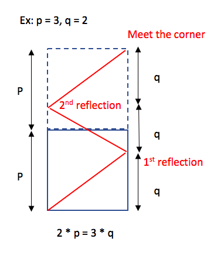

reference:
[1] https://leetcode.com/problems/mirror-reflection/discuss/146336/Java-solution-with-an-easy-to-understand-explanation

[Link to original post](https://leetcode.com/problems/mirror-reflection/discuss/939143/C%2B%2B-Geometry-mirror-game)

## Java solution with an easy-to-understand explanation
The idea comes from this post: https://leetcode.com/problems/mirror-reflection/discuss/141773, and here I add some explaination.
```c++
    public int mirrorReflection(int p, int q) {
        int m = 1, n = 1;
        while(m * p != n * q){
            n++;
            m = n * q / p;
        }
        if (m % 2 == 0 && n % 2 == 1) return 0;
        if (m % 2 == 1 && n % 2 == 1) return 1;
        if (m % 2 == 1 && n % 2 == 0) return 2;
        return -1;
    }
```

First, think about the case p = 3 & q = 2.


So, this problem can be transformed into finding `m * p = n * q`, where
`m` = the number of room extension + 1.
`n` = the number of light reflection + 1.

1. If the number of light reflection is odd (which means `n` is even), it means the corner is on the left-hand side. The possible corner is `2`.
Otherwise, the corner is on the right-hand side. The possible corners are `0` and `1`.
2. Given the corner is on the right-hand side.
If the number of room extension is even (which means `m` is odd), it means the corner is `1`. Otherwise, the corner is `0`.

So, we can conclude:
```
m is even & n is odd => return 0.
m is odd & n is odd => return 1.
m is odd & n is even => return 2.
```
Note: The case `m is even & n is even` is impossible. Because in the equation `m * q = n * p`, if `m` and `n` are even, we can divide both `m` and `n` by 2. Then, `m` or `n` must be odd.

--
Because we want to find `m * p = n * q`, where either `m` or `n` is odd, we can do it this way.
```java
    public int mirrorReflection(int p, int q) {
        int m = q, n = p;
        while(m % 2 == 0 && n % 2 == 0){
            m /= 2;
            n /= 2;
        }
        if (m % 2 == 0 && n % 2 == 1) return 0;
        if (m % 2 == 1 && n % 2 == 1) return 1;
        if (m % 2 == 1 && n % 2 == 0) return 2;
        return -1;
    }
```

[Link to original post](https://leetcode.com/problems/mirror-reflection/discuss/146336/Java-solution-with-an-easy-to-understand-explanation)

## [C++/Java/Python] 1-line without using any package or ✖️➗%
Here is my first solution. When I did it, I just code without any thinking.
```python
    def mirrorReflection(self, p, q):
        k = 1
        while (q * k % p): k += 1
        if q * k / p % 2 and k % 2: return 1
        if q * k / p % 2 == 0 and k % 2: return 0
        if q * k / p % 2 and k % 2 == 0: return 2
        return -1
```

When I reviewed the problems for my discuss article, I finaly realised only odd or even matter.

Divide `p,q` by `2` until at least one odd.

If `p = odd, q = even`: return 0
If `p = even, q = odd`: return 2
If `p = odd, q = odd`: return 1
I summary it as `return 1 - p % 2 + q % 2`


### C++
```c++
    int mirrorReflection(int p, int q) {
        while (p % 2 == 0 && q % 2 == 0) p >>= 1, q >>= 1;
        return 1 - p % 2 + q % 2;
    }
```

### Java:
```java
    public int mirrorReflection(int p, int q) {
        while (p % 2 == 0 && q % 2 == 0) {p >>= 1; q >>= 1;}
        return 1 - p % 2 + q % 2;
    }
```

### Python:
```python
    def mirrorReflection(self, p, q):
        while p % 2 == 0 and q % 2 == 0: p, q = p / 2, q / 2
        return 1 - p % 2 + q % 2
```

Based on this idea, I did this 1-line solutions without any package.

### C++/Java
```c++
        return (p & -p) > (q & -q) ? 2 : (p & -p) < (q & -q) ? 0:1;
```

### Python
```python
        return ((p & -p) >= (q & -q)) + ((p & -p) > (q & -q))
```

### Time Complexity
Time for 4 bit manipulations and 2 comparations.

[Link to orignal post](https://leetcode.com/problems/mirror-reflection/discuss/141773)

## Mirror Mirror Flip Flip with Pictures + 10 lines of code
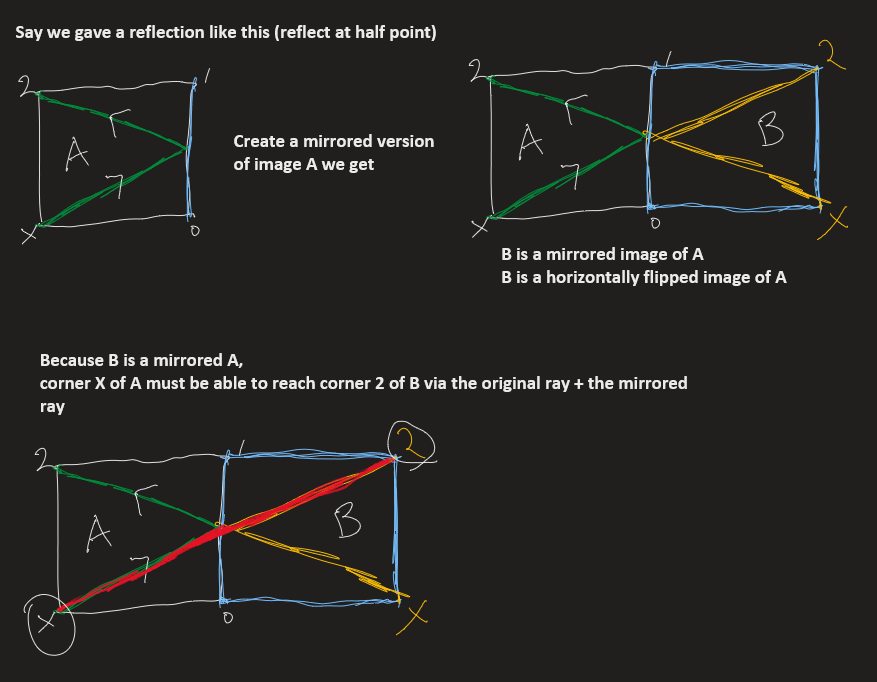
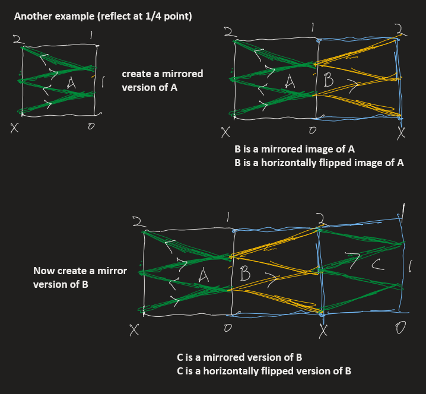
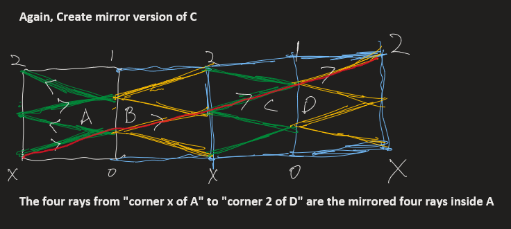
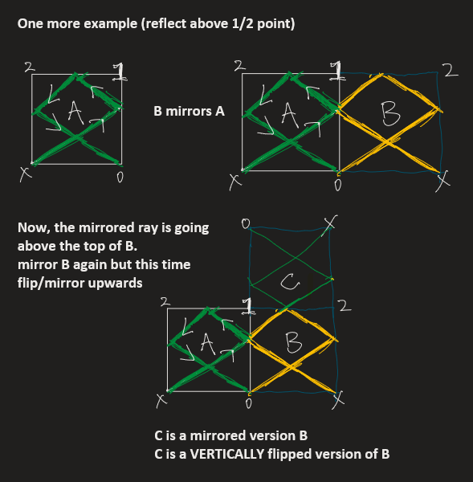
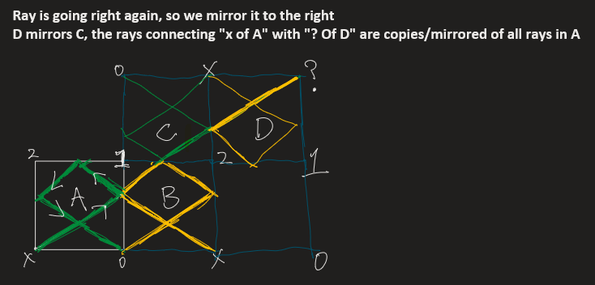
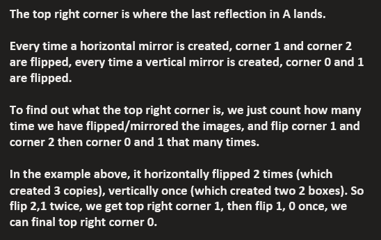
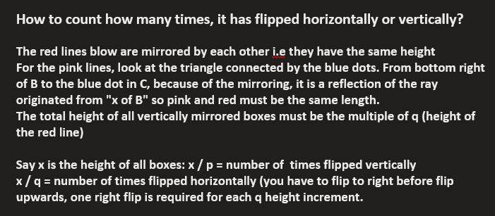
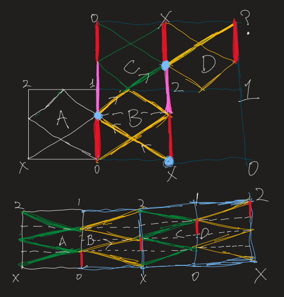

```js
function mirrorReflection (p, q) {   
    if (q === 0) return 0;
    
    let height = q;
    while (height < p || height % p) {
        height += q;
    }
    
    const upFlip = height / p;
    const rightFlip = height / q;

    const topCorner = upFlip % 2 ? 1 : 0;
    
    return rightFlip % 2 ? topCorner : 2;
};
```

[Link to original solution](https://leetcode.com/problems/mirror-reflection/discuss/939286/Mirror-Mirror-Flip-Flip-with-Pictures-%2B-10-lines-of-code)

## Golang easy to understand solution, beats 100%
As shown in below diagram, we extend the mirror square room

As the input wills are ints only, the input P and Q are actually X and Y in the diagram (P : Q == X:Y)

Based on X and Y, we could calculate the point K's value easily, which is just the receptor number.

The diagram shows a X = 5 and Y = 2 case, K value is 0, which means the laser ray will meet receptor 0 eventually.

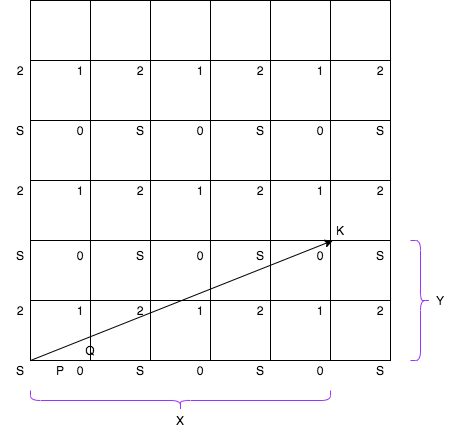

```go
unc mirrorReflection(p int, q int) int {
    x, y := gcd(p, q)  //gcd - greatest common divisor, get x, y based on p, q and their gcd
    
    x %= 2 //locate x back to squar 1
    y %= 2 //locate y back to squar 1
    
    if x == 0 && y == 1 {
        return 2
    } else if x == 1 && y == 1 || x == 0 && y == 0 {
        return 1
    } else {
        return 0
    }
}

func gcd(p, q int) (int, int) {
    x := p
    y := q
    for p % q != 0 {
        temp := p % q
        p = q
        q = temp
    }
    return x / q, y / q 
}
```

## Approach 1: Simulation
### Intuition

The initial ray can be described as going from an origin `(x, y) = (0, 0)` in the direction `(rx, ry) = (p, q)`. From this, we can figure out which wall it will meet and where, and what the appropriate new ray will be (based on reflection.) We keep simulating the ray until it finds it's destination.

### Algorithm

The parameterized position of the laser after time `t` will be `(x + rx * t, y + ry * t)`. From there, we know when it will meet the east wall (if `x + rx * t == p`), and so on. For a positive (and nonnegligible) time `t`, it meets the next wall.

We can then calculate how the ray reflects. If it hits an east or west wall, then `rx *= -1`, else `ry *= -1`.

In Java, care must be taken with floating point operations.

#### Java
```java
class Solution {
    double EPS = 1e-6;

    public int mirrorReflection(int p, int q) {
        double x = 0, y = 0;
        double rx = p, ry = q;    

        // While it hasn't reached a receptor,...
        while (!( close(x, p) && (close(y, 0) || close(y, p))
                  || close(x, 0) && close (y, p) )) {
            // Want smallest t so that some x + rx, y + ry is 0 or p
            // x + rxt = 0, then t = -x/rx etc.
            double t = 1e9;
            if ((-x / rx) > EPS) t = Math.min(t, -x / rx);
            if ((-y / ry) > EPS) t = Math.min(t, -y / ry);
            if (((p-x) / rx) > EPS) t = Math.min(t, (p-x) / rx);
            if (((p-y) / ry) > EPS) t = Math.min(t, (p-y) / ry);

            x += rx * t;
            y += ry * t;

            if (close(x, p) || close(x, 0)) rx *= -1;
            if (close(y, p) || close(y, 0)) ry *= -1;
        }

        if (close(x, p) && close(y, p)) return 1;
        return close(x, p) ? 0 : 2;
    }

    public boolean close(double x, double y) {
        return Math.abs(x - y) < EPS;
    }
}
```

#### Python
```python
class Solution(object):
    def mirrorReflection(self, p, q):
        from fractions import Fraction as F

        x = y = 0
        rx, ry = p, q
        targets = [(p, 0), (p, p), (0, p)]

        while (x, y) not in targets:
            #Want smallest t so that some x + rx, y + ry is 0 or p
            #x + rxt = 0, then t = -x/rx etc.
            t = float('inf')
            for v in [F(-x,rx), F(-y,ry), F(p-x,rx), F(p-y,ry)]:
                if v > 0: t = min(t, v)

            x += rx * t
            y += ry * t

            #update rx, ry
            if x == p or x == 0: # bounced from east/west wall, so reflect on y axis
                rx *= -1
            if y == p or y == 0:
                ry *= -1

        return 1 if x==y==p else 0 if x==p else 2
```

### Complexity Analysis

* Time Complexity: ***O(p)***. We can prove (using *Approach* #2) that the number of bounces is bounded by this.

* Space Complexity: ***O(1)***.

## Approach 2: Mathematical
### Intuition and Algorithm

Instead of modelling the ray as a bouncing line, model it as a straight line through reflections of the room.

For example, if `p = 2, q = 1`, then we can reflect the room horizontally, and draw a straight line from `(0, 0)` to `(4, 2)`. The ray meets the receptor `2`, which was reflected from `(0, 2)` to `(4, 2)`.

In general, the ray goes to the first integer point (`kp, kq`) where `k` is an integer, and `kp` and `kq` are multiples of `p`. Thus, the goal is just to find the smallest `k` for which `kq` is a multiple of `p`.

The mathematical answer is `k = p / gcd(p, q)`.

#### Java
```java
class Solution {

    public int mirrorReflection(int p, int q) {
        int g = gcd(p, q);
        p /= g; p %= 2;
        q /= g; q %= 2;

        if (p == 1 && q == 1) return 1;
        return p == 1 ? 0 : 2;
    }

    public int gcd(int a, int b) {
        if (a == 0) return b;
        return gcd(b % a, a);
    }
}
```

#### Python
```python
class Solution(object):
    def mirrorReflection(self, p, q):
        from fractions import gcd
        g = gcd(p, q)
        p = (p / g) % 2
        q = (q / g) % 2

        return 1 if p and q else 0 if p else 2
```

### Complexity Analysis

* Time Complexity: ***O(logP)***, the complexity of the `gcd` operation.

* Space Complexity: ***O(1)***.