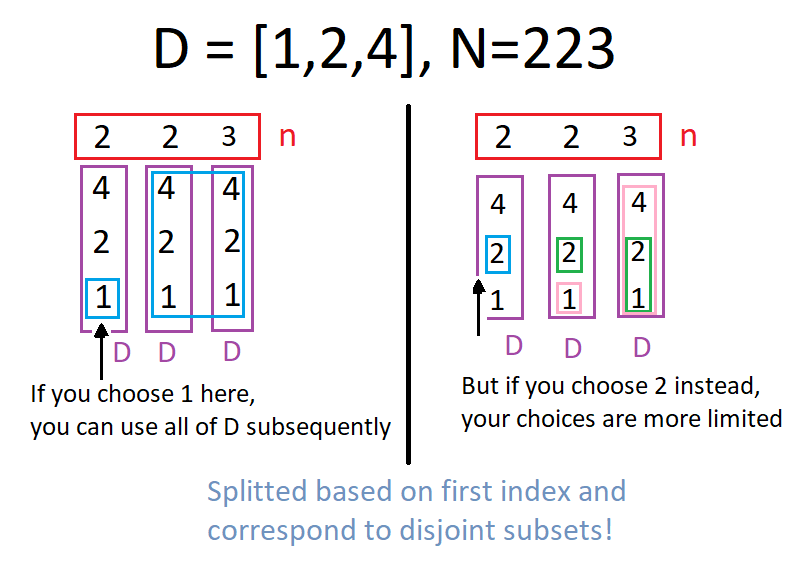

# LeetCode Hard 902. Numbers At Most N Given Digit Set Soluiton
## Approach 1: Dynamic Programming + Counting
### Intuition

First, call a positive integer `X` valid if `X <= N` and `X` only consists of digits from `D`. Our goal is to find the number of valid integers.

Say `N` has `K` digits. If we write a valid number with `k` digits (`k < K`), then there are (*D*.length)^*k* possible numbers we could write, since all of them will definitely be less than `N`.

Now, say we are to write a valid `K` digit number from left to right. For example, `N = 2345`, `K = 4`, and `D = '1', '2', ..., '9'`. Let's consider what happens when we write the first digit.

* If the first digit we write is less than the first digit of `N`, then we could write any numbers after, for a total of (*D*.length)^*K−1*
  valid numbers from this one-digit prefix. In our example, if we start with `1`, we could write any of the numbers `1111` to `1999` from this prefix.

* If the first digit we write is the same, then we require that the next digit we write is equal to or lower than the next digit in N. In our example (with `N = 2345`), if we start with `2`, the next digit we write must be `3` or less.

* We can't write a larger digit, because if we started with eg. `3`, then even a number of `3000` is definitely larger than `N`.

## Algorithm

Let `dp[i]` be the number of ways to write a valid number if `N` became `N[i]`, `N[i+1]`, .... For example, if `N = 2345`, then `dp[0]` would be the number of valid numbers at most `2345`, `dp[1]` would be the ones at most `345`, `dp[2]` would be the ones at most `45`, and `dp[3]` would be the ones at most `5`.

Then, by our reasoning above, `dp[i] = (number of d in D with d < S[i]) * ((D.length) ** (K-i-1))`, plus `dp[i+1]` if `S[i]` is in `D`.

### Java
```java
class Solution {
    public int atMostNGivenDigitSet(String[] D, int N) {
        String S = String.valueOf(N);
        int K = S.length();
        int[] dp = new int[K+1];
        dp[K] = 1;

        for (int i = K-1; i >= 0; --i) {
            // compute dp[i]
            int Si = S.charAt(i) - '0';
            for (String d: D) {
                if (Integer.valueOf(d) < Si)
                    dp[i] += Math.pow(D.length, K-i-1);
                else if (Integer.valueOf(d) == Si)
                    dp[i] += dp[i+1];
            }
        }

        for (int i = 1; i < K; ++i)
            dp[0] += Math.pow(D.length, i);
        return dp[0];
    }
}
```

### Python
```python
class Solution:
    def atMostNGivenDigitSet(self, D, N):
        S = str(N)
        K = len(S)
        dp = [0] * K + [1]
        # dp[i] = total number of valid integers if N was "N[i:]"

        for i in xrange(K-1, -1, -1):
            # Compute dp[i]

            for d in D:
                if d < S[i]:
                    dp[i] += len(D) ** (K-i-1)
                elif d == S[i]:
                    dp[i] += dp[i+1]

        return dp[0] + sum(len(D) ** i for i in xrange(1, K))
```

### Complexity Analysis

* Time Complexity: ***O(logN)***, and assuming *D*.length is constant. (We could make this better by pre-calculating the number of `d < S[i]` for all possible digits `S[i]`, but this isn't necessary.)

* Space Complexity: ***O(logN)***, the space used by `S` and `dp`. (Actually, we could store only the last 2 entries of `dp`, but this isn't necessary.)

## Approach 2: Mathematical
### Intuition

As in *Approach #1*, call a positive integer `X` *valid* if `X <= N` and `X` only consists of digits from `D`.

Now let `B = D.length`. There is a bijection between valid integers and so called "bijective-base-B" numbers. For example, if `D = ['1', '3', '5', '7']`, then we could write the numbers `'1', '3', '5', '7', '11', '13', '15', '17', '31', ...` as (bijective-base-B) numbers `'1', '2', '3', '4', '11', '12', '13', '14', '21', ....`

It is clear that both of these sequences are increasing, which means that the first sequence is a contiguous block of valid numbers, followed by invalid numbers.

Our approach is to find the largest valid integer, and convert it into bijective-base-`B` from which it is easy to find its rank (position in the sequence.) Because of the bijection, the rank of this element must be the number of valid integers.

Continuing our example, if `N = 64`, then the valid numbers are `'1', '3', ..., '55', '57'`, which can be written as bijective-base-4 numbers `'1', '2', ..., '33', '34'`. Converting this last entry `'34'` to decimal, the answer is `16` (3 * 4 + 4).

## Algorithm

Let's convert `N` into the largest possible valid integer `X`, convert `X` to bijective-base-B, then convert that result to a decimal answer. The last two conversions are relatively straightforward, so let's focus on the first part of the task.

Let's try to write `X` one digit at a time. Let's walk through an example where `D = ['2', '4', '6', '8']`. There are some cases:

* If the first digit of `N` is in `D`, we write that digit and continue. For example, if `N = 25123`, then we will write `2` and continue.

* If the first digit of `N` is larger than `min(D)`, then we write the largest possible number from `D` less than that digit, and the rest of the numbers will be big. For example, if `N = 5123`, then we will write `4888` (`4` then `888`).

* If the first digit of `N` is smaller than `min(D)`, then we must "subtract 1" (in terms of `X`'s bijective-base-B representation), and the rest of the numbers will be big.

For example, if `N = 123`, we will write `88`. If `N = 4123`, we will write `2888`. And if `N = 22123`, we will write `8888`. This is because "subtracting 1" from `'', '4', '22'` yields `'', '2', '8'` (can't go below 0).

Actually, in our solution, it is easier to write in bijective-base-B, so instead of writing digits of `D`, we'll write the index of those digits (1-indexed). For example, `X = 24888` will be `A = [1, 2, 4, 4, 4]`. Afterwards, we convert this to decimal.

### Java
``` 
class Solution {
    public int atMostNGivenDigitSet(String[] D, int N) {
        int B = D.length; // bijective-base B
        char[] ca = String.valueOf(N).toCharArray();
        int K = ca.length;
        int[] A = new int[K];
        int t = 0;

        for (char c: ca) {
            int c_index = 0;  // Largest such that c >= D[c_index - 1]
            boolean match = false;
            for (int i = 0; i < B; ++i) {
                if (c >= D[i].charAt(0))
                    c_index = i+1;
                if (c == D[i].charAt(0))
                    match = true;
            }

            A[t++] = c_index;
            if (match) continue;

            if (c_index == 0) { // subtract 1
                for (int j = t-1; j > 0; --j) {
                    if (A[j] > 0) break;
                    A[j] += B;
                    A[j-1]--;
                }
            }

            while (t < K)
                A[t++] = B;
            break;
        }

        int ans = 0;
        for (int x: A)
            ans = ans * B + x;
        return ans;
    }
}
```

### Python
```python
class Solution(object):
    def atMostNGivenDigitSet(self, D, N):
        B = len(D) # bijective-base B
        S = str(N)
        K = len(S)
        A = []  #  The largest valid number in bijective-base-B.

        for c in S:
            if c in D:
                A.append(D.index(c) + 1)
            else:
                i = bisect.bisect(D, c)
                A.append(i)
                # i = 1 + (largest index j with c >= D[j], or -1 if impossible)
                if i == 0:
                    # subtract 1
                    for j in xrange(len(A) - 1, 0, -1):
                        if A[j]: break
                        A[j] += B
                        A[j-1] -= 1

                A.extend([B] * (K - len(A)))
                break

        ans = 0
        for x in A:
            ans = ans * B + x
        return ans
```

### Complexity Analysis

* Time Complexity: ***O(logN)***, and assuming *D*.length is constant.

* Space Complexity: ***O(logN)***, the space used by `A`.

## [Python] Math solution, explained
This is one of those numbers problems, where we need to go digit by digit and count number of good number. Let me explain what I mean by that: imagine, that we have number `n = 314792` and `digits = [1,3,5,7]`, then we can split all numbers which are less or equal to `n` to several groups.

1. `n` itself: `314792`.
2. Numbers, which have form `31479?`, where question mark can be any number **less** than `2` and in our `digits` array.
3. Numbers, which have form `3147?*`, where question mark can be any number **less** than `9` and * mark means any digit from `digits`.
4. Numbers, which have form `314?**`, where question mark can be any number **less** than `7` and * again means any digit from `digits`.
5. Numbers, which have form `31?***`.
6. Numbers, which have form `3?****`.
7. Numbers, which have form `?*****`.
8. Finally, numbers which have form `*****`, `****`, `***`, `**`, `*`.

We can note, that we need to evaluate several times number of digits in `digits` which are less than some digit `2`, `9`, `7` and so on. We can just precompute array `up` for this purpuse. Also let `T` be number of our `digits`, `str_n` will be string created from `n`, `k` be length of this string and `d_set` be set of all `digits`.

What we need to do in main part of my algorithm:

1. Iterate from digit to digit, starting with `i = 0`.
2. Check if number constructed from first `i` digits have only `digits` inside: see step `4`: there we have numbers, starting with `314` and they can not be good. On step `5` however numbers start with `31` and it is OK for us.
3. Add `up[int(str_n[i])]` multiplied by `T` to the power `k-i-1` to our answer: just combinatorics to choose candidates for `?` place and for `*` place.
4. Finally, we need to deal with the last case: numbers with less number of digits and with first case: number `n` itself.

**Complexity:** time complexity is `O(10k + T)`, where `k` is lenght of our number `n` and `k` is lenght of `digits`. Actually, it can be just written as `O(T)`, because `10k <= 100` always. Space complexity is `O(T)`.

```python
class Solution:
    def atMostNGivenDigitSet(self, digits, n):
        up, ans, T, str_n = [0]*10, 0, len(digits), str(n)
        for i in range(10):
            for dig in digits:
                up[i] += (dig < str(i))
        
        k, d_set = len(str_n), set(digits)
        for i in range(k):
            if i > 0 and str_n[i-1] not in d_set: break
            ans += up[int(str_n[i])] * T**(k-i-1)
        
        addon = (T**k - 1)//(T-1) - 1 if T != 1 else k - 1
        return ans + addon + (not set(str_n) - set(digits))
```

[Link to original post](https://leetcode.com/problems/numbers-at-most-n-given-digit-set/discuss/943592/Python-Math-solution-explained)

## Python [split-combine] [visualized]
We can visualize the split-combine approach. Here `D=[1,2,4]`, `n=223`. We "diagonalize" by writing each digit of n in a row and the array D as a column for each row:

Left panel: Consider position-0, where n[0]=2. If we pick 1 from D, then for positions 1 & 2 we are free to use all the remaining entries (shown in blue).
Right panel: Now if you pick 2 from D instead, you have two choices subsequently, for position-1. If you choose 1 from D at position-1, you can use all elements from D at position-2 (shown in pink), but if you choose 2 from D at position-1, then you can only use 1 or 2 from D at position 2 (shown in green).
This is the split. To combine note that the two sets of numbers are distinct as we partition based on position-0.
The same structures extends within, so we have a simple for loop to do the whole calculation.



Time: O(1)
Space: O(1)

Please let me know if you have any questions, for this one I suggest you go through it with pen and paper, for the last loop, for better understanding.
```python
class Solution:
    def atMostNGivenDigitSet(self, D, n):
        #number of digits in n
        max_digit = len(str(n)) 
        
        #combine will be the answer
        combine = 0
        
        #Part I: First count the numbers with #(digits)<max_digit
        for i in range(1, max_digit):
            combine += len(D)**i
        
        #Part II: Now count the numbers with #(digits)=max_digit
        #less: number of digits in D that are less than n[i]
        #equal: 1 n[i] is in D, 0 otherwise
        split = []
        for e in list(str(n)):
            less = equal = 0
            for d in D:
                if int(d)<int(e): less += 1
                if int(d)==int(e): equal = 1
            split.append((less,equal))
        
        #Iteratively count disjoint subsets
        i, equal = 0, 1
        while equal and i<max_digit:
            less, equal = split[i]
            combine += (less)*(len(D)**(max_digit-i-1))
            i += 1
        if equal: combine += 1
        
        return combine  
```

More explanation (optional)

This question is essentially a discrete math question, a counting question in particular (and a really hard one tbh). We use the basic principles of counting (sum and product rule). In order to keep the computations tractable, we will be counting disjoint subsets and adding them.

There are two cases:

If the number of digits in the constructed number is less than n, it is easy! It is just the number of digits available in D raised to the power the number of available digits. Example: D=[1,2,3] and n=555, we can use all three digits to make-up two-digit numbers: 11, 12, 13, 21, 22, 23, 31, 32, 33. As numbers can be partitioned based on digit count, all subsets formed this way are disjoint and can be added together.
When the constructed number has the same digit count as the original one, then it gets complicated. Example: D=[1,2,4,8] and n=124. The three digit numbers we can get include 111, 124, 118; but not 811.
Now based on this last example, it turns out there is a diagonalization argument: For each digit in n (represented n[i] for position-i in decimal representation), we count the number of digits in D that are less than n[i]. Call this less. In addition if D contains n[i], set equal to 1. We now store the array split where split[i] = (less, equal) for n[i]. At any given point, if we use a digit less than n[i] then we can use all the digits available to us. For example if D = [2,4,8] and n=422, if we choose 2 at position-0 (most significant digit) we can get numbers like 288. So even if 8>2 we can use it at positions 1 & 2. But if we choose 4 at position-0, then we can only choose the number 2 for the next position. The last loop iteratively sums these element count of these disjoint subsets. At the end you see we have if equal: combine +=1. If this statement is executed, it means we can construct n from the digits in D.

Q:
How is time complexity O(1) ?
I think its ~ O(log n) because you are iterating over digits of n
base of log is 10 here
Please correct me if Im wrong

A:Yes, but n <= 10^9, so you get O(1).

[Link to original post](https://leetcode.com/problems/numbers-at-most-n-given-digit-set/discuss/943614/Python-split-combine-visualized)