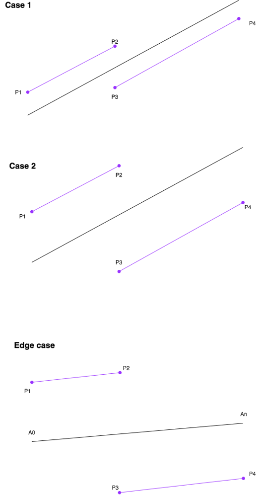

# LeetCode Medium 910. Smallest Range II Solution
## Approach 1: Linear Scan
### Intuition

As in *Smallest Range I*, smaller `A[i]` will choose to increase their value ("go up"), and bigger `A[i]` will decrease their value ("go down").

### Algorithm

We can formalize the above concept: if `A[i] < A[j]`, we don't need to consider when `A[i]` goes down while `A[j]` goes up. This is because the interval `(A[i] + K, A[j] - K)` is a subset of `(A[i] - K, A[j] + K)` (here, `(a, b)` for `a > b` denotes `(b, a)` instead.)

That means that it is never worse to choose `(up, down)` instead of `(down, up)`. We can prove this claim that one interval is a subset of another, by showing both `A[i] + K` and `A[j] - K` are between `A[i] - K` and `A[j] + K`.

For sorted `A`, say `A[i]` is the largest `i` that goes up. Then `A[0] + K`, `A[i] + K`, `A[i+1] - K`, `A[A.length - 1] - K` are the only relevant values for calculating the answer: every other value is between one of these extremal values.

### Java
```java
class Solution {
    public int smallestRangeII(int[] A, int K) {
        int N = A.length;
        Arrays.sort(A);
        int ans = A[N-1] - A[0];

        for (int i = 0; i < A.length - 1; ++i) {
            int a = A[i], b = A[i+1];
            int high = Math.max(A[N-1] - K, a + K);
            int low = Math.min(A[0] + K, b - K);
            ans = Math.min(ans, high - low);
        }
        return ans;
    }
}
```

### Python
```python
class Solution(object):
    def smallestRangeII(self, A, K):
        A.sort()
        mi, ma = A[0], A[-1]
        ans = ma - mi
        for i in xrange(len(A) - 1):
            a, b = A[i], A[i+1]
            ans = min(ans, max(ma-K, a+K) - min(mi+K, b-K))
        return ans
```

### Complexity Analysis

* Time Complexity: ***O(NlogN)***, where ***N*** is the length of the `A`.

* Space complexity : ***O(N)*** or ***O(logN)***

    * The space complexity of the sorting algorithm depends on the implementation of each program language.

    * For instance, the `list.sort()` function in Python is implemented with the [Timsort](https://en.wikipedia.org/wiki/Timsort) algorithm whose space complexity is ***O(N)***.

    * In Java, the [Arrays.sort()](https://docs.oracle.com/javase/8/docs/api/java/util/Arrays.html#sort-byte:A-) is implemented as a variant of quicksort algorithm whose space complexity is ***O(logN)***.

## Golang 100% solution with explanation

Sort A as the black line.

In order to get smallest range, the left part of A need to be added to K (P1 - P2) and right part need to be substracted K (P3 - P4)

We could see in both case 1 (K is smaller) and case 2 (K is bigger), max value is max(P2, P4) and min value is min(P1, P3). What we are looking for is min(max(P2, P4) - min(P1, P3))

Be noted the edge case, the smallest range is just An - A0, so we use it as defaul result value.





### Go
```go
func smallestRangeII(A []int, K int) int {
    if len(A) == 1 {
        return 0
    }
    sort.Ints(A) 
    res := A[len(A) - 1] - A[0] //default value, as there is a edge case that P1 
    P1 := A[0] + K
    P4 := A[len(A) - 1] - K
    for i := 0; i < len(A) - 1; i++ {
        P2 := A[i] + K
        P3 := A[i + 1] - K
        res = min(res, max(P2, P4) - min(P1, P3))
    }
    return res
}

func min(a, b int) int {
    if a < b {
        return a
    } else {
        return b
    }
}

func max(a, b int) int {
    if a > b {
        return a
    } else {
        return b
    }
}
```

[Link to original post](https://leetcode.com/problems/smallest-range-ii/discuss/980417/Golang-100-solution-with-explanation)