# LeetCode 94. Binary Tree Inorder Traversal Solution
## Approach 1: Recursive Approach
The first method to solve this problem is using recursion. This is the classical method and is straightforward. We can define a helper function to implement recursion.

### Java
```java
class Solution {
    public List < Integer > inorderTraversal(TreeNode root) {
        List < Integer > res = new ArrayList < > ();
        helper(root, res);
        return res;
    }

    public void helper(TreeNode root, List < Integer > res) {
        if (root != null) {
            if (root.left != null) {
                helper(root.left, res);
            }
            res.add(root.val);
            if (root.right != null) {
                helper(root.right, res);
            }
        }
    }
}
```

### Complexity Analysis

* Time complexity : ***O(n)***. The time complexity is ***O(n)*** because the recursive function is ***T(n)=2⋅T(n/2)+1***.

* Space complexity : The worst case space required is ***O(n)***, and in the average case it's ***O(logn)*** where nn is number of nodes.

## Approach 2: Iterating method using Stack
The strategy is very similiar to the first method, the different is using stack.

Here is an illustration:

### 1
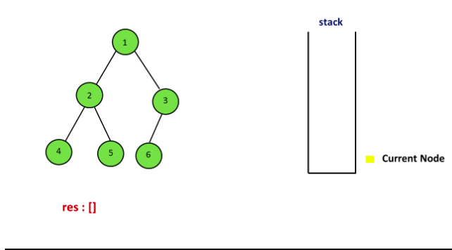

### 2


### 3
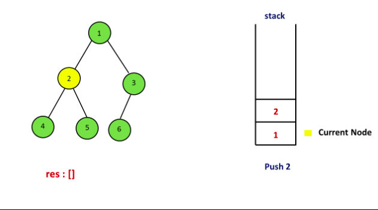

### 4


### 5
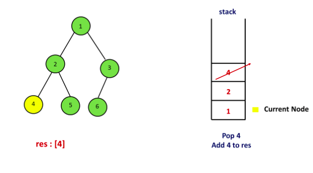

### 6
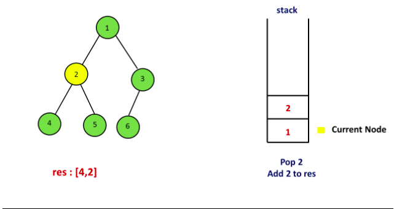

### 7
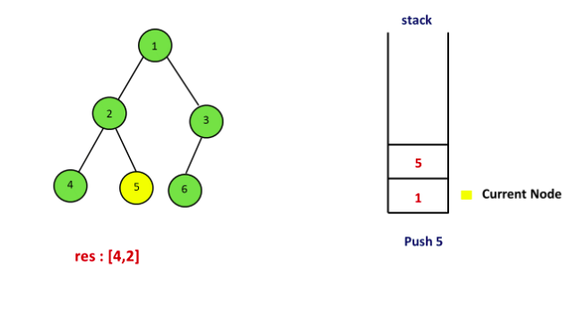

### 8
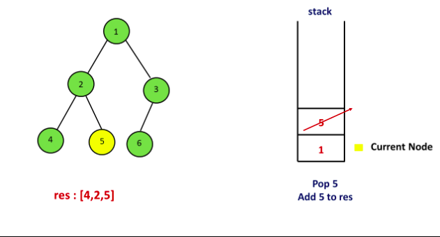

### 9
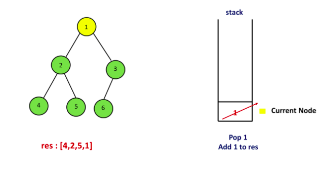

### 10
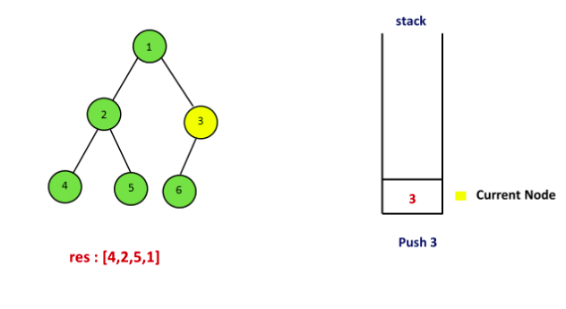

### 11


### 12
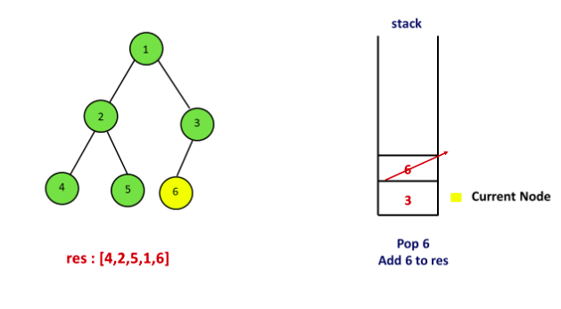

### 13
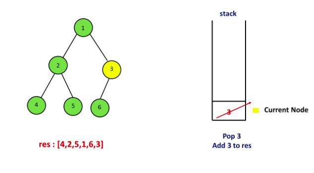

### 14
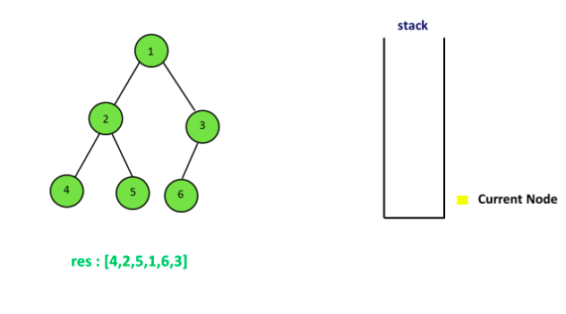

### Java
```java
public class Solution {
    public List < Integer > inorderTraversal(TreeNode root) {
        List < Integer > res = new ArrayList < > ();
        Stack < TreeNode > stack = new Stack < > ();
        TreeNode curr = root;
        while (curr != null || !stack.isEmpty()) {
            while (curr != null) {
                stack.push(curr);
                curr = curr.left;
            }
            curr = stack.pop();
            res.add(curr.val);
            curr = curr.right;
        }
        return res;
    }
}
```

### Complexity Analysis

* Time complexity : ***O(n)***.

* Space complexity : ***O(n)***.

## Approach 3: Morris Traversal
In this method, we have to use a new data structure-Threaded Binary Tree, and the strategy is as follows:

```
Step 1: Initialize current as root

Step 2: While current is not NULL,

If current does not have left child

    a. Add current’s value

    b. Go to the right, i.e., current = current.right

Else

    a. In current's left subtree, make current the right child of the rightmost node

    b. Go to this left child, i.e., current = current.left
```

For example:
```
          1
        /   \
       2     3
      / \   /
     4   5 6
```

First, 1 is the root, so initialize 1 as current, 1 has left child which is 2, the current's left subtree is
```
         2
        / \
       4   5
```

So in this subtree, the rightmost node is 5, then make the current(1) as the right child of 5. Set current = cuurent.left (current = 2). The tree now looks like:
```

         2
        / \
       4   5
            \
             1
              \
               3
              /
             6
```

For current 2, which has left child 4, we can continue with thesame process as we did above
```
        4
         \
          2
           \
            5
             \
              1
               \
                3
               /
              6
```

then add 4 because it has no left child, then add 2, 5, 1, 3 one by one, for node 3 which has left child 6, do the same as above. Finally, the inorder taversal is [4,2,5,1,6,3].

For more details, please check [Threaded binary](https://en.wikipedia.org/wiki/Threaded_binary_tree) tree and [Explaination of Morris Method](https://stackoverflow.com/questions/5502916/explain-morris-inorder-tree-traversal-without-using-stacks-or-recursion)

### Java
```java
class Solution {
    public List < Integer > inorderTraversal(TreeNode root) {
        List < Integer > res = new ArrayList < > ();
        TreeNode curr = root;
        TreeNode pre;
        while (curr != null) {
            if (curr.left == null) {
                res.add(curr.val);
                curr = curr.right; // move to next right node
            } else { // has a left subtree
                pre = curr.left;
                while (pre.right != null) { // find rightmost
                    pre = pre.right;
                }
                pre.right = curr; // put cur after the pre node
                TreeNode temp = curr; // store cur node
                curr = curr.left; // move cur to the top of the new tree
                temp.left = null; // original cur left be null, avoid infinite loops
            }
        }
        return res;
    }
}
```

### Complexity Analysis

* Time complexity : ***O(n)***. To prove that the time complexity is ***O(n)***, the biggest problem lies in finding the time complexity of finding the predecessor nodes of all the nodes in the binary tree. Intuitively, the complexity is ***O(nlogn)***, because to find the predecessor node for a single node related to the height of the tree. But in fact, finding the predecessor nodes for all nodes only needs ***O(n)*** time. Because a binary Tree with ***n*** nodes has ***n-1*** edges, the whole processing for each edges up to 2 times, one is to locate a node, and the other is to find the predecessor node. So the complexity is ***O(n)***.

* Space complexity : ***O(n)***. Arraylist of size ***n*** is used.