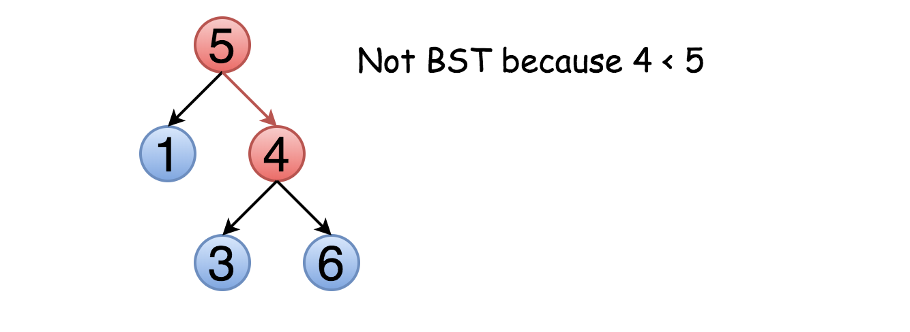
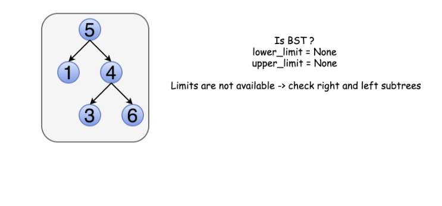
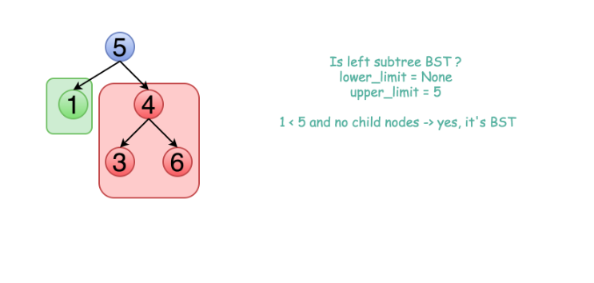
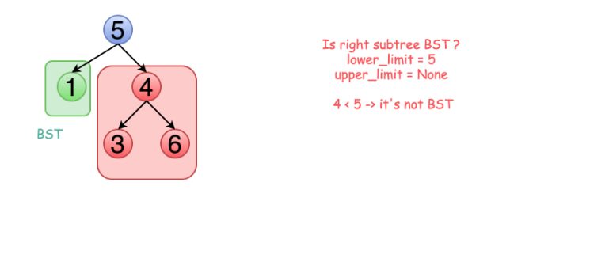
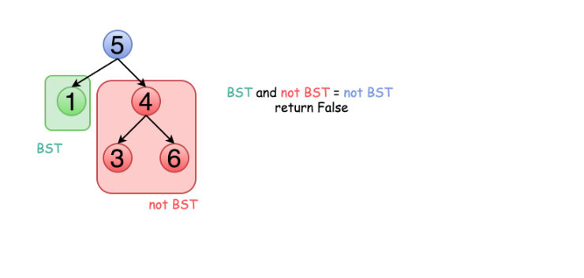
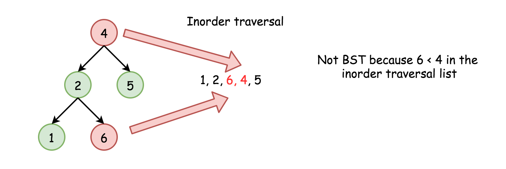

# LeetCode Medium 98. Validate Binary Search Tree Solution
## Tree definition
First of all, here is the definition of the `TreeNode` which we would use.

### Java
```java
// Definition for a binary tree node.
public class TreeNode {
  int val;
  TreeNode left;
  TreeNode right;

  TreeNode(int x) {
    val = x;
  }
}
```

### Python3
```python
# Definition for a binary tree node.
class TreeNode:
    def __init__(self, val=0, left=None, right=None):
        self.val = x
        self.left = None
        self.right = None
```

## Intuition
On the first sight, the problem is trivial. Let's traverse the tree and check at each step if `node.right.val > node.val` and `node.left.val < node.val`. This approach would even work for some trees



The problem is this approach will not work for all cases. Not only the right child should be larger than the node but all the elements in the right subtree. Here is an example :


That means one should keep both upper and lower limits for each node while traversing the tree, and compare the node value not with children values but with these limits.

## Approach 1: Recursive Traversal with Valid Range
The idea above could be implemented as a recursion. One compares the node value with its upper and lower limits if they are available. Then one repeats the same step recursively for left and right subtrees.

### 1


### 2


### 3


### 4


### Java
```java
class Solution {
    public boolean validate(TreeNode root, Integer low, Integer high) {
        // Empty trees are valid BSTs.
        if (root == null) {
            return true;
        }
        // The current node's value must be between low and high.
        if ((low != null && root.val <= low) || (high != null && root.val >= high)) {
            return false;
        }
        // The left and right subtree must also be valid.
        return validate(root.right, root.val, high) && validate(root.left, low, root.val);
    }

    public boolean isValidBST(TreeNode root) {
        return validate(root, null, null);
    }
}
```

### Python3
```python
class Solution:
    def isValidBST(self, root: TreeNode) -> bool:
        
        def validate(node, low=-math.inf, high=math.inf):
            # Empty trees are valid BSTs.
            if not node:
                return True
            # The current node's value must be between low and high.
            if node.val <= low or node.val >= high:
                return False
            
            # The left and right subtree must also be valid.
            return (validate(node.right, node.val, high) and
                   validate(node.left, low, node.val))
        
        return validate(root)
```

### Complexity Analysis

* Time complexity : ***O(N)*** since we visit each node exactly once.
* Space complexity : ***O(N)*** since we keep up to the entire tree.

## Approach 2: Iterative Traversal with Valid Range
The above recursion could be converted into iteration, with the help of an explicit stack. DFS would be better than BFS since it works faster here.

### Java
```java
class Solution {

    private Deque<TreeNode> stack = new LinkedList();
    private Deque<Integer> upperLimits = new LinkedList();
    private Deque<Integer> lowerLimits = new LinkedList();

    public void update(TreeNode root, Integer low, Integer high) {
        stack.add(root);
        lowerLimits.add(low);
        upperLimits.add(high);
    }

    public boolean isValidBST(TreeNode root) {
        Integer low = null, high = null, val;
        update(root, low, high);

        while (!stack.isEmpty()) {
            root = stack.poll();
            low = lowerLimits.poll();
            high = upperLimits.poll();

            if (root == null) continue;
            val = root.val;
            if (low != null && val <= low) {
                return false;
            }
            if (high != null && val >= high) {
                return false;
            }
            update(root.right, val, high);
            update(root.left, low, val);
        }
        return true;
    }
}
```

### Python3
```python
class Solution:
    def isValidBST(self, root: TreeNode) -> bool:
        if not root:
            return True
            
        stack = [(root, -math.inf, math.inf)] 
        while stack:
            root, lower, upper = stack.pop()
            if not root:
                continue
            val = root.val
            if val <= lower or val >= upper:
                return False
            stack.append((root.right, val, upper))
            stack.append((root.left, lower, val))
        return True
```

### Complexity Analysis

* Time complexity : ***O(N)*** since we visit each node exactly once.
* Space complexity : ***O(N)*** since we keep up to the entire tree.

## Approach 3: Recursive Inorder Traversal
### Algorithm

Let's use the order of nodes in the [inorder traversal](https://leetcode.com/problems/binary-tree-inorder-traversal/solution/) `Left -> Node -> Right`.


Here the nodes are enumerated in the order you visit them, and you could follow `1-2-3-4-5` to compare different strategies.

`Left -> Node -> Right` order of inorder traversal means for BST that each element should be smaller than the next one.

Hence the algorithm with ***O(N)*** time complexity and ***O(N)*** space complexity could be simple:

* Compute inorder traversal list `inorder`.

* Check if each element in i`norder` is smaller than the next one.



>Do we need to keep the whole `inorder` traversal list?

Actually, no. The last added inorder element is enough to ensure at each step that the tree is BST (or not). Hence one could merge both steps into one and reduce the used space.

### Code

We can implement the algorithm recursively.

### Java
```java
class Solution {
    // We use Integer instead of int as it supports a null value.
    private Integer prev;
    
    public boolean isValidBST(TreeNode root) {
        prev = null;
        return inorder(root);
    }
    
    private boolean inorder(TreeNode root) {
        if (root == null) {
            return true;
        }
        if (!inorder(root.left)) {
            return false;
        }
        if (prev != null && root.val <= prev) {
            return false;
        }
        prev = root.val;
        return inorder(root.right);
    }
}
```

### Python3
```python
class Solution:
    def isValidBST(self, root: TreeNode) -> bool:
        
        def inorder(root):
            if not root:
                return True
            if not inorder(root.left):
                return False
            if root.val <= self.prev:
                return False
            self.prev = root.val
            return inorder(root.right)
        
        self.prev = -math.inf
        return inorder(root)
```

### Complexity Analysis

* Time complexity : ***O(N)*** in the worst case when the tree is a BST or the "bad" element is a rightmost leaf.

* Space complexity : ***O(N)*** for the space on the run-time stack.

## Approach 4: Iterative Inorder Traversal
Alternatively, we could implement the above algorithm iteratively.

### Java
```java
class Solution {
    public boolean isValidBST(TreeNode root) {
        Deque<TreeNode> stack = new ArrayDeque<>();
        Integer prev = null;

        while (!stack.isEmpty() || root != null) {
            while (root != null) {
                stack.push(root);
                root = root.left;
            }
            root = stack.pop();
            // If next element in inorder traversal
            // is smaller than the previous one
            // that's not BST.
            if (prev != null && root.val <= prev) {
                return false;
            }
            prev = root.val;
            root = root.right;
        }
        return true;
    }
}
```

### Python3
```python
class Solution:
    def isValidBST(self, root: TreeNode) -> bool:
        stack, prev = [], -math.inf
        
        while stack or root:
            while root:
                stack.append(root)
                root = root.left
            root = stack.pop()
            # If next element in inorder traversal
            # is smaller than the previous one
            # that's not BST.
            if root.val <= prev:
                return False
            prev = root.val
            root = root.right

        return True
```

### Complexity Analysis

* Time complexity : ***O(N)*** in the worst case when the tree is BST or the "bad" element is a rightmost leaf.

* Space complexity : ***O(N)*** to keep `stack`.