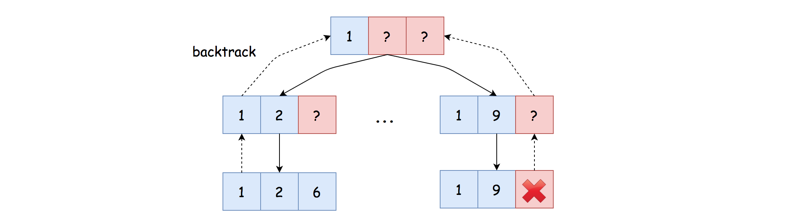

# LeetCode Combination Sum III Solution
## Approach 1: Backtracking
### Intuition

The problem asks us to come up with some fixed-length combinations that meet certain conditions.

To solve the problem, it would be beneficial to build a combination by hand.

If we represent the combination as an array, we then could fill the array ***one element at a time***.

For example, given the input *k=3* and *n=9*, i.e. the size of the combination is 3, and the sum of the digits in the combination should be 9. Here are a few steps that we could do:

1. We could pick a digit for the ***first*** element in the combination. Initially, the list of candidates is **[1, 2, 3, 4, 5, 6, 7, 8. 9]** for any element in the combination, as stated in the problem. Let us pick 1 as the first element. The current combination is **[1]**.


2. Now that we picked the first element, we have two more elements to fill in the final combination. Before we proceed, let us review the conditions that we should fullfil for the next steps.

    * Since we've already picked the digit **1**, we should exclude the digit from the original candidate list for the remaining elements, in order to ensure that the combination does not contain any ***duplicate*** digits, as required in the problem.

    * In addition, the sum of the remaining two elements should be **9−1=8**.

3. Based on the above conditions, for the second element, we could have several choices. Let us pick the digit **2**, which is not a duplicate of the first element, plus it does not exceed the desired sum (*i.e. 8*) neither. The combination now becomes **[1, 2]**.


4. Now for the third element, with all the constraints, it leaves us no choice but to pick the digit **6** as the final element in the combination of **[1, 2, 6]**.


5. As we mentioned before, for the second element, we could have several choices. For instance, we could have picked the digit **3**, instead of the digit **2**. Eventually, it could *lead* us to another solution as **[1, 3, 5]**.

6. As one can see, for each element in the combination, we could ***revisit*** our choices, and ***try out*** other possibilities to see if it leads to a valid solution.

If you have followed the above steps, it should become *evident* that ***backtracking*** would be the technique that we could use to come up an algorithm for this problem.



>Indeed, we could resort to *backtracking*, where we try to fill the combination **one element at a step**. Each choice we make at certain step might lead us to a final solution. If not, we simply revisit the choice and try out other choices, *i.e.* backtrack.

### Algorithm

There are many ways to implement a backtracking algorithm. One could also refer to our [Explore card](https://leetcode.com/explore/learn/card/recursion-ii/472/backtracking/) where we give some examples of backtracking algorithms.

To implement the algorithm, one could literally follow the steps in the Intuition section. However, we would like to highlight a key ***trick*** that we employed, in order to ensure the ***non-redundancy*** among the digits within a single combination, as well as the ***non-redundancy*** among the combinations.

The trick is that we pick the candidates ***in order***. We treat the candidate digits as a list with order, *i.e.* **[1, 2, 3, 4, 5, 6, 7, 8. 9]**. At any given step, once we pick a digit, *e.g.* **6**, we will not consider any digits before the chosen digit for the following steps, *e.g.* the candidates are reduced down to **[7, 8, 9]**.

With the above strategy, we could ensure that a digit will never be picked twice for the same combination. Also, all the combinations that we come up with would be unique.

Here are some sample implementations based on the above ideas.

**Java**
```java
class Solution {
    protected void backtrack(int remain, int k,
            LinkedList<Integer> comb, int next_start,
            List<List<Integer>> results) {

        if (remain == 0 && comb.size() == k) {
            // Note: it's important to make a deep copy here.
            results.add(new ArrayList<Integer>(comb));
            return;
        } else if (remain < 0 || comb.size() == k) {
            // Exceed the scope, no need to explore further.
            return;
        }

        // Iterate through the reduced list of candidates.
        for (int i = next_start; i < 9; ++i) {
            comb.add(i + 1);
            this.backtrack(remain - i - 1, k, comb, i + 1, results);
            comb.removeLast();
        }
    }

    public List<List<Integer>> combinationSum3(int k, int n) {
        List<List<Integer>> results = new ArrayList<List<Integer>>();
        LinkedList<Integer> comb = new LinkedList<Integer>();

        this.backtrack(n, k, comb, 0, results);
        return results;
    }
}
```

**Python**
```python
class Solution:
    def combinationSum3(self, k: int, n: int) -> List[List[int]]:
        results = []
        def backtrack(remain, comb, next_start):
            if remain == 0 and len(comb) == k:
                # make a copy of current combination
                results.append(list(comb))
                return
            elif remain < 0 or len(comb) == k:
                # exceed the scope, no need to explore further.
                return

            # Iterate through the reduced list of candidates.
            for i in range(next_start, 9):
                comb.append(i+1)
                backtrack(remain-i-1, comb, i+1)
                # backtrack the current choice
                comb.pop()

        backtrack(n, [], 0)

        return results
```
### Complexity Analysis

Let *K* be the number of digits in a combination.

* Time Complexity: *O(9!⋅K/(9−K)!))*

    * In a worst scenario, we have to explore all potential combinations to the very end, *i.e.* the sum *n* is a large number (*n > 9 ∗ 9*). At the first step, we have *9* choices, while at the second step, we have 88 choices, so on and so forth.

    * The number of exploration we need to make in the worst case would be *P(9,K)= 9!/ (9−K)!*, assuming that *K<=9*. By the way, *K* cannot be greater than 9, otherwise we cannot have a combination whose digits are all unique.

    * Each exploration takes a constant time to process, except the last step where it takes O(K) time to make a copy of combination.

    * To sum up, the overall time complexity of the algorithm would be (9!/(9−K)!)⋅O(K)=O(9!⋅K/(9−K)!).

* Space Complexity: *O(K)*

    * During the backtracking, we used a list to keep the current combination, which holds up to *K* elements, i.e. *O(K)*.

    * Since we employed recursion in the backtracking, we would need some additional space for the function call stack, which could pile up to *K* consecutive invocations, *i.e. O(K)*.

    * Hence, to sum up, the overall space complexity would be *O(K)*.

    * **Note that**, we did not take into account the space for the final results in the space complexity.

## [Python] backtrack solution, explained
If in problem we need to return all possible options with some property, usually it means that we need to do backtracking. Let us use **BackTr** function with parameters:

1. **k** is number of numbers we need to take to build our number.
2. **n** is number we need to build
3. **curr_sol** built solution so far.

Then if **n<0** of **k<0** we need to go back; if **n==0** and **k==0** means that we found solution, so we add it to our **self.sol**. Then we just run our **BackTr** with parameters: **k-1**: we need to take one less number, **n-i**, where **i** is the last digit we added: it is either starts with **1** or with **curr_sol[-1] + 1** and **curr_sol + [i]** will be our built solution so far.

Finally, we run **self.BackTr(k, n, [])** and return **self.sol**.

**Comlexity**: For first digit we have not more than **9** options, for second one no more than **8** and so on, so there will be **9 * 8 * ... * (9-k+1)** possible options, for each of which we need **O(k)**. We can improve this bound if we take into account that there is 2^9 possible combinations at all, so complexity is **O(2^9*k)**, because of all dead-ends we can have. Space complexity is **O(k)**, if we do not take into account output solution.
```python
class Solution:
    def combinationSum3(self, k, n):
        self.sol = []
        self.BackTr(k, n, [])
        return self.sol
        
    def BackTr(self, k, n, curr_sol):
        if n < 0 or k < 0: return
        if n == 0 and k == 0:
            self.sol.append(curr_sol)
            
        start = curr_sol[-1] + 1 if curr_sol else 1
            
        for i in range(start, 10):
            self.BackTr(k - 1, n - i, curr_sol + [i])
```

[Link to original post](https://leetcode.com/problems/combination-sum-iii/discuss/842764/Python-backtrack-solution-explained)