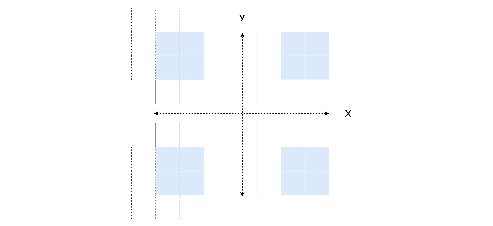
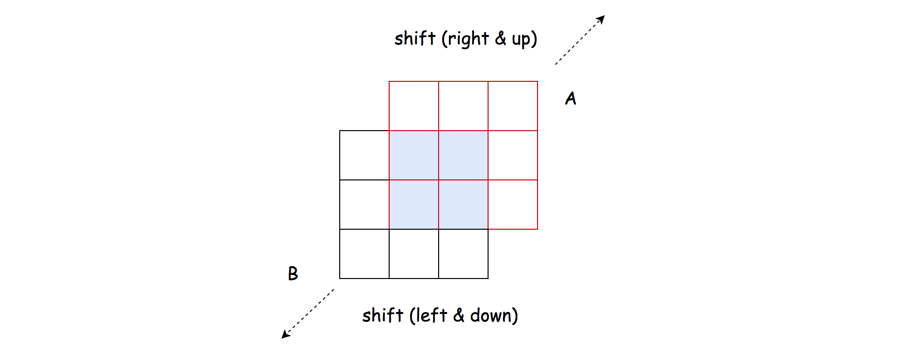
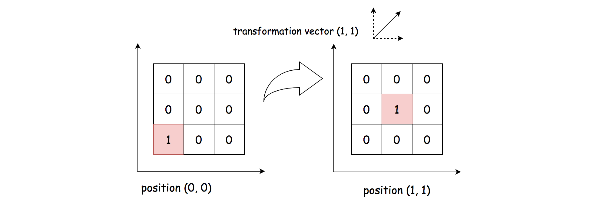
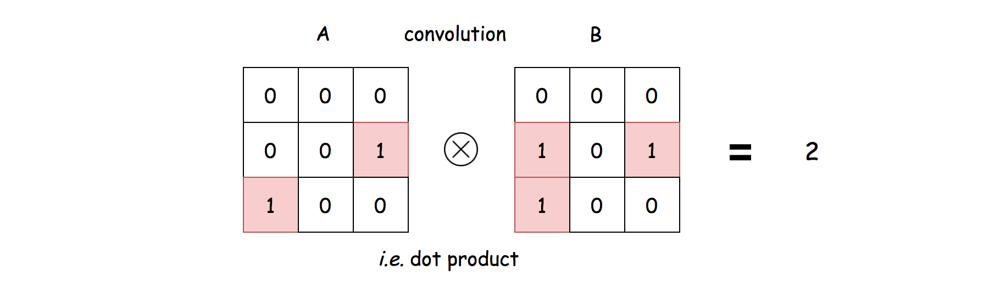
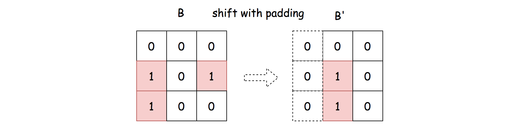
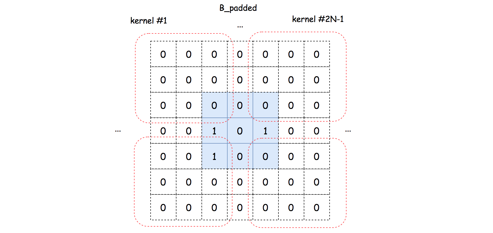
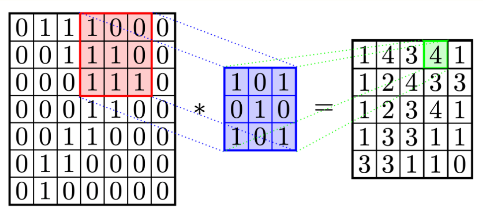

# LeetCode Image Overlap Solution
## Overview
First of all, this is a really fun problem to solve, as one would discover later. In addition, it could be a practical problem in real world. For instance, if one can find the maximal overlapping zone between two images, one could *clip* the images to make them smaller and more focused.

In this article, we will cover three approaches as follows:

* We could solve the problem intuitively by enumerating all the possible overlapping zones.

* Or more efficiently, we can apply some knowledge of ***linear algebra*** (or geometry), as we will present another solution in the second approach.

* Finally, we could even solve it with the conception of ***convolution***, as in Convolution Neural Network (*a.k.a.* CNN), which is the backbone operation for the image recognition models nowadays.

## Approach 1: Shift and Count
### Intuition

As stated in the problem description, in order to calculate the number of ones in the overlapping zone, we should first ***shift*** one of the images. Once the image is shifted, it is intuitive to ***count*** the numbers.

>Therefore, a simple idea is that one could come up all possible overlapping zones, by *shifting* the image matrix, and then simply count within each overlapping zone.

The image matrix could be shifted in four directions, *i.e.* left, right, up and down.

We could represent the shifting with a 2-axis coordinate as follows, where the X-axis indicates the shifting on the directions of *left* and *right* and the Y-axis indicates the shifting of *up* and down.



For instance, the coordinate of **(1, 1)** represents that we shift the matrix to the right by one and to the up side by one as well.

>One important insight is that shifting one matrix to a direction is **equivalent** to shifting the other matrix to the *opposite* direction, in the sense that we would have the same overlapping zone at the end.



For example, by shifting the matrix A to one step on the right, is same as shifting the matrix B to the left by one step.

### Algorithm

Based on the above intuition, we could implement the solution step by step. First we define the function **shift_and_count(x_shift, y_shift, M, R)** where we shift the matrix **M** with reference to the matrix **R** with the shifting coordinate **(x_shift, y_shift)** and then we count the overlapping ones in the overlapping zone.

* The algorithm is organized as a loop over all possible combinations of shifting coordinates **(x_shift, y_shift)**.

* More specifically, the ranges of **x_shift** and **y_shift** are both **[0, N-1]** where ***N*** is the width of the matrix.

* At each iteration, we invoke the function **shift_and_count()** twice to shift and count the overlapping zone, first with the matrix B as the reference and vice versa.

**Java**
```java
class Solution {
    protected int shiftAndCount(int xShift, int yShift, int[][] M, int[][] R) {
        int count = 0;
        int rRow = 0;
        // count the cells of ones in the overlapping zone.
        for (int mRow = yShift; mRow < M.length; ++mRow) {
            int rCol = 0;
            for (int mCol = xShift; mCol < M.length; ++mCol) {
                if (M[mRow][mCol] == 1 && M[mRow][mCol] == R[rRow][rCol])
                    count += 1;
                rCol += 1;
            }
            rRow += 1;
        }
        return count;
    }

    public int largestOverlap(int[][] A, int[][] B) {
        int maxOverlaps = 0;

        for (int yShift = 0; yShift < A.length; ++yShift)
            for (int xShift = 0; xShift < A.length; ++xShift) {
                // move one of the matrice up and left and vice versa.
                // (equivalent to move the other matrix down and right)
                maxOverlaps = Math.max(maxOverlaps, shiftAndCount(xShift, yShift, A, B));
                maxOverlaps = Math.max(maxOverlaps, shiftAndCount(xShift, yShift, B, A));
            }

        return maxOverlaps;
    }
}
```

**Python**
```python
class Solution:
    def largestOverlap(self, A: List[List[int]], B: List[List[int]]) -> int:

        dim = len(A)

        def shift_and_count(x_shift, y_shift, M, R):
            """ 
                Shift the matrix M, and count the ones in the overlapping zone.
                M: matrix to be moved
                R: matrix for reference

                moving one matrix up and left is equivalent to
                moving the other matrix down and right
            """
            count = 0
            for r_row, m_row in enumerate(range(y_shift, dim)):
                for r_col, m_col in enumerate(range(x_shift, dim)):
                    if M[m_row][m_col] == 1 and M[m_row][m_col] == R[r_row][r_col]:
                        count += 1
            return count

        max_overlaps = 0
        # move one of the matrice up and left and vice versa.
        # (equivalent to move the other matrix down and right)
        for y_shift in range(0, dim):
            for x_shift in range(0, dim):
                max_overlaps = max(max_overlaps, shift_and_count(x_shift, y_shift, A, B))
                max_overlaps = max(max_overlaps, shift_and_count(x_shift, y_shift, B, A))

        return max_overlaps
```

### Complexity Analysis

Let ***N*** be the width of the matrix.

First of all, let us calculate the number of all possible shiftings, (*i.e.* the number of overlapping zones).

For a matrix of length ***N***, we have ***2(N−1)*** possible offsets along each axis to shift the matrix. Therefore, there are in total ***2(N−1)⋅2(N−1)=4(N−1)^2*** possible overlapping zones to calculate.

* Time Complexity: ***O(N^4)***

    * As discussed before, we have in total ***4(N−1)^2*** possible overlapping zones.

    * The size of the overlapping zone is bounded by ***O(N^2)***.

    * Since we iterate through each overlapping zone to find out the overlapping ones, the overall time complexity of the algorithm would be ***4(N-1)^2 * O(N^2) = O(N^4)***.

* Space Complexity: ***O(1)***

    * As one can see, a constant space is used in the above algorithm.

## Approach 2: Linear Transformation
### Intuition

One drawback of the above algorithm is that we would scan through those zones that are filled with zeros over and over, even though these zones are not of our interests.

Because for those cells filled with zero, no matter how we *shift*, they would not *add up* to the final solutions. As a follow-up question, we could ask ourselves that, *can we* ***focus*** *on those cells with ones*?

>The answer is yes. The idea is that we filter out those cells with ones in both matrices, and then we apply the ***linear transformation*** to align the cells.

First of all, we define a 2-dimension coordinate, via which we could assign a unique coordinate to each cell in the matrix, *e.g.* a cell can be indexed as ***I = (X_i, Y_i)***.

Then to shift a cell, we can obtain the new position of the cell by applying a *linear transformation*. For example, to shift the cell to the right by one and to the up side by one is to apply the linear transformation vector of ***V = (1, 1)***. The new index of the cell can be obtained by ***I + V = (X_i + 1, Y_i + 1)***.



Furthermore, given two matrices, we have two non-zero cells respectively in the matrices as *P_a =(X_a, Y_a)* and *P_b = (X_b, Y_b)*. To align these cells together, we would need a transformation vector as *V_ab = (X_b - X_a, Y_b - Y_a)*, so that *P_a + V_ab = P_bP*.

>Now, the key insight is that all the cells in the ***same*** overlapping zone would share the ***same*** linear transformation vector.

Based on the above insight, we can then use the transformation vector *V_ab* as a key to ***group*** all the non-zero cells alignments between two matrices. Each group represents an overlapping zone. Naturally, the size of the overlapping zone would be the size of the group as well.

### Algorithm

The algorithm can be implemented in two overall steps.

* First, we filter out those non-zero cells in each matrix respectively.

* Second, we do a cartesian product on the non-zero cells. For each pair of the products, we calculate the corresponding linear transformation vector as *V_ab = (X_b - X_a, Y_b - Y_a)*. Then, we count the number of the pairs that have the same transformation vector, which is also the number of ones in the overlapping zone.

Here are some sample implementation which are inspired from the user [TejPatel18](https://leetcode.com/problems/image-overlap/discuss/150504/Python-Easy-Logic) in the discussion forum.

**Java**
```java
class Solution {
    protected List<Pair<Integer, Integer>> non_zero_cells(int[][] M) {
        List<Pair<Integer, Integer>> ret = new ArrayList<>();
        for (int row = 0; row < M.length; ++row)
            for (int col = 0; col < M.length; ++col)
                if (M[row][col] == 1)
                    ret.add(new Pair<>(row, col));
        return ret;
    }

    public int largestOverlap(int[][] A, int[][] B) {

        List<Pair<Integer, Integer>> A_ones = non_zero_cells(A);
        List<Pair<Integer, Integer>> B_ones = non_zero_cells(B);

        int maxOverlaps = 0;
        HashMap<Pair<Integer, Integer>, Integer> groupCount = new HashMap<>();

        for (Pair<Integer, Integer> a : A_ones)
            for (Pair<Integer, Integer> b : B_ones) {
                Pair<Integer, Integer> vec =
                    new Pair<>(b.getKey() - a.getKey(), b.getValue() - a.getValue());

                if (groupCount.containsKey(vec)) {
                    groupCount.put(vec, groupCount.get(vec) + 1);
                } else {
                    groupCount.put(vec, 1);
                }
                maxOverlaps = Math.max(maxOverlaps, groupCount.get(vec));
            }

        return maxOverlaps;
    }
}
```

**Python**
```python
class Solution:
    def largestOverlap(self, A: List[List[int]], B: List[List[int]]) -> int:

        dim = len(A)

        def non_zero_cells(M):
            ret = []
            for x in range(dim):
                for y in range(dim):
                    if M[x][y] == 1:
                        ret.append((x, y))
            return ret

        transformation_count = defaultdict(int)
        max_overlaps = 0

        A_ones = non_zero_cells(A)
        B_ones = non_zero_cells(B)

        for (x_a, y_a) in A_ones:
            for (x_b, y_b) in B_ones:
                vec = (x_b - x_a, y_b - y_a)
                transformation_count[vec] += 1
                max_overlaps = max(max_overlaps, transformation_count[vec])

        return max_overlaps
```

### Complexity Analysis

Let *M_a*, *M_b* be the number of non-zero cells in the matrix A and B respectively. Let *N* be the width of the matrix.

* Time Complexity: *O(N^4)*.

    * In the first step, we filter out the non-zero cells in each matrix, which would take *O(N^2)* time.

    * In the second step, we enumerate the cartesian product of non-zero cells between the two matrices, which would take *O(M_a * M_b)* time. In the worst case, both *M_a* and *M_b* would be up to *N^2*, i.e. matrix filled with ones.

    * To sum up, the overall time complexity of the algorithm would be *O(N^2) + O(N^2 * N^2) = O(N^4)*.

    * Although this approach has the same time complexity as the previous approach, it should run faster in practice, since we ignore those zero cells.

* Space Complexity: *O(N^2)*

* We kept the indices of non-zero cells in both matrices. In the worst case, we would need the *O(N^2)* space for the matrices filled with ones.

## Approach 3: Imagine Convolution
### Intuition

As it turns out, the number of overlapped ones in an overlapping zone is equal to the result of performing a [convolution operation](https://en.wikipedia.org/wiki/Kernel_(image_processing)) between two matrices.



To put it simple, the convolution between two matrices is to perform a **dot product** between them, *i.e.* *∑_x_to_N ∑_y_to_N(V_xy(A)⋅V_xy(B))* where *V_xy(A)* and is the value of the cell in the matrix A at the position of *(x, y)*.

From the above formulas, one can clearly see why the result of convolution is the number of overlapping ones.

Usually, the image convolution is performed between an image and a specific ***kernel*** matrix, in order to obtain certain effects such as blurring or sharpening. In our case, we would perform the convolution between the matrix A and the ***shifted*** matrix B which serves as a kernel.

More importantly, we should shift the matrix with truncation and ***zero padding***, in order to obtain a proper kernel for convolution.



>As a result, rather than manually counting the number of overlapping ones, we could perform the convolution operation instead.

### Algorithm

Overall, we enumerate all possible kernels (by shifting the matrix B), and then perform the convolution operation to count the overlapping ones. The algorithm can be broke down into the following steps:

* First of all, we extend both the width and height of the matrix B to *N + 2(N-1) = 3N-2*, and pad the extended cells with zeros, as follows:



* From the extended and padded matrix B, we then can extract the kernel one by one.

* For each kernel, we perform the convolution operation with the matrix A to count the number of overlapping ones.

* At the end, we return the maximal value of overlapping ones.

Here are some sample implementations that are inspired from the solution of user [HeroKillerEver](https://leetcode.com/problems/image-overlap/discuss/131344/An-interesting-SOLUTION%3A-Let-us-think-about-it-as-%22Convolution%22) in the discussion forum.

**Java**
```java
class Solution {

    protected int convolute(int[][] A, int[][] kernel, int xShift, int yShift) {
        int result = 0;
        for (int row = 0; row < A.length; ++row)
            for (int col = 0; col < A.length; ++col)
                result += A[row][col] * kernel[row + yShift][col + xShift];
        return result;
    }

    public int largestOverlap(int[][] A, int[][] B) {

        int N = A.length;
        int[][] B_padded = new int[3 * N - 2][3 * N - 2];
        for (int row = 0; row < N; ++row)
            for (int col = 0; col < N; ++col)
                B_padded[row + N - 1][col + N - 1] = B[row][col];

        int maxOverlaps = 0;
        for (int xShift = 0; xShift < 2 * N - 1; ++xShift)
            for (int yShift = 0; yShift < 2 * N - 1; ++yShift) {
                maxOverlaps = Math.max(maxOverlaps,
                    convolute(A, B_padded, xShift, yShift));
            }

        return maxOverlaps;
    }
}
```

**Python**
```python
class Solution:
    def largestOverlap(self, A: List[List[int]], B: List[List[int]]) -> int:

        import numpy as np
        A = np.array(A)
        B = np.array(B)

        dim = len(A)
        # extend the matrix to a wider range for the later kernel extraction.
        B_padded = np.pad(B, dim-1, mode='constant', constant_values=(0, 0))

        max_overlaps = 0
        for x_shift in range(dim*2 - 1):
            for y_shift in range(dim* 2 - 1):
                # extract a kernel from the padded matrix
                kernel = B_padded[x_shift:x_shift+dim, y_shift:y_shift+dim]
                # convolution between A and kernel
                non_zeros = np.sum(A * kernel)
                max_overlaps = max(max_overlaps, non_zeros)

        return max_overlaps
```

Note that, in the Python solution, we utilise the **numpy** package, which is a well-known library in the tasks of data processing and machine learning.

The **numpy** library is highly *optimized* for the matrix operations, which is why it runs faster than the Approach #1, although they have the same time complexity.

### Complexity Analysis

Let *N* be the width of the matrix.

* Time Complexity: *O(N^4)*

    * We iterate through *(2N−1)⋅(2N−1)* number of kernels.

    * For each kernel, we perform a convolution operation, which takes *O(N^2)* time.

    * To sum up, the overall time complexity of the algorithm would be *(2N−1)⋅(2N−1)⋅O(N^2)=O(N^4)*.

* Space Complexity: *O(N^2)*

    * We extend the matrix B to the size of *(3N−2)⋅(3N−2)*, which would require the space of *O(N^2)*.


## [Python] 2 lines, using convolutions, explained

If you have some data science backgroud, as I have, then it is not difficult to think about convolutions, when you see this problem. Let me remind you, what 2d convolution is: this is special operations between matrices, which use the notion of sliding window. For each window we need to evaluate sum of products of all elements in this window and the second matrix, which is called **filter**. For example for thise red matrix we have **1 * 1 + 0 * 0 + 0 * 1 + 1 * 0 + 1 * 1 + 0 * 0 + 1 * 1 + 1 * 0 + 1 * 1 = 4**.



Now, notice, that each value in the resulting matrix will show how many overlaps we have for shifted image! However there is couple of points we need to deal with:

1. Let as add a lot of zeros to the **B** matrix: by this I mean, if it had **n x n** size, let us make it **3n x 3n** with original matrix B in the middle and zeroes outside. Why we need this? Because we need to consider all possible shifts, including **n** shift to the right, left, up and down.
2. Also, I want to use **scipy.ndimage** library, which have **convolve** function, exactly what we need. But before we use it, we need to rotate image **A** by **180** degrees! This step was not obvious for me, but this is because convolution is defined a bit different in different sources.
3. Finally, we return maximum of resulting matrix.

**Complexity**: Let n be size of images. Then to evaluate one element of resulting image we need to make **n^2** multiplications and summations. We have **O(n^2)** elements in the end, so we have **O(n^4)** complexity. Memory is **O(n^2)**.

```python
from scipy.ndimage import convolve
import numpy as np

class Solution:
    def largestOverlap(self, A, B):
        B = np.pad(B, len(A), mode='constant', constant_values=(0, 0))
        return np.amax(convolve(B, np.flip(np.flip(A,1),0), mode='constant'))
```

[Link to original post](https://leetcode.com/problems/image-overlap/discuss/832150/Python-2-lines-using-convolutions-explained)