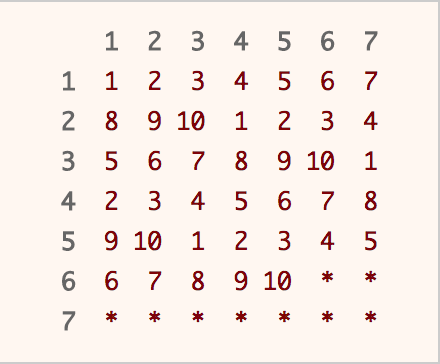
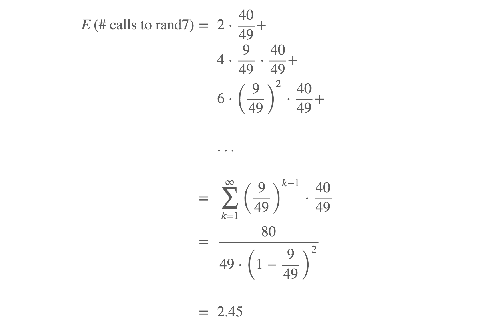
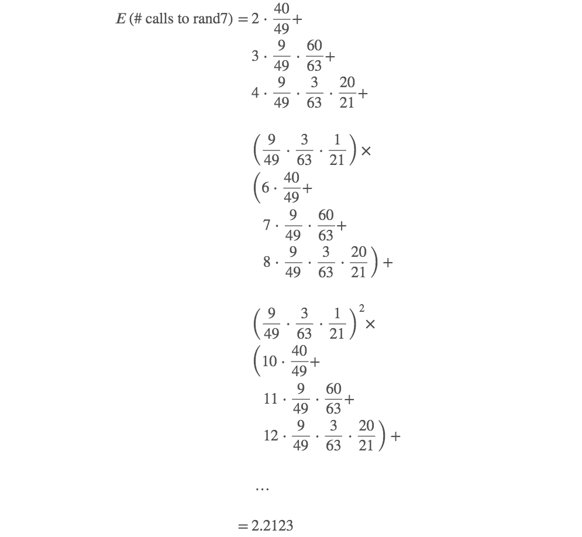

# LeetCode 
## Approach 1: Rejection Sampling
### Intuition

What if you could generate a random integer in the range 1 to 49? How would you generate a random integer in the range of 1 to 10? What would you do if the generated number is in the desired range? What if it is not?

### Algorithm

This solution is based upon [Rejection Sampling](https://en.wikipedia.org/wiki/Rejection_sampling). The main idea is when you generate a number in the desired range, output that number immediately. If the number is out of the desired range, reject it and re-sample again. As each number in the desired range has the same probability of being chosen, a uniform distribution is produced.

Obviously, we have to run rand7() function at least twice, as there are not enough numbers in the range of 1 to 10. By running rand7() twice, we can get integers from 1 to 49 uniformly. Why?



A table is used to illustrate the concept of rejection sampling. Calling rand7() twice will get us row and column index that corresponds to a unique position in the table above. Imagine that you are choosing a number randomly from the table above. If you hit a number, you return that number immediately. If you hit a * , you repeat the process again until you hit a number.

Since 49 is not a multiple of 10, we have to use rejection sampling. Our desired range is integers from 1 to 40, which we can return the answer immediately. If not (the integer falls between 41 to 49), we reject it and repeat the whole process again.

### C++
```c++
class Solution {
public:
    int rand10() {
        int row, col, idx;
        do {
            row = rand7();
            col = rand7();
            idx = col + (row - 1) * 7;
        } while (idx > 40);
        return 1 + (idx - 1) % 10;
    }
};
```

### Java
```java
class Solution extends SolBase {
    public int rand10() {
        int row, col, idx;
        do {
            row = rand7();
            col = rand7();
            idx = col + (row - 1) * 7;
        } while (idx > 40);
        return 1 + (idx - 1) % 10;
    }
}
```

### Complexity Analysis

* Time Complexity: ***O(1)*** average, but ***O(∞)*** worst case.

The [expected value](https://en.wikipedia.org/wiki/Expected_value) for the number of calls to rand7() can be computed as follows:



* Space Complexity: ***O(1)***.

## Approach 2: Utilizing out-of-range samples
### Intuition

There are a total of 2.45 calls to rand7() on average when using approach 1. Can we do better? Glad that you asked. In fact, we are able to improve average number of calls to rand7() by about 10%.

The idea is that we should not throw away the out-of-range samples, but instead use them to increase our chances of finding an in-range sample on the successive call to rand7.

### Algorithm

Start by generating a random integer in the range 1 to 49 using the aforementioned method. In the event that we could not generate a number in the desired range (1 to 40), it is equally likely that each number of 41 to 49 would be chosen. In other words, we are able to obtain integers in the range of 1 to 9 uniformly. Now, run rand7() again to obtain integers in the range of 1 to 63 uniformly. Apply rejection sampling where the desired range is 1 to 60. If the generated number is in the desired range (1 to 60), we return the number. If it is not (61 to 63), we at least obtain integers of 1 to 3 uniformly. Run rand7() again to obtain integers in the range of 1 to 21 uniformly. The desired range is 1 to 20, and in the unlikely event we get a 21, we reject it and repeat the entire process again.

### C++
```c++
class Solution {
public:
    int rand10() {
        int a, b, idx;
        while (true) {
            a = rand7();
            b = rand7();
            idx = b + (a - 1) * 7;
            if (idx <= 40)
                return 1 + (idx - 1) % 10;
            a = idx - 40;
            b = rand7();
            // get uniform dist from 1 - 63
            idx = b + (a - 1) * 7;
            if (idx <= 60)
                return 1 + (idx - 1) % 10;
            a = idx - 60;
            b = rand7();
            // get uniform dist from 1 - 21
            idx = b + (a - 1) * 7;
            if (idx <= 20)
                return 1 + (idx - 1) % 10;
        }
    }
};
```

### Java
```java
class Solution extends SolBase {
    public int rand10() {
        int a, b, idx;
        while (true) {
            a = rand7();
            b = rand7();
            idx = b + (a - 1) * 7;
            if (idx <= 40)
                return 1 + (idx - 1) % 10;
            a = idx - 40;
            b = rand7();
            // get uniform dist from 1 - 63
            idx = b + (a - 1) * 7;
            if (idx <= 60)
                return 1 + (idx - 1) % 10;
            a = idx - 60;
            b = rand7();
            // get uniform dist from 1 - 21
            idx = b + (a - 1) * 7;
            if (idx <= 20)
                return 1 + (idx - 1) % 10;
        }
    }
}
```

### Complexity Analysis

* Time Complexity: ***O(1)*** average, but ***O(∞)*** worst case.

The [expected value](https://en.wikipedia.org/wiki/Expected_value) for the number of calls to rand7() can be computed as follows (with some steps omitted due to tediousness):



* Space Complexity: ***O(1)***.

### Comment to this solution

First approach can be done much more effective:
```c++
int
rand10(void)
{
	int a, b, r;

	a = rand7() - 1;
	do {
		b = a;
		a = rand7() - 1;
		r = a * 7 + b;
	} while (r > 39);

	return r % 10 + 1;
}
```

Second approach can be done much more simple, consistent and understandable:
```c++
int
rand10(void)
{
	int r;

	for (;;) {
		r = (rand7() - 1) * 7 + rand7() - 1;
		if (r < 40)
			break;
		r = r * 7 + rand7() - 1;
		if (r < 340)
			break;
		r = r * 7 + rand7() - 1;
		if (r < 2400)
			break;
	}

	return r % 10 + 1;
}
```

By the way, there is third approach, simple, effective and concise:
```c++
int
rand10(void)
{
	int a, b;

	do a = rand7(); while (a == 7);
	do b = rand7(); while (b > 5);

	return a & 1 ? b : b + 5;
}
```

## Another solutions

### Sol 1 in py
What we can do here is to generate numbers between **1** and **7** and this makes this problems both easy and difficult. Easy, because you do not have a lot of choice what to do, difficult, because we need to use not very big number of generations. Can we use one number between **1** and **7** to generate number between **1** and **10**? I do not think so, we have very small choice. Can we use **2**? Yes, we can, here is the strategy:

1. Generate a from **1** to **7** and b from **1** to **7**, then we have **7x7 = 49** options. Let us create number **c = (a-1)*7 + b-1**, then we can show that **c** is number between **0** and **48**: substitute all possible values for a and b and you will see.
2. Now, let us divide these number into groups: **[0,9]; [10;19]; [20;29]; [30;39]; [40;48]**. If we get into one of the first four group we are happy: there is ten number in each group, so we just return **c%10 + 1**.
3. If we are in the fifth group, we are not happy, there are only **9** numbers in this group and we need **10**, use **9** is not fair. So in these case, we say, that our experiment was not working, and we just start it all over again! That is all.

**Complexity:** what we do here is called sampling with rejection. Success of first sampling is **p = 40/49**. If first time our sampling was not working and it worked second time we have **(1-p) * p** , if it worked third time it is **(1-p) * (1-p) * p** and so on. Each time we use two **rand7()** generation. So, overall our expectation is **2 * p + 4 * (1-p) * p + 6 * (1-p)^2 * p + ...** How to compute it? Note, that it is nothing else than geometrical distribution: https://en.wikipedia.org/wiki/Geometric_distribution, so the answer is just **2/p** = **98/40** = **2.45**.

```python
class Solution:
    def rand10(self):
        c = (rand7() - 1)*7 + rand7() - 1
        return self.rand10() if c >= 40 else (c % 10) + 1
```

[Link to original post](https://leetcode.com/problems/implement-rand10-using-rand7/discuss/816210/Python-rejection-sampling-2-lines-explained)

### Solution 2 in C++
My main intuition was that **7 == 2 + 5** and **2 * 5 == 10**.

Seems still too abstract (or absurd)? Bear with me!

First of all we declare 2 variables, **n** and **m**, settimg them initially to be **rand7()** and **7**.

Then we make sure tha **n** is only in the **1 - 5** range and, if not, we regenerate it and assign **n - 5** to **m**, that thus would be in the 1** - 2** range. Notice that in this way **n** and **m** have the same probabiliy of still being each specific number in their own range.

In the second loop, we make sure that m has a **1 - 6** value, with similar logic of regenerating numbers until we need them.

Finally we return **n** + either **0** or **5**, depending if **m** is even or odd, respectively.

This gives us perfectly distributed numbers :)

The code:
```c++
class Solution {
public:
    int n, m;
    int rand10() {
        // initialising the values
		n = rand7(), m = 7;
        // making sure n is in the right 1-5 range and, if we can, we settle m too
		while (n > 5) {
            m = n - 5;
            n = rand7();
        }
        // if m was not settled, we do it here
		while (m == 7) m = rand7();
        return (m % 2 ? 5 : 0) + n;
    }
};
```

### Comment to this post

My planning went like this:
-- I've got to roll the dice more than once
-- If I roll twice, how will I combine the results?
-- I'll multiply them together!

And, OMG, here is the convoluted result!
```javascript
var rand10 = function() {
    // pick two numbers from rand7(); 49 possible pairs
    // multiply together; 25 possible answers
    // pick 4 pairs to assign to each of 1..10, 
    // other nine pairs redo and hope to get a useable pair eventually! 
    
    const mapping = {
        6 : 1, 
        12: 2,
        2 : 3, 3 : 3, // each come up twice
        7 : 4, 8 : 4,
        10: 5, 14: 5,
        15: 6, 18: 6,
        20: 7, 21: 7,
        24: 8, 30: 8,
        28: 9, 35: 9,
        42: 10, 5: 10
        // leaving the nine pairs which score 4, 1, 9, 16, 25, 36, 49
        // (4 comes up with 3 pairs)
    }
    let chosen = 0; limit = 0;
    while (chosen === 0 && limit < 30) {
        let num1 = rand7(), num2 = rand7();
        let prod = num1 * num2;
        if (mapping[prod] !== undefined) {chosen = mapping[prod]}
        limit++ // small chance of 0 being chosen
    }
    return chosen
};
```
I ought to give myself more options when planning. Why did I limit myself to using the product?
The main solution uses a 2D numbering I've used in loads of board games and is much easier.

Let alone your solution, which really doesn't need more than the code to understand.
```javascript
var rand10 = function() {
    let num1 = 7, num2 = 7;
    while (num1 > 5) {num1 = rand7()}
    while (num2 > 6) {num2 = rand7()}
    return num2 % 2 === 1 ? num1 : num1+5
};
```

[Link to original post](https://leetcode.com/problems/implement-rand10-using-rand7/discuss/816213/C%2B%2B-Simple-2-Steps-Solution-Explained-~100-Time-~60-Space)