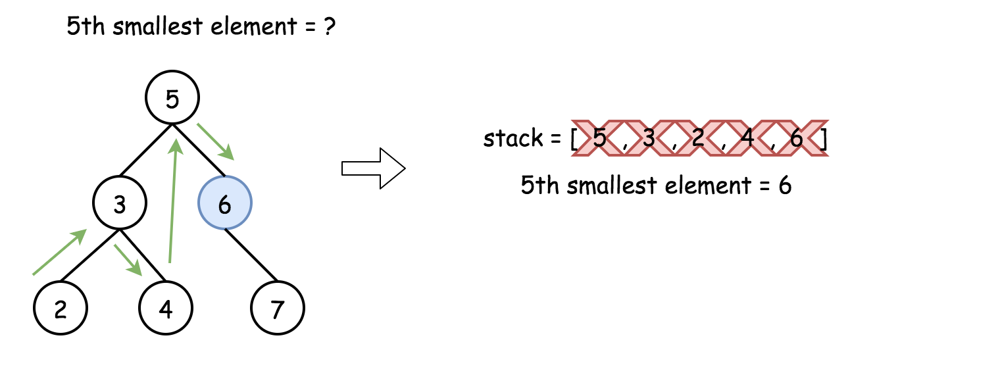

# Solution
## How to traverse the tree
There are two general strategies to traverse a tree:

* *Depth First Search* (**DFS**)

In this strategy, we adopt the **depth** as the priority, so that one would start from a root and reach all the way down to certain leaf, and then back to root to reach another branch.

The DFS strategy can further be distinguished as **preorder**, **inorder**, and **postorder** depending on the relative order among the root node, left node and right node.

* *Breadth First Search* (**BFS**)

We scan through the tree level by level, following the order of height, from top to bottom. The nodes on higher level would be visited before the ones with lower levels.

On the following figure the nodes are numerated in the order you visit them, please follow *1-2-3-4-5* to compare different strategies.


```
To solve the problem, one could use the property of BST : inorder traversal of BST is an array sorted in the ascending order.
```

## Approach 1: Recursion
It's a very straightforward approach with *O(N)* time complexity. The idea is to build an inorder traversal of BST which is an array sorted in the ascending order. Now the answer is the **k - 1**th element of this array.


**Java**
```java
class Solution {
  public ArrayList<Integer> inorder(TreeNode root, ArrayList<Integer> arr) {
    if (root == null) return arr;
    inorder(root.left, arr);
    arr.add(root.val);
    inorder(root.right, arr);
    return arr;
  }

  public int kthSmallest(TreeNode root, int k) {
    ArrayList<Integer> nums = inorder(root, new ArrayList<Integer>());
    return nums.get(k - 1);
  }
}
```

**Python**
```python
class Solution:
    def kthSmallest(self, root, k):
        """
        :type root: TreeNode
        :type k: int
        :rtype: int
        """
        def inorder(r):
            return inorder(r.left) + [r.val] + inorder(r.right) if r else []
    
        return inorder(root)[k - 1]
```

### Complexity Analysis

* Time complexity : *O(N)* to build a traversal.
* Space complexity : *O(N)* to keep an inorder traversal.

## Approach 2: Iteration
The above recursion could be converted into iteration, with the help of stack. This way one could speed up the solution because there is no need to build the entire inorder traversal, and one could stop after the kth element.



**Java**
```java
class Solution {
  public int kthSmallest(TreeNode root, int k) {
    LinkedList<TreeNode> stack = new LinkedList<TreeNode>();

    while (true) {
      while (root != null) {
        stack.add(root);
        root = root.left;
      }
      root = stack.removeLast();
      if (--k == 0) return root.val;
      root = root.right;
    }
  }
}
```

**Python**
```python
class Solution:
    def kthSmallest(self, root, k):
        """
        :type root: TreeNode
        :type k: int
        :rtype: int
        """
        stack = []
        
        while True:
            while root:
                stack.append(root)
                root = root.left
            root = stack.pop()
            k -= 1
            if not k:
                return root.val
            root = root.right
```

### Complexity Analysis

* Time complexity : *O(H+k)*, where *H* is a tree height. This complexity is defined by the stack, which contains at least *H + k* elements, since before starting to pop out one has to go down to a leaf. This results in *O(logN + k)* for the balanced tree and *O(N + k)* for completely unbalanced tree with all the nodes in the left subtree.

* Space complexity : *O(H + k)*, the same as for time complexity, *O(N + k)* in the worst case, and *O(logN + k)* in the average case.

### Follow up
```
What if the BST is modified (insert/delete operations) often and you need to find the kth smallest frequently? How would you optimize the kthSmallest routine?
```

Insert and delete in a BST were discussed last week, the time complexity of these operations is *O(H)*, where *H* is a height of binary tree, and *H = logN* for the balanced tree.

Hence without any optimisation insert/delete + search of kth element has *O(2H + k)* complexity. How to optimise that?

That's a design question, basically we're asked to implement a structure which contains a BST inside and optimises the following operations :

* Insert

* Delete

* Find kth smallest

Seems like a database description, isn't it? Let's use here the same logic as for LRU cache design, and combine an indexing structure (we could keep BST here) with a double linked list.

Such a structure would provide:

* *O(H)* time for the insert and delete.

* *O(k)* for the search of kth smallest.


The overall time complexity for insert/delete + search of kth smallest is *O(H + k)* instead of *O(2H + k)*.

### Complexity Analysis

* Time complexity for insert/delete + search of kth smallest: *O(H + k)*, where *H* is a tree height. *O(logN + k)* in the average case, *O(N + k)* in the worst case.

* Space complexity : *O(N)* to keep the linked list.

