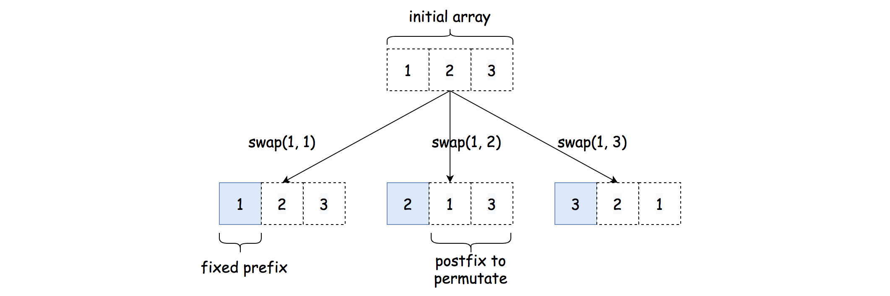
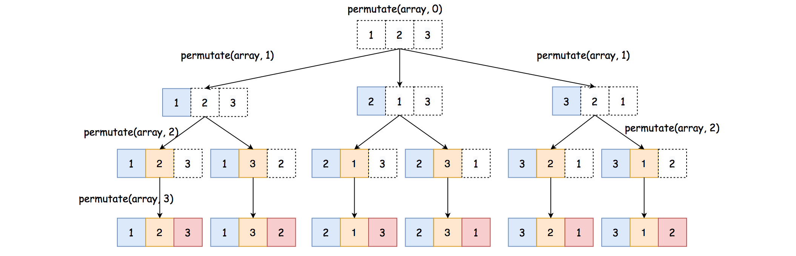

# LeetCode Largest Time for Given Digits Solution
## Overview
If we add one statement in the problem description that one could use the utility function in their preferred programming language to generate all permutations from a given list, *i.e.* **itertools.permutations(list)** in Python, then many of you would agree that this is definitely an **easy** problem.

>Indeed, if we have all the permutations from the given list of digits, we could simply ***enumerate*** each of the permutations to see if we could build a valid time.

At the end of the enumeration, it would be easy to get the maximum of all valid times.

In the following sections, we would first present a solution with the built-in ***permutation*** utility.

Then, in case the interviewer insists that one should not use the permutation utility, we also present another solution where we ***hand-craft*** the permutations.

## Approach 1: Enumerate the Permutations
### Intuition

>As we stated before, once we have the permutations at our disposal, the idea is simple: we iterate through all possible permutations of the given 4 digits, and for each permutation, we check if we could build a time out of it in the 24H format (*i.e.* **HH:MM**).

There are two conditions that we should meet, in order to construct a valid time format:

* **HH < 24:** The first two digits, *i.e.* the hour, should be less than 24.

* **MM < 60:** The last two digits, *i.e.* the minute, should be less than 60.

### Algorithm

* The algorithm can be implemented in a single loop over all the possible permutations for the given 4 digits.

* At each iteration, we check if we could build a valid time based on the conditions we presented before.

* Meanwhile, we use a variable (*i.e.***max_time**) to keep track of the maximum valid time that we've seen during the iteration.

**C++**
```c++
class Solution {
public:
    string largestTimeFromDigits(vector<int>& A) {

        int max_time = -1;
        // prepare for the generation of permutations next.
        std::sort(A.begin(), A.end());

        do {
            int hour = A[0] * 10 + A[1];
            int minute = A[2] * 10 + A[3];

            if (hour < 24 && minute < 60) {
                int new_time = hour * 60 + minute;
                max_time = new_time > max_time ? new_time : max_time;
            }
        } while(next_permutation(A.begin(), A.end()));

        if (max_time == -1) {
            return "";
        } else {
            std::ostringstream strstream;
            strstream << std::setw(2) << std::setfill('0') << max_time / 60
               << ":" << std::setw(2) << std::setfill('0') << max_time % 60;
            return strstream.str();
        }
    }
};
```

**Python**
```python
class Solution:
    def largestTimeFromDigits(self, A: List[int]) -> str:
        
        max_time = -1
        # enumerate all possibilities, with the permutation() func
        for h, i, j, k in itertools.permutations(A):
            hour = h*10 + i
            minute = j*10 + k
            if hour < 24 and minute < 60:
                max_time = max(max_time, hour * 60 + minute)
        
        if max_time == -1:
            return ""
        else:
            return "{:02d}:{:02d}".format(max_time // 60, max_time % 60)
```

### Note:

* We did not provide a solution in Java, since in Java we don't have a built-in function that can do the permutation.

* Both the [itertools.permutations](https://docs.python.org/3/library/itertools.html#itertools.permutations) API in Python and the [next_permutation()](https://en.cppreference.com/w/cpp/algorithm/next_permutation) in C++ can generate the permutations in ***lexicographic*** ordering. As a result, one can order the input array in descending order, rather than iterating all possible permutations, one can have an **early stop** as soon as we find the first valid time, which would also be the largest one, since the permutations are generated in lexicographic ordering.

### Complexity Analysis

* Time Complexity: ***O(1)***

    * For an array of length ***N***, the number of permutations would be ***N!***. In our case, the input is an array of 4 digits. Hence, the number of permutations would be 4! = 4 * 3 * 2 * 1 = 24.

    * Since the length of the input array is fixed, it would take the same constant time to generate its permutations, regardless the content of the array. Therefore, the time complexity to generate the permutations would be ***O(1)***.

    * In the above program, each iteration takes a constant time to process. Since the total number of permutations is fixed (constant), the time complexity of the loop in the algorithm is constant as well, *i.e.* ***24⋅O(1)=O(1)***.

    * To sum up, the overall time complexity of the algorithm would be ***O(1)+O(1)=O(1)***.

* Space Complexity: ***O(1)***

    * In the algorithm, we keep the permutations for the input digits, which are in total 24, *i.e.* a constant number regardless the input.

## Approach 2: Permutation via Backtracking
### Intuition

As we discussed before, the ***hard*** part of the problem is not enumerating over the permutations, but actually constructing the permutations itself.

In this approach, we present a solution to *reinvent the wheel, i.e.* generating permutations, which itself is a fun problem to solve. For practice, one can implement the permutation algorithms on these two problem: [permutations](https://leetcode.com/problems/permutations/) and [next permutation](https://leetcode.com/problems/next-permutation/).

There are several classic algorithms to generate the permutations. For instance, B.R. Heap proposed an algorithm (named [[Heap's algorithm](https://en.wikipedia.org/wiki/Heap%27s_algorithm)) in 1963, which minimizes the movements of elements. It was still considered as the most efficient algorithm later in 1977.

Here we present an algorithm, which might not be the most efficient one but arguably more intuitive.

>It is based on the ideas of **divide-and-conquer**, **swapping** and **backtracking**.

* First of all, the algorithm follows the paradigm of ***divide and conquer***. Given an array **A[0:n]**, once we fix on the arrangements of the prefix subarray **A[0:i]**, we then reduce the problem down to a subproblem, *i.e.* generating the permutations for the postfix subarray **A[i:n]**.

* In order to fix on a prefix subarray, we apply the operation of **swapping**, where we swap the elements between a fixed position and an alternative position.



* Finally, once we explore the permutations after a swapping operation, we then revert the choice (*i.e.* **backtracking**) by performing the same swapping, so that we could have a clean slate to start all over again.


## Algorithm

Now we can put together all the ideas that we presented before, and implement the permutation algorithm.

Here we implement the permutation algorithm as the function **permutate(array, start)** which generates the permutations for the postfix subarray of **array[start:len(array)]**. Once we implement the function, we invocate it as **permutate(array, 0)** to generate all the permutations from the array.

As a preview, once implemented, the function will unfold itself as in the following example.



For instance, starting from the root node, first we try to fix on the first element in the final combination, which we try to switch the element between the first position in the array and each of the positions in the array. Since there are 3 possible candidates, we branch out in 3 directions from the root node.

The function can be implemented in ***recursion***, due to its nature of divide-and-conquer and backtracking.

* The base case of the function would be s**tart == len(array)**, where we've fixed all the prefixes and reached the end of the combination. In this case, we simply add the current array as one of the results of combination.

* When we still have some postfix that need to be permutated, *i.e.* **start < len(array)**, we then apply backtracking to try out all possible permutations for the postfixes, *i.e.* **permutate(array, start+1)**. More importantly, we need to swap the **start** element with each of the elements following the start index (including the start element). The goal is two-fold: 1). we generate different prefixes for the final combination; 2). we generate different lists of candidates in the postfixes, so that the permutations generated from the postfixes would vary as well.

* At the end of backtracking, we will swap the **start** element back to its original position, so that we can try out other alternatives.

* For each permutation, we apply the same logic as in the previous approach, *i.e.* check if the permutation is of valid time and update the maximum time.

**Java**
```java
class Solution {
    private int max_time = -1;

    public String largestTimeFromDigits(int[] A) {
        this.max_time = -1;
        permutate(A, 0);
        if (this.max_time == -1)
            return "";
        else
            return String.format("%02d:%02d", max_time / 60, max_time % 60);
    }

    protected void permutate(int[] array, int start) {
        if (start == array.length) {
            this.build_time(array);
            return;
        }
        for (int i = start; i < array.length; ++i) {
            this.swap(array, i, start);
            this.permutate(array, start + 1);
            this.swap(array, i, start);
        }
    }

    protected void build_time(int[] perm) {
        int hour = perm[0] * 10 + perm[1];
        int minute = perm[2] * 10 + perm[3];
        if (hour < 24 && minute < 60)
            this.max_time = Math.max(this.max_time, hour * 60 + minute);
    }

    protected void swap(int[] array, int i, int j) {
        if (i != j) {
            int temp = array[i];
            array[i] = array[j];
            array[j] = temp;
        }
    }
}
```

**Python**
```python
class Solution:
    def largestTimeFromDigits(self, A: List[int]) -> str:

        max_time = -1

        def build_time(permutation):
            nonlocal max_time

            h, i, j, k = permutation
            hour = h*10 + i
            minute = j*10 + k
            if hour < 24 and minute < 60:
                max_time = max(max_time, hour * 60 + minute)

        def swap(array, i, j):
            if i != j:
                array[i], array[j] = array[j], array[i]

        def permutate(array, start):
            if start == len(array):
                build_time(array)
                return

            for index in range(start, len(array)):
                swap(array, index, start)
                # repeat the permutation with the original array mutated
                permutate(array, start+1)
                swap(array, index, start)

        permutate(A, 0)
        if max_time == -1:
            return ""
        else:
            return "{:02d}:{:02d}".format(max_time // 60, max_time % 60)
```

### Complexity Analysis

* Time Complexity: ***O(1)***

    * Since the length of the input array is fixed, it would take the same constant time to generate its permutations, regardless the content of the array. Therefore, the time complexity to generate the permutations would be ***O(1)***.

    * Therefore, same as the previous approach, the overall time complexity of the algorithm would be ***O(1)***.

* Space Complexity: ***O(1)***

    * In the algorithm, we keep the permutations for the input digits, which are in total 24, *i.e.* a constant number regardless the input.

    * Although the recursion in the algorithm could incur additional memory consumption in the function call stack, the maximal number of recursion is bounded by the size of the combination. Hence, the space overhead for the recursion in this problem is constant.