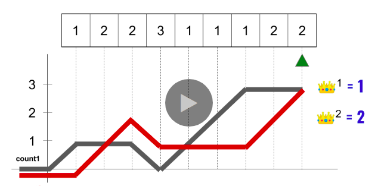

# LeetCode Majority Element II Solution

This problem can be approached similarly to [Majority Element](https://leetcode.com/problems/majority-element/). For this problem, two constraints we have to satisfy are linear runtime and constant space. In this article, we will focus on the solution which satisfies both constraints.

## Approach 1: Boyer-Moore Voting Algorithm
### Intuition

To figure out a *O(1)* space requirement, we would need to get this simple intuition first. For an array of length n:

* There can be at most **one** majority element which is more than **⌊n/2⌋** times.
* There can be at most **two** majority elements which are more than **⌊n/3⌋** times.
* There can be at most **three** majority elements which are more than **⌊n/4⌋** times.

and so on.

Knowing this can help us understand how we can keep track of majority elements which satisfies *O(1)* space requirement.

Let's try to get an intuition for the case where we would like to find a majority element which is more than **⌊n/2⌋** times in an array of length **n**.

The idea is to have two variables, one holding a potential candidate for majority element and a counter to keep track of whether to swap a potential candidate or not. Why can we get away with only two variables? Because *there can be at most ***one*** majority element which is more than ***⌊n/2⌋**** times. Therefore, having only one variable to hold the only potential candidate and one counter is enough.

While scanning the array, the counter is incremented if you encounter an element which is exactly same as the potential candidate but decremented otherwise. When the counter reaches zero, the element which will be encountered next will become the potential candidate. Keep doing this procedure while scanning the array. However, when you have exhausted the array, you have to make sure that the element recorded in the potential candidate variable is the majority element by checking whether it occurs more than **⌊n/2⌋** times in the array. In the original [Majority Element](https://leetcode.com/problems/majority-element/) problem, it is guaranteed that there is a majority element in the array so your implementation can omit the second pass. However, in a general case, you need this second pass since your array can have no majority elements at all!

The counter is initialized as **0** and the potential candidate as **None** at the start of the array.

**1**


**2**


**3**


**4**


**5**


**6**


**7**


**8**


**9**


**10**


If an element is truly a majority element, it will stick in the potential candidate variable, no matter how it shows up in the array (i.e. all clustered in the beginning of the array, all clustered near the end of the array, or showing up anywhere in the array), after the whole array has been scanned. Of course, while you are scanning the array, the element might be replaced by another element in the process, but the true majority element will definitely remain as the potential candidate in the end.

Now figuring out the majority elements which show up more than **⌊n/3⌋** times is not that hard anymore. Using the intuition presented in the beginning, we only need four variables: two for holding two potential candidates and two for holding two corresponding counters. Similar to the above case, both candidates are initialized as None in the beginning with their corresponding counters being **0**. While going through the array:

* If the current element is equal to one of the potential candidate, the count for that candidate is increased while leaving the count of the other candidate as it is.
* If the counter reaches zero, the candidate associated with that counter will be replaced with the next element **if** the next element is not equal to the other candidate as well.
* Both counters are decremented **only when** the current element is different from both candidates.

**1**


**2**


**3**


**4**


**5**


**6**


**7**


**8**


**9**


**10**


### Implementation

**Java**
```java
class Solution {
    public List < Integer > majorityElement(int[] nums) {

        // 1st pass
        int count1 = 0;
        int count2 = 0;

        Integer candidate1 = null;
        Integer candidate2 = null;

        for (int n: nums) {
            if (candidate1 != null && candidate1 == n) {
                count1++;
            } else if (candidate2 != null && candidate2 == n) {
                count2++;
            } else if (count1 == 0) {
                candidate1 = n;
                count1++;
            } else if (count2 == 0) {
                candidate2 = n;
                count2++;
            } else {
                count1--;
                count2--;
            }
        }

        // 2nd pass
        List result = new ArrayList <> ();

        count1 = 0;
        count2 = 0;

        for (int n: nums) {
            if (candidate1 != null && n == candidate1) count1++;
            if (candidate2 != null && n == candidate2) count2++;
        }

        int n = nums.length;
        if (count1 > n/3) result.add(candidate1);
        if (count2 > n/3) result.add(candidate2);

        return result;
    }
}
```

**Python**
```python
class Solution:

    def majorityElement(self, nums):
        if not nums:
            return []
        
        # 1st pass
        count1, count2, candidate1, candidate2 = 0, 0, None, None
        for n in nums:
            if candidate1 == n:
                count1 += 1
            elif candidate2 == n:
                count2 += 1
            elif count1 == 0:
                candidate1 = n
                count1 += 1
            elif count2 == 0:
                candidate2 = n
                count2 += 1
            else:
                count1 -= 1
                count2 -= 1
        
        # 2nd pass
        result = []
        for c in [candidate1, candidate2]:
            if nums.count(c) > len(nums)//3:
                result.append(c)

        return result
```

### Complexity Analysis

* Time complexity : ***O(N)*** where ***N*** is the size of **nums**. We first go through **nums** looking for first and second potential candidates. We then count the number of occurrences for these two potential candidates in **nums**. Therefore, our runtime is ***O(N) + O(N) = O(2N) ≈ O(N)***.

* Space complexity : ***O(1)*** since we only have four variables for holding two potential candidates and two counters. Even the returning array is at most 2 elements

## [Python] Voting O(n) solution, explained

Let us iterate through our data and at each moment of time keep at most **2** candidates with the highest score, let us consider example **1 2 3 3 3 2 2 2 4 2**.

1. On first step we add **1** to our candidates, frequency **1**, so we have **1: 1**
2. Now we add **2** to our candidates, frequency **1**, so we have **1:1**, **2:1**.
3. Now we add **3** to our candidates and we have **1:1, 2:1, 3:1**. Now we subtract **1** from all frequencies, because it will not change anything.
4. Now we add **3**, so we have **3:1**.
5. Now we add **3**, so we have **3:2**.
6. Now we add **2**, so we have **3:2, 2:1**.
7. Now we add **2**, so we have **3:2, 2:2**
8. Now we add **2**, so we have **3:2, 2:3**.
9. Now we add **4**, so we have **3:2, 2:3, 4:1**, subtract **1** from all, and we have **3:1, 2:2**.
10. Finally we add **2**, so we have **3:1, 2:3**.

First stage of our algorithm is finished, we have no more than two candidates. Now we need to make sure, that these candidates indeed has frequence more than **[n/3]**. So we iterate through our data once again and count them. In our case **2** is true candidate and **3** need to be removed, its frequency is not big enough.

**Complexity:** Time complexity is **O(n)**, because we traverse our **nums** twice: on first run we process each number at most twice: when we add it to counter and when remove. Second run, where we evaluate frequencies of candidates is also linear. Space complexity is **O(1)**, because our counter always have no more than **3** elements.

```python
class Solution:
    def majorityElement(self, nums):
        count = Counter()
        for num in nums:
            count[num] += 1
            if len(count) == 3:
                new_count = Counter()
                for elem, freq in count.items(): 
                    if freq != 1: new_count[elem] = freq - 1
                count = new_count
                    
        cands = Counter(num for num in nums if num in count)      
        return [num for num in cands if cands[num] > len(nums)/3]
```

[Link to original post](https://leetcode.com/problems/majority-element-ii/discuss/858872/Python-Voting-O(n)-solution-explained)