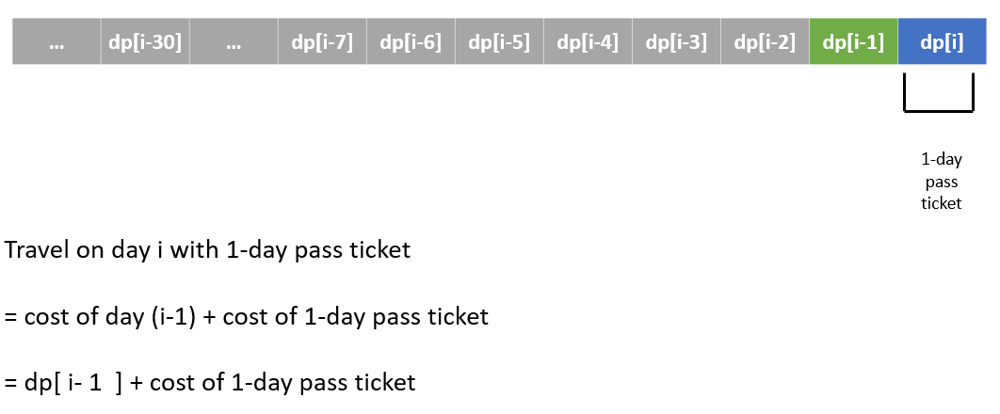
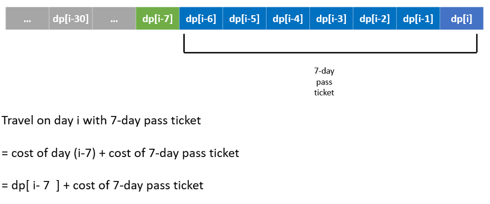
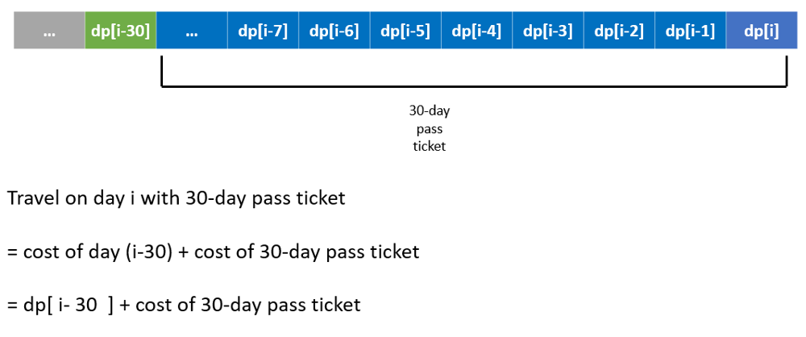

# LeetCode Minimum Cost For Tickets Solution

We can solve this problem using dynamic programming. If we define:

* dp[i] = minimum cost for tickets on day i

Then, at each step, we have 3 options:

* dp[i] = dp[i - 1] + costs[0] // for 1-day pass
* dp[i] = dp[i - 7] + costs[1] // for 7-day pass
* dp[i] = dp[i - 30] + costs[2] // for 30-day pass

Approaches 2 & 3 use this definition.

We can also define our dp table a bit differently:

* dp[i] = minimum cost for tickets on day days[i]

Note the subtle difference, it's not on day i but rather on day days[i]. Now we have a problem, how do we find a value x in days where:

* x >= days[i] - 1
* x >= days[i] - 7
* x >= days[i] - 30
For this we can use binary search shown in Approach 1.

## Approach 1: DP + Binary Search
We find the previous day greater than or equal to x using binary search. Usually, we would use std::lower_bound for this but in this case our dp table is one-indexed instead of zero-indexed. So we use std::upper_bound instead.
```c++
int mincostTickets(vector<int>& days, vector<int>& costs) {
	int n = days.size();
	vector<int> dp(n + 1);
	for (int j, i = 1; i <= n; i++) {
		dp[i] = dp[i - 1] + costs[0];
		j = distance(days.begin(), upper_bound(days.begin(), days.begin() + i, days[i - 1] - 7));
		dp[i] = min(dp[j] + costs[1], dp[i]);
		j = distance(days.begin(), upper_bound(days.begin(), days.begin() + i, days[i - 1] - 30));
		dp[i] = min(dp[j] + costs[2], dp[i]);
	}
	return dp[n];
}
```

### Complexity
* Time: O(n • log n)
* Space: O(n)

## Approach 2: DP + HashSet
We can only buy a ticket on a day we fly, not on other days. So we need a quick way to check if given a day x, whether it exists in days. For this we can use a HashSet or std::unordered_set.
```c++
int mincostTickets(vector<int>& days, vector<int>& costs) {
	int n = days.back();
	vector<int> dp(n + 1);
	unordered_set<int> seen(days.begin(), days.end());
	
	// dynamic programming
	for (int i = 1; i <= n; i++) {
		if (!seen.count(i))
			dp[i] = dp[i - 1];
		else
			dp[i] = min({dp[i - 1         ] + costs[0],
							dp[max(0, i -  7)] + costs[1],
							dp[max(0, i - 30)] + costs[2]});
	}
	
	return dp[n];
}
```
### Complexity
* Time: O(n)
* Space: O(n)

## Approach 3: DP
Instead of using a HashSet to check if a given day x exists in days, we can initialize it to some cost which we know we can never have, this cost can be anything <= 0, I chose cost zero to keep things simple.
```c++
int mincostTickets(vector<int>& days, vector<int>& costs) {
	int n = days.back();
	vector<int> dp(n + 1);
	
	// initialization
	for (int& day: days)
		dp[day] = numeric_limits<int>::max();
	
	// dynamic programming
	for (int i = 1; i <= n; i++) {
		if (dp[i] == 0)
			dp[i] = dp[i - 1];
		else
			dp[i] = min({dp[i - 1         ] + costs[0],
							dp[max(0, i -  7)] + costs[1],
							dp[max(0, i - 30)] + costs[2]});
	}
	
	return dp[n];
}
```
### Complexity
* Time: O(n)
* Space: O(n)

[Link to original post](https://leetcode.com/problems/minimum-cost-for-tickets/discuss/810728/C%2B%2B-3-Approaches)

# Solution 2

### Hint:

Optimal substructure for DP

### Base case:
```
# no cost before first day (i.e., no travel)
dp[ 0 ] = 0
```
### General case:

For non-traveling day:
```
# today is not traveling day, no extra cost

dp[ d ] = dp[ d - 1 ] 
```

For traveling day:

```
# compute minimum cost from subproblem

dp[ d ] = min( dp[     d - 1      ] + cost[0],
               dp[ max(d - 7, 0)  ] + cost[1],
			   dp[ max(d - 30, 0) ] + cost[2] )

# cost[0]: the cost of 1-day-pass ticket
# cost[1]: the cost of 7-day-pass ticket
# cost[2]: the cost of 30-day-pass ticket
```

### Note:
Here we use max( d-7, 0) and max( d-30, 0) to avoid invalid day index which is out-of-boundary.







### Implementation by Dynamic Programming
```python
class Solution:
    def mincostTickets(self, days: List[int], costs: List[int]) -> int:
        
        # index of ticket
        _1day_pass, _7day_pass, _30day_pass = 0, 1, 2
        
        # Predefined constant to represent not-traverling day
        NOT_Traveling_Day = -1
        
        # DP Table, record for minimum cost of ticket to travel
        dp_cost = [NOT_Traveling_Day for _ in range(366)]
        
        
        # base case:
        # no cost before travel
        dp_cost[0] = 0
        
        for day in days:
            
            # initialized to 0 for traverling days
            dp_cost[day] = 0
            
        
        
        # Solve min cost by Dynamic Programming
        for day_i in range(1, 366):
            
            if dp_cost[day_i] == NOT_Traveling_Day:
                
                # today is not traveling day
                # no extra cost
                dp_cost[day_i] = dp_cost[day_i - 1]
            
            
            else:
                
                # today is traveling day
                # compute optimal cost by DP
                
                dp_cost[day_i] = min(   dp_cost[ day_i - 1 ]  + costs[ _1day_pass ],
                                        dp_cost[ max(day_i - 7, 0) ]  + costs[ _7day_pass ],
                                        dp_cost[ max(day_i - 30, 0) ] + costs[ _30day_pass ]     )
        
        
        # Cost on last day of this year is the answer
        return dp_cost[365]
```

[Link to original post](https://leetcode.com/problems/minimum-cost-for-tickets/discuss/810749/Python-by-DP-w-Visualization)