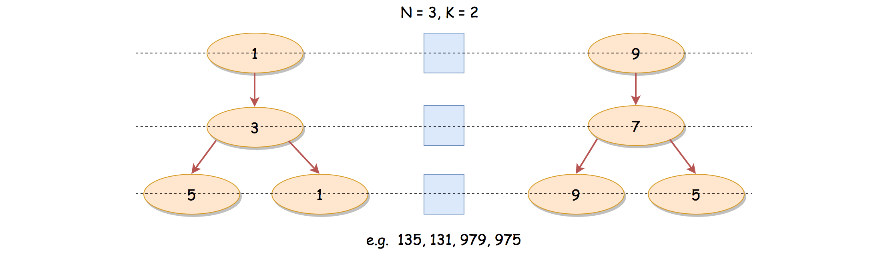
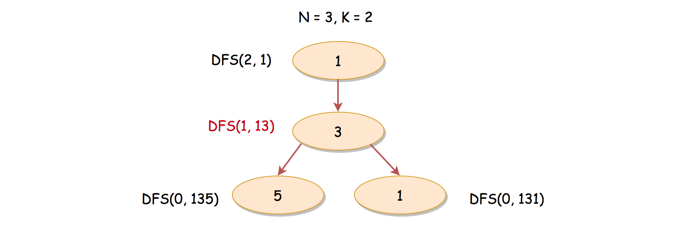
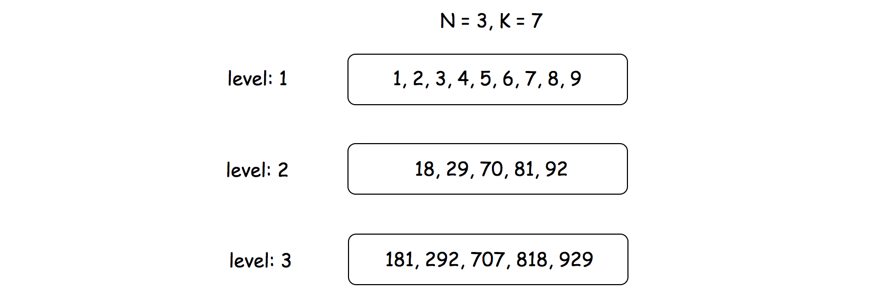

# LeetCode Numbers With Same Consecutive Differences Solution
## Overview
The problem asks us to come up a list of digit combinations that follow the defined pattern. Before jumping to the implementation, it is always helpful to *manually* deduce some examples.

Suppose that we have **N=3** and **K=2**, i.e. we should come up a series of 3-digits numbers, where for each number the difference between each adjacent digits is 2.

Let us try to build the number ***digit by digit***. Starting from the highest digit, we can pick the digit 1. Then for the next digit, we need to pick **3** (*i.e. 1+2*). Finally, for the last digit, we could have two choices: **5** and **1** (*i.e. 3+2, 3-2*). We illustrate the process in the following graph, where each ***node*** represents a digit that we pick, and the ***level*** of the node corresponds to the position that the digit situates in the final number.



>As one might notice that, we just converted the problem into a tree traversal problem, where each path from the root to a leaf forms a solution for the problem.

As we know, the common algorithms for the tree traversal problem would be ***DFS*** (Depth-First Search) and ***BFS*** (Breadth-First Search), which are exactly what we will present in the following sections.

## Approach 1: DFS (Depth-First Search)
### Intuition

If one is not familiar with the concepts of DFS and BFS, we have an Explore card called [Queue & Stack](https://leetcode.com/explore/learn/card/queue-stack/) where we cover the [DFS traversal](https://leetcode.com/explore/learn/card/queue-stack/232/practical-application-stack/) as well as the [BFS traversal](https://leetcode.com/explore/learn/card/queue-stack/231/practical-application-queue/).

In this section, we will start from the DFS strategy, which arguably is more intuitive for this problem.

As we stated in the overview section, we could build a valid digit combination *digit by digit* or (node by node in terms of tree).

For a number consisting of **N** digits, we start from the highest digit and walk through to the lowest digit. At each step, we might have several candidates that are eligible to be explored.

With the DFS strategy, we prioritize the *depth* over the *breadth*, i.e. we pick one of the candidates and continue the exploration before moving on to the other candidates that are of the same level.

### Algorithm

Intuitively we could implement the DFS algorithm with recursion. Here we define a recursive function **DFS(N, num)** (in Python) whose goal is to come up the combinations for the remaining **N** digits, starting from the current **num**. Note that, the signature of the function is slightly different in our Java implementation. Yet, the semantics of the function remains the same.



For instance, in the previous examples, where **N=3** and **K=2**, and there is a moment we would invoke **DFS(1, 13)** which is to add another digit to the existing number **13** so that the final number meets the requirements. If the DFS function works properly, we should have the numbers of **135** and **131** as results after the invocation.

We could implement the recursive function in the following steps:

* As a base case, when **N=0** *i.e.* no more remaining digits to complete, we could return the current **num** as the result.

* Otherwise, there are still some remaining digits to be added to the current number, *e.g.* **13**. There are two potential cases to explore, based on the last digit of the current number which we denote as **tail_digit**.

    * Adding the difference **K** to the last digit, *i.e.* **tail_digit + K**.

    * Deducting the difference **K** from the last digit, *i.e.* **tail_digit - K**.

* If the result of either above case falls into the valid digit range (*i.e.* [0, 9]), we then continue the exploration by invoking the function itself.

Once we implement the **DFS(N, num)** function, we then simply call this function over the scope of **[1, 9]**, *i.e.* the valid digits for the highest position.

**Note:** *If we are asked to return numbers of a single digit (i.e. N=1), then regardless of K, all digits are valid, including zero*. We treat this as a special case in the code, since in our implementation of DFS function, we will never return zero as the result.

### Java
```java
class Solution {

    public int[] numsSameConsecDiff(int N, int K) {
        if (N == 1)
            return new int[] {0, 1, 2, 3, 4, 5, 6, 7, 8, 9};

        List<Integer> results = new ArrayList<Integer>();
        for (int num = 1; num < 10; ++num)
            this.DFS(N - 1, num, K, results);

        // convert the ArrayList to int[]
        return results.stream().mapToInt(i->i).toArray();
    }

    protected void DFS(int N, int num, int K, List<Integer> results) {
        if (N == 0) {
            results.add(num);
            return;
        }
        List<Integer> nextDigits = new ArrayList<>();

        Integer tailDigit = num % 10;
        nextDigits.add(tailDigit + K);
        if (K != 0)
            nextDigits.add(tailDigit - K);
        for (Integer nextDigit : nextDigits) {
            if (0 <= nextDigit && nextDigit < 10) {
                Integer newNum = num * 10 + nextDigit;
                this.DFS(N - 1, newNum, K, results);
            }
        }
    }
}
```

### Python3
```python
class Solution:
    def numsSameConsecDiff(self, N: int, K: int) -> List[int]:

        if N == 1:
            return [i for i in range(10)]

        ans = []
        def DFS(N, num):
            # base case
            if N == 0:
                return ans.append(num)

            tail_digit = num % 10
            # using set() to avoid duplicates when K == 0
            next_digits = set([tail_digit + K, tail_digit - K])

            for next_digit in next_digits:
                if 0 <= next_digit < 10: 
                    new_num = num * 10 + next_digit
                    DFS(N-1, new_num)

        for num in range(1, 10):
            DFS(N-1, num)

        return list(ans)
```

### Complexity Analysis

Let ***N*** be the number of digits for a valid combination, and ***K*** be the difference between digits.

First of all, let us estimate the number of potential solutions. For the highest digit, we could have 9 potential candidates. Starting from the second highest position, we could have at most 2 candidates for each position. Therefore, at most, we could have 9*2^(N−1) solutions, for N > 1.

* Time Complexity: O(N* 2^N)

    * For each final combination, we would invoke the recursive function ***N*** times. The operations within each invocation takes a constant time ***O(1)***.

    * Therefore, for a total 9 * 2^(N−1) number of potential combinations, a **loose** upper-bound on the time complexity of the algorithm would be O(N * 9 * 2^(N−1))=O(N * 2^N), since different combinations could share some efforts during the construction.

    * Note that, when ***K = 0***, at each position, there is only one possible candidate, *e.g.* 333. In total, we would have 9 numbers in the result set, and each number is of ***N*** digits. The time complexity would then be reduced down to ***O(N)***.

* Space Complexity:***O(2N)***

    * Since we adopt a recursive solution, we would have some additional memory consumption on the function call stack. The maximum number of consecutive calls on the recursion function is ***N***. Hence, the space complexity for the call stack is ***O(N)***.

    * We use a list to keep all the solutions, which could amount to 9 * 2^(N−1) number of elements.

    * To sum up, the overall space complexity of the algorithm is ***O(N)+O(9 * 2^(N−1))=O(2^N)***.

## Approach 2: BFS (Breadth-First Search)
### Intuition

It might be more intuitive to come up a DFS solution as we presented before. However, it is also viable to solve this problem with *BFS* (Breadth-First Search) traversal strategy.

>Rather than building the solution one by one, we could do it batch by batch, i.e. level by level.

Each level contains the numbers that are of the same amount of digits. Also, each level corresponds to the solutions with a specific number of digits.



For example, given **N=3** and **K=7**, at the first level, we would have potentially 9 candidates (*i.e.* **[1, 2, 3, 4, 5, 7, 8, 9]**). When we move on to the second level, the candidates are reduced down to **[18, 29, 70, 81, 92]**. Finally, at the last level, we would have the solutions as **[181, 292, 707, 818, 929]**.

### Algorithm

Here are a few steps to implement the BFS algorithm for this problem.

* We could implement the algorithm with nested two-levels loops, where the outer loop iterates through levels and the inner loop handles the elements within each level.

* We could use a list data structure to keep the numbers for a single level, *i.e.* here we name the variable as **queue**.

* For each number in the queue, we could apply the same logics as in the DFS approach, except the last step, rather than making a recursive call for the next number we simply append the number to the queue for the next level.

### Java
```java
class Solution {

    public int[] numsSameConsecDiff(int N, int K) {

        if (N == 1)
            return new int[] {0, 1, 2, 3, 4, 5, 6, 7, 8, 9};

        List<Integer> queue = Arrays.asList(1, 2, 3, 4, 5, 6, 7, 8, 9);
        for(int level = 1; level < N; ++ level) {
            ArrayList<Integer> nextQueue = new ArrayList<>();
            // iterate through each number within the level
            for (Integer num : queue) {
                Integer tailDigit = num % 10;

                ArrayList<Integer> nextDigits = new ArrayList<>();
                nextDigits.add(tailDigit + K);
                if (K != 0)
                    nextDigits.add(tailDigit - K);
                for (Integer nextDigit : nextDigits) {
                    if (0 <= nextDigit && nextDigit < 10) {
                        Integer newNum = num * 10 + nextDigit;
                        nextQueue.add(newNum);
                    }
                }
            }
            // prepare for the next level
            queue = nextQueue;
        }

        return queue.stream().mapToInt(i->i).toArray();
    }
}
```

### Python3
```python
class Solution:
    def numsSameConsecDiff(self, N: int, K: int) -> List[int]:

        if N == 1:
            return [i for i in range(10)]

        # initialize the queue with candidates for the first level
        queue = [digit for digit in range(1, 10)]

        for level in range(N-1):
            next_queue = []
            for num in queue:
                tail_digit = num % 10
                # using set() to avoid duplicates when K == 0
                next_digits = set([tail_digit + K, tail_digit - K])

                for next_digit in next_digits:
                    if 0 <= next_digit < 10: 
                        new_num = num * 10 + next_digit
                        next_queue.append(new_num)
            # start the next level
            queue = next_queue

        return queue
```

### Complexity Analysis

Let ***N*** be the number of digits for a valid combination, and ***K*** be the difference between digits.

* Time Complexity: O(N * 2^N)

    * Similar with the DFS approach, it takes ***O(N)*** to build each solution.

    * Therefore, for a total 9 * 2^(N−1) number of potential combinations as we estimated before, the time complexity of the algorithm would be O(N * 9 * 2^(N−1))=O(N * 2^N).

* Space Complexity: O(2^N)

    * We use two queues to maintain the intermediate solutions, which contain no more than two levels of elements. The number of elements at the level of *i* is up to 9 * 2^(i−1).

    * To sum up, the space complexity of the algorithm would be O(9 *2^(N−1) + 9 * 2^(N−2))=O(2^N).