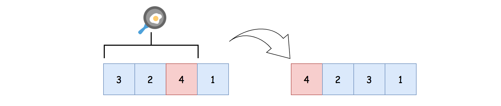
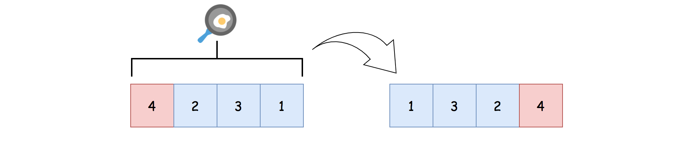

# LeetCode Pancake Sorting Solution
## Approach 1: Sort like Bubble-Sort
### Intuition

One might argue that this is an awkward question to do things. Indeed, it is not the most practical operation that one can have with the *pancake flipping*, in order to sort a list.

However awkward the problem might be, it is the game that we play with. And in order to win the game, we have to play by the rules. Actually, from this perspective, this problem does share some similarity with the *[Rubik's cube](https://en.wikipedia.org/wiki/Rubik%27s_Cube)*, i.e. one cannot move one tile without moving other tiles along with. Let us get on with it, by playing a few rounds ourselves to get the hang of the problem.

Given the input of **[3, 2, 4, 1]**, the desired sorted output would be **[1, 2, 3, 4]**.

As a reminder, the only operation that we could perform in order to move the elements in the list, is the so-called *pancake flip*, which is to reverse a *prefix* of the list.

Starting from the largest value in the list, *i.e.* 4 in the example, its desired position would be the tail of the list. While in the input, it is located at the third of the list, if we look at the list from left to right.

In order to move the value of 4 to its desired position, we could perform the following two steps:

* Firstly, we do the pancake flip on the prefix of **[3, 2, 4]**. With this operation, we then move the value **4** to the ***head*** of the updated list as **[4, 2, 3, 1]**.



* Now that, the value **4** is located at the head of the list, we could now perform another pancake flip on the entire list, which would get us the list of **[1, 3, 2, 4]**.



Voila. With the obtained list of **[1, 3, 2, 4]**, we are now one step closer to our final goal, with the value **4** now at its proper place. For the following steps, we only need to focus on the sublist of **[1, 3, 2]**.

>If one looks over the above steps again, it might ring a bell to a well-known algorithm called [bubble sort](https://en.wikipedia.org/wiki/Bubble_sort).


Indeed, we share the same strategy as the bubble sort, by *sinking* the numbers to the bottom one by one.

>Here we can make a statement that for any given number, in order to move it to any desired position, it takes ***at most*** two pancake flips to do so.

The idea is simple. First we move the number to the head of the list, then we can switch it with any other element by performing another pancake flip.

### Algorithm

One can inspire from the bubble sort to implement the algorithm.

* First of all, we implement a function called **flip(list, k)**, which performs the pancake flip on the prefix of **list[0:k]** (in Python).

* The main algorithm runs a loop over the values of the list, starting from the largest one.

    * At each round, we identify the value to sort (named as **value_to_sort**), which is the number we would put in place at this round.

    * We then locate the index of the **value_to_sort**.

    * If the **value_to_sort** is not at its place already, we can then perform at most two pancake flips as we explained in the intuition.

    * At the end of the round, the **value_to_sort** would be put in place.

### Java
```java
class Solution {
    /**
     * sort like bubble-sort i.e. sink the largest number to the bottom at each round.
     */
    public List<Integer> pancakeSort(int[] A) {
        List<Integer> ans = new ArrayList<>();

        for (int valueToSort = A.length; valueToSort > 0; valueToSort--) {
            // locate the position for the value to sort in this round
            int index = this.find(A, valueToSort);

            // sink the value_to_sort to the bottom,
            // with at most two steps of pancake flipping.
            if (index == valueToSort - 1)
                continue;
            // 1). flip the value to the head if necessary
            if (index != 0) {
                ans.add(index + 1);
                this.flip(A, index + 1);
            }
            // 2). now that the value is at the head, flip it to the bottom
            ans.add(valueToSort);
            this.flip(A, valueToSort);
        }

        return ans;
    }

    protected void flip(int[] sublist, int k) {
        int i = 0;
        while (i < k / 2) {
            int temp = sublist[i];
            sublist[i] = sublist[k - i - 1];
            sublist[k - i - 1] = temp;
            i += 1;
        }
    }

    protected int find(int[] a, int target) {
        for (int i = 0; i < a.length; i++)
            if (a[i] == target)
                return i;
        return -1;
    }
}
```

### Python3
```python
class Solution:
    def pancakeSort(self, A: List[int]) -> List[int]:
        """ sort like bubble-sort
            sink the largest number to the bottom at each round
        """
        def flip(sublist, k):
            i = 0
            while i < k / 2:
                sublist[i], sublist[k-i-1] = sublist[k-i-1], sublist[i]
                i += 1

        ans = []
        value_to_sort = len(A)
        while value_to_sort > 0:
            # locate the position for the value to sort in this round
            index = A.index(value_to_sort)

            # sink the value_to_sort to the bottom,
            #   with at most two steps of pancake flipping.
            if index != value_to_sort - 1:
                # flip the value to the head if necessary
                if index != 0:
                    ans.append(index+1)
                    flip(A, index+1)
                # now that the value is at the head, flip it to the bottom
                ans.append(value_to_sort)
                flip(A, value_to_sort)

            # move on to the next round
            value_to_sort -= 1

        return ans
```

### Complexity Analysis

Let ***N*** be the length of the input list.

* Time Complexity: ***O(N^2)***

    * In the algorithm, we run a loop with ***N*** iterations.

    * Within each iteration, we are dealing with the corresponding prefix of the list. Here we denote the length of the prefix as *k, e.g.* in the first iteration, the length of the prefix is ***N***. While in the second iteration, the length of the prefix is ***N−1***.

    * Within each iteration, we have operations whose time complexity is linear to the length of the prefix, such as iterating through the prefix to find the index, or flipping the entire prefix *etc.* Hence, for each iteration, its time complexity would be ***O(k)***

    * To sum up all iterations, we have the overall time complexity of the algorithm as ***∑ k=1 to N O(k)=O(N^2)***.

* Space Complexity: ***O(N)***

    * Within the algorithm, we use a list to maintain the final results, which is proportional to the number of pancake flips.

    * For each round of iteration, at most we would add two pancake flips. Therefore, the maximal number of pancake flips needed would be ***2 * N***.

    * As a result, the space complexity of the algorithm is ***O(N)***. If one does not take into account the space required to hold the result of the function, then one could consider the above algorithm as a constant space solution.


## [Python] O(n) flips/O(n^2) time, explained 

The idea is the following: first, put pancake with the biggest index on its place, then we never need to move it! Let us go through example:
**[3,2,4,6,5,1]**.

1. We want to put pancake number **6** to the end, we can no do it immediatly, so let us put it to the beginning first: we need to flip first **4** pancakes: **A = [6,4,2,3,5,1]**. On the next step we can flip first **6** pancakes, so we have **A = [1,5,3,2,4,6]**.
2. Now, we want to put pancake number **5** to its place, we first flip first **2** pancakes to have **[5,1,3,2,4,6]** and then first **5**, to have **[4,2,3,1,5,6]**.
3. Similar logic with number **4**, but it is already in the beginning, so one step is enough: we flip first **4** pancakes to have **[1,3,2,4,5,6]**.
4. Put **3** to its place: flip first **2** to have **[3,1,2,4,5,6]** and then flip first **3** to have **[2,1,3,4,5,6]**.
5. Finally, put **2** on its place, flit first **2**: we have **[1,2,3,4,5,6]**.

So, our filps are the following: **[4,6,2,5,4,2,3,2]**.

**Comlexity**: this is interesting part, we need to compute two types of complexities: classical one and how many flips we make. Note, that we make **O(n)** flips, because at each step we need to make no more than **2**. Now, note, that on each step we make no more than **O(n)** operations, because we need to inverse some part of array. So, overall complexity will be **O(n^2)**. Space complexity is **O(n)** to keep our answer.
```python
class Solution:
    def pancakeSort(self, A):
        result, n = [], len(A)
        for i in range(n,0,-1):
            pl = A.index(i)
            if pl == i-1: continue
            if pl != 0:
                result.append(pl+1)
                A[:pl+1] = A[:pl+1][::-1]
            result.append(i)
            A[:i] = A[:i][::-1]
            
        return result
```
[Link to original post](https://leetcode.com/problems/pancake-sorting/discuss/817862/Python-O(n)-flipsO(n2)-time-explained)