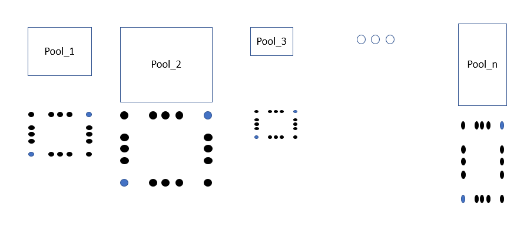
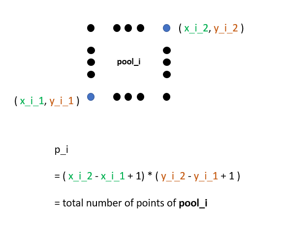
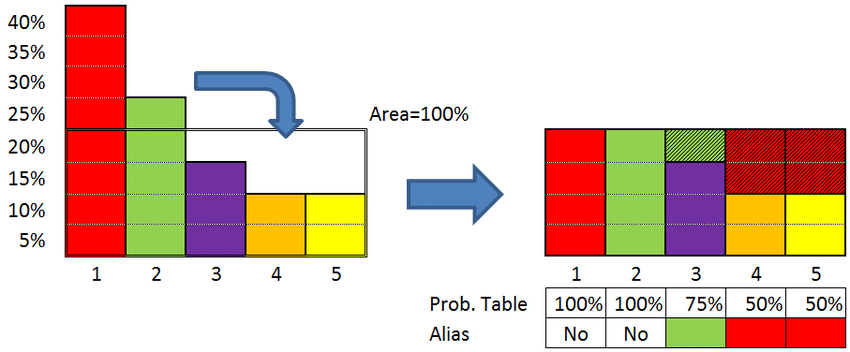

# Leetcode Random Point in Non-overlapping Rectangles Solution

If you are unable to solve this question, I would highly suggest you try this one first:
https://leetcode.com/problems/random-pick-with-weight/

If you had solved the above question, you would understand that here the probablity of picking up a random rectangle is proportional to the number if points enclosed in the rectangle (Area). In short the number of points enclosed by the rectangle is its weight (area).

Now let's break this problem into 2 subproblems:

1. Pick a random rectangle based on weight (area).
2. Pick a random point in the rectangle obtained in the first step.
```c++
class Solution {
public:
    vector<int> np;
    vector<vector<int>> Rects;
    Solution(vector<vector<int>>& rects) {
        Rects = rects;
        for(auto rect : rects){
            int l1 = rect[2] - rect[0] + 1;
            int l2 = rect[3] - rect[1] + 1;
            int val = np.size() ? np.back() + (l1*l2) : l1*l2; 
            np.push_back(val);
        }
    }
    
    vector<int> pick() {
        int m = np.back();
        int r = rand() % m;
        auto it = upper_bound(np.begin(), np.end(), r);
        int rect = it - np.begin();  //end of step 1
		//step 2 begins
        vector<int> R = Rects[rect];
        int x = rand() % (R[2]-R[0]+1) + R[0];
        int y = rand() % (R[3]-R[1]+1) + R[1];
        return {x, y};
    }
};
```
[Link to original post](https://leetcode.com/problems/random-point-in-non-overlapping-rectangles/discuss/805466/C%2B%2B-Easy-solution-with-explanation)

## Solution 2
This is a straightforward idea from probability theory. Say you have two rectangles, the first one contains 7 points inside and the second one contains 3. A randomly drawn point has a probability of coming from the first rectangle equal to 0.7. So you calculate the number of points in each rectangle, and then use the inverse CDF* rule to simulate a random draw of rectangles based on the number of points they contain. (So you select the first rectangle with probability 0.7 in the example above.) Once you pick the rectangle, choose any point uniformly at random.

CDF rule is at the core of simulations, Monte Carlo methods, and many machine learning algorithms.

Time: **O(K)** where K is the number of rectangles. This is where we calculate the weights in the constructor.
Space: **O(K)** as we store the rectangle coordinates.

*CDF: Cumulative distribution function
```python
import random
import bisect
class Solution:
    def __init__(self, rects: List[List[int]]):
        self.rects = rects
        #
        weig, c = [], 0
        for rect in rects:
            x1, y1, x2, y2 = rect
            c += (x2-x1+1)*(y2-y1+1)
            weig.append(c)
        self.weigc = [e/c for e in weig]
        
        
    def pick(self) -> List[int]:
        u = random.random()
        ix = bisect.bisect_left(self.weigc, u)
        x1, y1, x2, y2 = self.rects[ix]
        x = random.randint(x1,x2)
        y = random.randint(y1,y2)
        return [x,y]
```
[Link to original post](https://leetcode.com/problems/random-point-in-non-overlapping-rectangles/discuss/805166/Python-ProbabilityMonte-Carlo)

## Solution 3
### Hint:

Think of **pool sampling**.

Total **n** pools, and total **P** points



Each **rectangle** acts as **pool_i** with points **p_i** by itself,
where p_i = ( x_i_2 - x_i_1 + 1) * ( y_i_2 - y_i_1 + 1 )

**

So, p_1 + p_2 + ... + p_n = P, and
each pool_i has a **weight** of **p_i / P** during **pool sampling**.

Then, generate a random number **r** from 1 to P

Compute the **pool index** (i.e., **rectangle index) from r by bisection

Then compute the **corresponding x, y coordinate** in that pool from r by modulo and division.
```python
from random import randint
from bisect import bisect_left

class Solution:

    def __init__(self, rects: List[List[int]]):
        
        self.rectangles = rects
        
        # record prefix sum of points number (i.e., acts like the CDF)
        self.prefix_points_sum = []
        
        for x1, y1, x2, y2 in rects:
            
            # compute current number of points
            cur_points = ( x2 - x1 + 1 ) * ( y2 - y1 + 1)
            
            # update to prefix table
            if self.prefix_points_sum:
                self.prefix_points_sum.append( self.prefix_points_sum[-1] + cur_points )
                
            else:
                self.prefix_points_sum.append( cur_points )
        
            

    def pick(self) -> List[int]:
        
        total_num_of_points = self.prefix_points_sum[-1]
        
        # get a random point serial, sampling from 1 ~ total number of points
        random_point_serial = randint(1, total_num_of_points)
        
        # get the rectangle index by looking up prefix table with bisection
        idx_of_rectangle = bisect_left(self.prefix_points_sum, random_point_serial)
        
        # get the point range of that rectangle by index
        x1, y1, x2, y2 = self.rectangles[idx_of_rectangle]
        
        # compute the offset value between prefix sum and random point serial
        offset = self.prefix_points_sum[idx_of_rectangle] - random_point_serial
        
        # compute corresponding x, y points coordination in that rectangle
        x = offset % ( x2 - x1 + 1) + x1
        y = offset // ( x2 - x1 + 1) + y1
        
        return [x, y]
```
[Link to original post](https://leetcode.com/problems/random-point-in-non-overlapping-rectangles/discuss/805166/Python-ProbabilityMonte-Carlo)

## Solution 4 : Javascript O(n) initiation O(1) picking using Alias Method
```javascript
var Solution = function(rects) {
  // Imagine we put the boxes into a 2D pool and pick one. Then the bigger box will more likely to be seen and picked
  // So first we initialize the pool with the area of the boxes
  let totalArea = 0;
  this.boxes = rects.map(([x1, y1, x2, y2], index, area) => (
    totalArea += area = (x2 - x1 + 1) * (y2 - y1 + 1),
    { area, index, x1, y1, x2, y2 }
  ));
  // Alias method says that, for example you have n boxes, and n rooms with can contain exactly the average area of the boxes,
  // you can distribute the content of the boxes into the rooms such that each room contains only content of 2 type of boxes.
  // So the idea is putting each box into each room. Then some box will be larger than the room, and some will be smaller
  // You can then split the larger box and put into the room which contains the smaller box
  // So now let's classify the boxes base on if it's larger or smaller than the room size
  const avgArea = this.avg = totalArea / rects.length;
  const smallers = this.boxes.filter(box => box.area < avgArea);
  const largers = this.boxes.filter(box => box.area > avgArea);
  while (smallers.length !== 0 && largers.length !== 0) {
    const smaller = smallers.shift();
    const larger = largers[0];
    smaller.added = larger.index;
    larger.area -= avgArea - smaller.area;
	// After splitting the larger box, calling A for example, and put into the room of the smaller box, that room is now full, and we no longer care about it
	// About the box A, if it is now still bigger than the room capacity, keep it in the "largers" stack to work with later
	// If it is now fit into its room, forget about it
	// If it becomes smaller for a typical room, we put it into the "smallers" stack to find it a new "larger boxie"
    larger.area <= avgArea && (
      largers.shift(),
      larger.area < avgArea && (smallers[smallers.length] = larger)
    );
  }
  this.pick = function() {
    // Now we just need to pick a random room
    const box = this.boxes[Math.random() * this.boxes.length | 0];
	// And then pick 1 of the 2 boxes in that room, based on their area as above
    const { x1, y1, x2, y2 } = Math.random() * this.avg > box.area ? this.boxes[box.added] : box;
	// Finally return a point inside that box
    return [
      Math.floor(x1 + Math.random() * (x2 - x1 + 1)),
      Math.floor(y1 + Math.random() * (y2 - y1 + 1))
    ];
  }
};
```



[Link to original post](https://leetcode.com/problems/random-point-in-non-overlapping-rectangles/discuss/805452/Javascript-O(n)-initiation-O(1)-picking-using-Alias-Method)