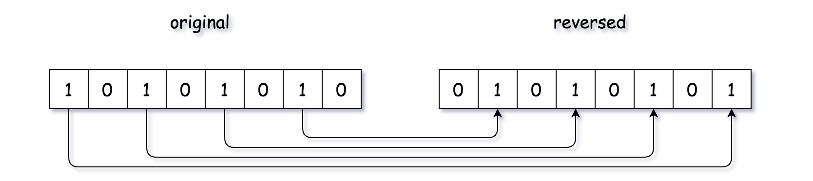
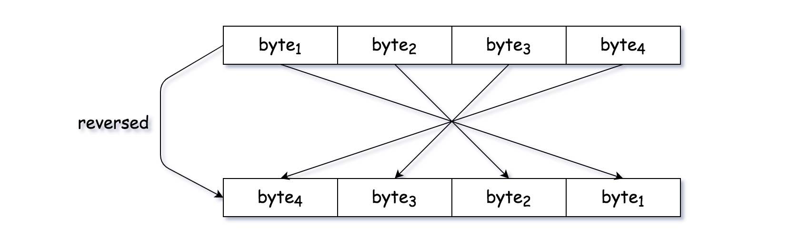
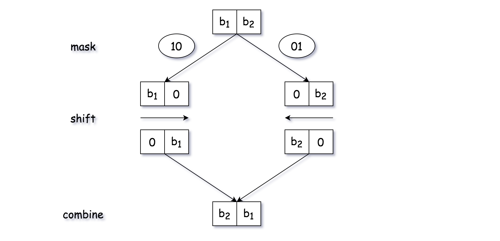

# Solution
## Approach 1: Bit by Bit
### Intuition

Though the question is not difficult, it often serves as a warm-up question to kick off the interview. The point is to test one's basic knowledge on data type and bit operations.

> As one of the most intuitive solutions that one could come up during an interview, one could reverse the bits **one by one**.



As easy as it sounds, the above intuition could lead to quite some variants of implementation. For instance, to retrieve the *right-most* bit in an integer **n**, one could either apply the modulo operation (*i.e.* **n % 2**) or the bit AND operation (*i.e.* **n & 1**). Another example would be that in order to combine the results of reversed bits (*e.g.* 2^a, 2^b), one could either use the addition operation (*i.e.* 2^a + 2^b2) or again the bit OR operation (*i.e.* 2^a | 2^b2).

### Algorithm

Here we show on example of implementation based on the above intuition.


> The key idea is that for a bit that is situated at the index **i**, after the reversion, its position should be **31-i** (note: the index starts from zero).

* We iterate through the bit string of the input integer, from right to left (*i.e.* **n = n >> 1**). To retrieve the right-most bit of an integer, we apply the bit AND operation (**n & 1**).

* For each bit, we reverse it to the correct position (*i.e.* **(n & 1) << power**). Then we accumulate this reversed bit to the final result.

* When there is no more bits of one left (*i.e.* **n == 0**), we terminate the iteration.

**C++**
```c++
class Solution {
  public:
  uint32_t reverseBits(uint32_t n) {
    uint32_t ret = 0, power = 31;
    while (n != 0) {
      ret += (n & 1) << power;
      n = n >> 1;
      power -= 1;
    }
    return ret;
  }
};
```

**Python**
```python
class Solution:
    # @param n, an integer
    # @return an integer
    def reverseBits(self, n):
        ret, power = 0, 31
        while n:
            ret += (n & 1) << power
            n = n >> 1
            power -= 1
        return ret
```

**Go**
```go
func reverseBits(num uint32) uint32 {
    ret := uint32(0)
    power := uint32(31)
    for num != 0 {
        ret += (num & 1) << power
        num = num >> 1
        power -= 1
    }
    return ret
}
```

### Complexity

* Time Complexity: **O(1)**. Though we have a loop in the algorithm, the number of iteration is fixed regardless the input, since the integer is of fixed-size (32-bits) in our problem.

* Space Complexity: **O(1)**, since the consumption of memory is constant regardless the input.


## Approach 2: Byte by Byte with Memoization
### Intuition

Someone might argument it might be more efficient to reverse the bits, **per byte**, which is an unit of 8 bits. Though it is not necessarily true in our case, since the input is of fixed-size 32-bit integer, it could become more advantageous when dealing with the input of long bit stream.



Another implicit advantage of using **byte** as the unit of iteration is that we could apply the technique of [memoization](https://leetcode.com/explore/learn/card/recursion-i/255/recursion-memoization/), which caches the previously calculated values to avoid the re-calculation.

The application of memoization can be considered as a response to the **follow-up** question posed in the description of the problem, which is stated as following:

> If this function is called many times, how would you optimize it?

To reverse bits for a byte, one could apply the same algorithm as we show in the above approach. Here we would like to show a different algorithm which is solely based on the arithmetic and bit operations without resorting to any loop statement, as following:

```python
def reverseByte(byte):
    return (byte * 0x0202020202 & 0x010884422010) % 1023
```

The algorithm is documented as "[reverse the bits in a byte with 3 operations](http://graphics.stanford.edu/~seander/bithacks.html#ReverseByteWith64BitsDiv)" on the online book called **Bit Twiddling Hacks** by Sean Eron Anderson, where one can find more details.

### Algorithm

* We iterate over the bytes of an integer. To retrieve the right-most byte in an integer, again we apply the bit AND operation (*i.e.* **n & 0xff**) with the bit mask of **11111111**.

* For each byte, first we reverse the bits within the byte, via a function called **reverseByte(byte)**. Then we shift the reversed bits to their final positions.

* With the function **reverseByte(byte)**, we apply the technique of memoization, which caches the result of the function and returns the result directly for the future invocations of the same input.

Note that, one could opt for a smaller unit rather than byte, *e.g.* a unit of 4 bits, which would require a bit more calculation in exchange of less space for cache. It goes without saying that, the technique of memoization is a trade-off between the space and the computation.

**C++**
```c++
class Solution {
public:
    uint32_t reverseByte(uint32_t byte, map<uint32_t, uint32_t> cache) {
        if (cache.find(byte) != cache.end()) {
            return cache[byte];
        }
        uint32_t value = (byte * 0x0202020202 & 0x010884422010) % 1023;
        cache.emplace(byte, value);
        return value;
    }

    uint32_t reverseBits(uint32_t n) {
        uint32_t ret = 0, power = 24;
        map<uint32_t, uint32_t> cache;
        while (n != 0) {
            ret += reverseByte(n & 0xff, cache) << power;
            n = n >> 8;
            power -= 8;
        }
        return ret;
    }
};
```

**Python**
```python
class Solution:
    # @param n, an integer
    # @return an integer
    def reverseBits(self, n):
        ret, power = 0, 24
        cache = dict()
        while n:
            ret += self.reverseByte(n & 0xff, cache) << power
            n = n >> 8
            power -= 8
        return ret

    def reverseByte(self, byte, cache):
        if byte not in cache:
            cache[byte] = (byte * 0x0202020202 & 0x010884422010) % 1023 
        return cache[byte]
```

**Go**
```go
func reverseByte(b uint32, cache map[uint32]uint64) uint64 {
    value, ok := cache[b]
    if ok {
        return value
    }
    value = (uint64(b) * 0x0202020202 & 0x010884422010) % 1023
    cache[b] = value
    return value
}

func reverseBits(num uint32) uint32 {
    ret := uint64(0)
    power := uint64(24)
    var cache = map[uint32]uint64{}

    for num != 0 {
        ret += reverseByte(num & 0xff, cache) << power
        num = num >> 8
        power -= 8
    }
    return uint32(ret)
}
```

**Python3**
```python
import functools

class Solution:
    # @param n, an integer
    # @return an integer
    def reverseBits(self, n):
        ret, power = 0, 24
        while n:
            ret += self.reverseByte(n & 0xff) << power
            n = n >> 8
            power -= 8
        return ret

    # memoization with decorator
    @functools.lru_cache(maxsize=256)
    def reverseByte(self, byte):
        return (byte * 0x0202020202 & 0x010884422010) % 1023
```

### Complexity

* Time Complexity: **O(1)**. Though we have a loop in the algorithm, the number of iteration is fixed regardless the input, since the integer is of fixed-size (32-bits) in our problem.

* Space Complexity: **O(1)**. Again, though we used a cache keep the results of reversed bytes, the total number of items in the cache is bounded to 2^8 = 2562 
8
 =256.


## Approach 3: Mask and Shift
### Intuition

We have shown in Approach #2 an example on how to reverse the bits in a byte without resorting to the loop statement. During the interview, one might be asked to reverse the entire 32 bits without using loop. Here we propose one solution that utilizes only the bit operations.

> The idea can be considered as a strategy of **divide and conquer**, where we divide the original 32-bits into blocks with fewer bits via **bit masking**, then we reverse each block via **bit shifting**, and at the end we merge the result of each block to obtain the final result.

In the following graph, we demonstrate how to reverse two bits with the above-mentioned idea. As one can see, the idea could be applied to **blocks** of bits.



### Algorithm

We can implement the algorithm in the following steps:

* 1). First, we break the original 32-bit into 2 blocks of 16 bits, and switch them.

* 2). We then break the 16-bits block into 2 blocks of 8 bits. Similarly, we switch the position of the 8-bits blocks

* 3). We then continue to break the blocks into smaller blocks, until we reach the level with the block of 1 bit.

* 4). At each of the above steps, we merge the intermediate results into a single integer which serves as the input for the next step.

The credit of this solution goes to @tworuler and @bhch3n for their post and comment in the discussion forum.

**C++**
```c++
class Solution {
public:
    uint32_t reverseBits(uint32_t n) {
        n = (n >> 16) | (n << 16);
        n = ((n & 0xff00ff00) >> 8) | ((n & 0x00ff00ff) << 8);
        n = ((n & 0xf0f0f0f0) >> 4) | ((n & 0x0f0f0f0f) << 4);
        n = ((n & 0xcccccccc) >> 2) | ((n & 0x33333333) << 2);
        n = ((n & 0xaaaaaaaa) >> 1) | ((n & 0x55555555) << 1);
        return n;
    }
};
```

**Python**
```python
class Solution:
    # @param n, an integer
    # @return an integer
    def reverseBits(self, n):
        n = (n >> 16) | (n << 16)
        n = ((n & 0xff00ff00) >> 8) | ((n & 0x00ff00ff) << 8)
        n = ((n & 0xf0f0f0f0) >> 4) | ((n & 0x0f0f0f0f) << 4)
        n = ((n & 0xcccccccc) >> 2) | ((n & 0x33333333) << 2)
        n = ((n & 0xaaaaaaaa) >> 1) | ((n & 0x55555555) << 1)
        return n
```

**Go**
```go
func reverseBits(num uint32) uint32 {
    num = (num >> 16) | (num << 16)
    num = ((num & 0xff00ff00) >> 8) | ((num & 0x00ff00ff) << 8)
    num = ((num & 0xf0f0f0f0) >> 4) | ((num & 0x0f0f0f0f) << 4)
    num = ((num & 0xcccccccc) >> 2) | ((num & 0x33333333) << 2)
    num = ((num & 0xaaaaaaaa) >> 1) | ((num & 0x55555555) << 1)
    return num
}
```

### Complexity

* Time Complexity: **O(1)**, no loop is used in the algorithm.

* Space Complexity: **O(1)**. Actually, we did not even create any new variable in the function.