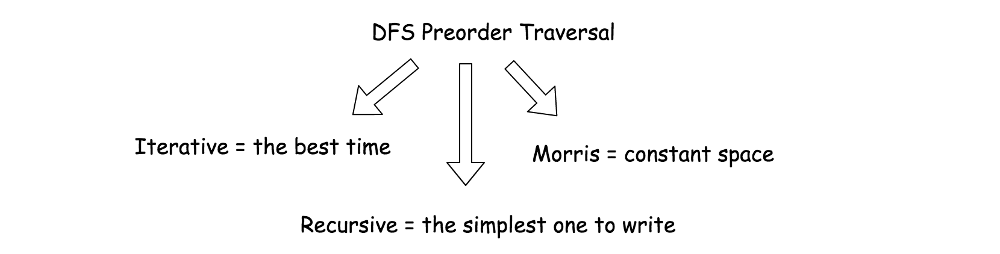
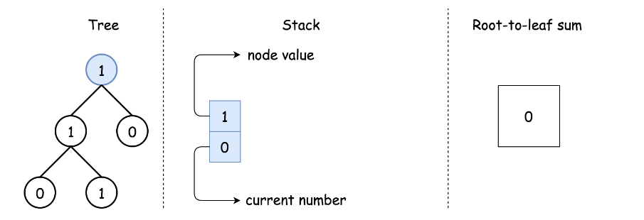
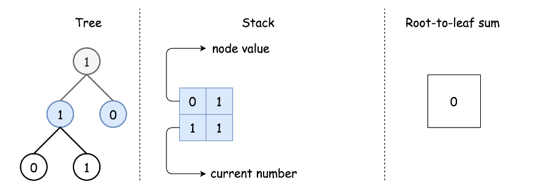
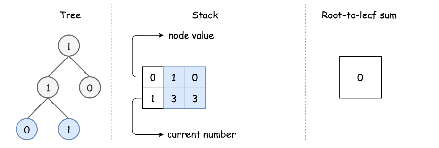
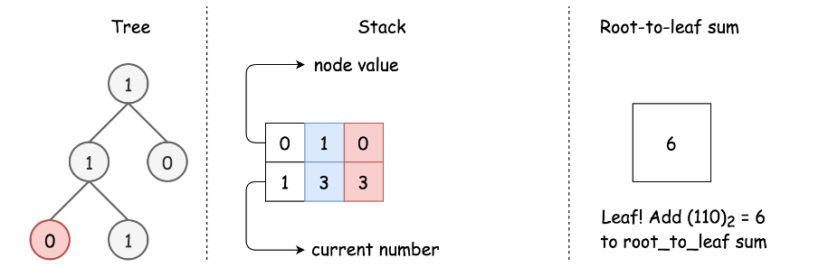
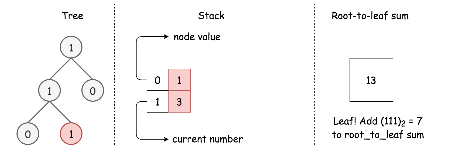
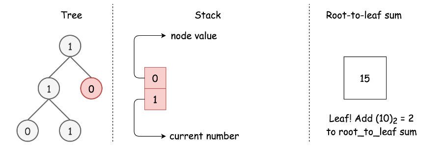
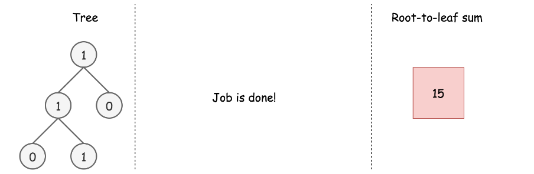

# LeetCode Sum of Root To Leaf Binary Numbers Solution

## Overview
### Prerequisites: Bitwise Trick

If you work with decimal representation, the conversion of **1->2** into **12** is easy. You start from **curr_number = 1**, then shift one register to the left and add the next digit: **curr_number = 1 * 10 + 2 = 12**.

If you work with binaries **1 -> 1 -> 3**, it's the same. You start from **curr_number = 1**, then shift one register to the left and add the next digit: **curr_number = (1 << 1) | 1 = 3**.

### Prerequisites: Tree Traversals

There are three DFS ways to traverse the tree: preorder, postorder and inorder. Please check two minutes picture explanation, if you don't remember them quite well: [here is Python version](https://leetcode.com/problems/binary-tree-inorder-traversal/discuss/283746/all-dfs-traversals-preorder-inorder-postorder-in-python-in-1-line) and [here is Java version](https://leetcode.com/problems/binary-tree-inorder-traversal/discuss/328601/all-dfs-traversals-preorder-postorder-inorder-in-java-in-5-lines).

### Optimal Strategy to Solve the Problem

>Root-to-left traversal is so-called *DFS preorder traversal*. To implement it, one has to follow straightforward strategy Root->Left->Right.

Since one has to visit all nodes, the best possible time complexity here is linear. Hence all interest here is to improve the space complexity.

>There are 3 ways to implement preorder traversal: iterative, recursive and Morris.

Iterative and recursive approaches here do the job in one pass, but they both need up to *O(H)* space to keep the stack, where *H* is a tree height.

Morris approach is two-pass approach, but it's a constant-space one.



## Approach 1: Iterative Preorder Traversal.
### Intuition

Here we implement standard iterative preorder traversal with the stack:

* Push root into stack.

* While stack is not empty:

    * Pop out a node from stack and update the current number.

    * If the node is a leaf, update root-to-leaf sum.

    * Push right and left child nodes into stack.

* Return root-to-leaf sum.

### 1


### 2


### 3


### 4


### 5


### 6


### 7


### Implementation

Note, that [Javadocs recommends to use ArrayDeque, and not Stack as a stack implementation](https://docs.oracle.com/javase/8/docs/api/java/util/ArrayDeque.html).

### Java
```java
class Solution {
    public int sumRootToLeaf(TreeNode root) {
        int rootToLeaf = 0, currNumber = 0;
        Deque<Pair<TreeNode, Integer>> stack = new ArrayDeque();
        stack.push(new Pair(root, 0));

        while (!stack.isEmpty()) {
          Pair<TreeNode, Integer> p = stack.pop();
          root = p.getKey();
          currNumber = p.getValue();

          if (root != null) {
            currNumber = (currNumber << 1) | root.val;
            // if it's a leaf, update root-to-leaf sum
            if (root.left == null && root.right == null) {
              rootToLeaf += currNumber;
            } else {
              stack.push(new Pair(root.right, currNumber));
              stack.push(new Pair(root.left, currNumber));
            }
          }
        }
        return rootToLeaf;
    }
}
```

### Python
```python
class Solution:
    def sumRootToLeaf(self, root: TreeNode) -> int:
        root_to_leaf = 0
        stack = [(root, 0) ]
        
        while stack:
            root, curr_number = stack.pop()
            if root is not None:
                curr_number = (curr_number << 1) | root.val
                # if it's a leaf, update root-to-leaf sum
                if root.left is None and root.right is None:
                    root_to_leaf += curr_number
                else:
                    stack.append((root.right, curr_number))
                    stack.append((root.left, curr_number))
                        
        return root_to_leaf
```

### Complexity Analysis

* Time complexity: *O(N)*, where *N* is a number of nodes, since one has to visit each node.

* Space complexity: up to *O(H)* to keep the stack, where *H* is a tree height.

## Approach 2: Recursive Preorder Traversal.
Iterative approach 1 could be converted into recursive one.

Recursive preorder traversal is extremely simple: follow Root->Left->Right direction, i.e. do all the business with the node (= update the current number and root-to-leaf sum), and then do the recursive calls for the left and right child nodes.

P.S. Here is the difference between preorder and the other DFS recursive traversals. On the following figure the nodes are enumerated in the order you visit them, please follow **1-2-3-4-5** to compare different DFS strategies implemented as recursion.


### Implementation

**Java**
```java
class Solution {
    int rootToLeaf = 0;
    
    public void preorder(TreeNode r, int currNumber) {
        if (r != null) {
            currNumber = (currNumber << 1) | r.val;
            // if it's a leaf, update root-to-leaf sum
            if (r.left == null && r.right == null) {
            rootToLeaf += currNumber;
            }
            preorder(r.left, currNumber);
            preorder(r.right, currNumber);
        }
    }

    public int sumRootToLeaf(TreeNode root) {
        preorder(root, 0);
        return rootToLeaf;
    }
}
```

**Python**
```python
class Solution:
    def sumRootToLeaf(self, root: TreeNode) -> int:
        def preorder(r, curr_number):
            nonlocal root_to_leaf
            if r:
                curr_number = (curr_number << 1) | r.val
                # if it's a leaf, update root-to-leaf sum
                if not (r.left or r.right):
                    root_to_leaf += curr_number
                    
                preorder(r.left, curr_number)
                preorder(r.right, curr_number) 
        
        root_to_leaf = 0
        preorder(root, 0)
        return root_to_leaf
```

### Complexity Analysis

* Time complexity: *O(N)*, where *N* is a number of nodes, since one has to visit each node.

* Space complexity: up to *O(H)* to keep the recursion stack, where *H* is a tree height.

## Approach 3: Morris Preorder Traversal.
We discussed already iterative and recursive preorder traversals, which both have great time complexity though use up to O(H) to keep the stack. We could trade in performance to save space.

The idea of Morris preorder traversal is simple: to use no space but to traverse the tree.

>How that could be even possible? At each node one has to decide where to go: to the left or to the right, traverse the left subtree or traverse the right subtree. How one could know that the left subtree is already done if no additional memory is allowed?

The idea of [Morris](https://www.sciencedirect.com/science/article/abs/pii/0020019079900681) algorithm is to set the temporary link between the node and its [predecessor](https://leetcode.com/problems/delete-node-in-a-bst/solution/): **predecessor.right = root**. So one starts from the node, computes its predecessor and verifies if the link is present.

* There is no link? Set it and go to the left subtree.

* There is a link? Break it and go to the right subtree.

There is one small issue to deal with : what if there is no left child, i.e. there is no left subtree? Then go straightforward to the right subtree.

### Implementation

**Java**
```java
class Solution {
    public int sumRootToLeaf(TreeNode root) {
        int rootToLeaf = 0, currNumber = 0;
        int steps;
        TreeNode predecessor;

        while (root != null) {
            // If there is a left child,
            // then compute the predecessor.
            // If there is no link predecessor.right = root --> set it.
            // If there is a link predecessor.right = root --> break it.
            if (root.left != null) {
                // Predecessor node is one step to the left
                // and then to the right till you can.
                predecessor = root.left;
                steps = 1;
                while (predecessor.right != null && predecessor.right != root) {
                    predecessor = predecessor.right;
                    ++steps;
                }

                // Set link predecessor.right = root
                // and go to explore the left subtree
                if (predecessor.right == null) {
                    currNumber = (currNumber << 1) | root.val;
                    predecessor.right = root;
                    root = root.left;
                }
                // Break the link predecessor.right = root
                // Once the link is broken,
                // it's time to change subtree and go to the right
                else {
                    // If you're on the leaf, update the sum
                    if (predecessor.left == null) {
                        rootToLeaf += currNumber;
                    }
                    // This part of tree is explored, backtrack
                    for(int i = 0; i < steps; ++i) {
                        currNumber >>= 1;
                    }
                    predecessor.right = null;
                    root = root.right;
                }
            }
            // If there is no left child
            // then just go right.
            else {
                currNumber = (currNumber << 1) | root.val;
                // if you're on the leaf, update the sum
                if (root.right == null) {
                    rootToLeaf += currNumber;
                }
                root = root.right;
            }
        }
        return rootToLeaf;
    }
}
```

**Python**
```python
class Solution:
    def sumRootToLeaf(self, root: TreeNode) -> int:
        root_to_leaf = curr_number = 0
        
        while root:  
            # If there is a left child,
            # then compute the predecessor.
            # If there is no link predecessor.right = root --> set it.
            # If there is a link predecessor.right = root --> break it.
            if root.left: 
                # Predecessor node is one step to the left 
                # and then to the right till you can.
                predecessor = root.left 
                steps = 1
                while predecessor.right and predecessor.right is not root: 
                    predecessor = predecessor.right 
                    steps += 1

                # Set link predecessor.right = root
                # and go to explore the left subtree
                if predecessor.right is None:
                    curr_number = (curr_number << 1) | root.val                    
                    predecessor.right = root  
                    root = root.left  
                # Break the link predecessor.right = root
                # Once the link is broken, 
                # it's time to change subtree and go to the right
                else:
                    # If you're on the leaf, update the sum
                    if predecessor.left is None:
                        root_to_leaf += curr_number
                    # This part of tree is explored, backtrack
                    for _ in range(steps):
                        curr_number >>= 1
                    predecessor.right = None
                    root = root.right 
                    
            # If there is no left child
            # then just go right.        
            else: 
                curr_number = (curr_number << 1) | root.val
                # if you're on the leaf, update the sum
                if root.right is None:
                    root_to_leaf += curr_number
                root = root.right
                        
        return root_to_leaf
```

### Complexity Analysis

* Time complexity: *O(N)*, where NN is a number of nodes.

* Space complexity: *O(1)*.

## [Python] 2 Easy recursion solutions, explained

Let us traverse our tree and change values of nodes, so when we reach leaf we will have in this leaf exactly the number we need to add to total sum. Imagine, we have path 10110, then let us look at sequence: **1, 10, 101, 1011, 10110**, which is equivalent to **1, 2, 5, 11, 22**.

1. If we reached leaf, add value of this leaf to total sum.
2. Check left and right children and if they exist, update their values; run dfs for these children.

**Complexity:** time complexity is **O(n)**: to traverse our tree. Space complexity is **O(h)** for dfs stack. Note, that we change our tree in process, but it can be easily avoided: instead of changing values we can return value for **dfs** function.

```python
class Solution:
    def sumRootToLeaf(self, root):
        def dfs(node):
            if not node.left and not node.right: self.sum += node.val
            for child in filter(None, [node.left, node.right]):
                child.val += node.val * 2
                dfs(child)
          
        self.sum = 0
        dfs(root)
        return self.sum
```

Solution 2: without changing tree

```python
class Solution:
    def sumRootToLeaf(self, root):
        def dfs(node, Q):
            if not node.left and not node.right: self.sum += Q
            for child in filter(None, [node.left, node.right]):
                dfs(child, Q*2 + child.val)
          
        self.sum = 0
        dfs(root, root.val)
        return self.sum
```

[Link to original post](https://leetcode.com/problems/sum-of-root-to-leaf-binary-numbers/discuss/835958/Python-2-Easy-recursion-solutions-explained)

## [C++] 2 Solutions | Recursive, Iterative DFS, Explained | Left Shift and Simple Math

### Explanation
The key here is tree traversal and generating the numbers as we go from the root towards the leaves.
Using shift operators, we can always keep the current value, **cur_val** in base 10 and as soon as we reach any leaf, we add this current value to the running answer.

**cur_val = (cur_val << 1) | rt->val;**
**cur_val << 1** means we're shifting the bits of **cur_val** to the left by 1 place, which is equivalent to multiplying **cur_val** by 2 (in base 10). Bitwise OR is used to set a particular bit. Let's take an example!
Suppose, the root-to-leaf path is **1->0->1**.
Then, at the root, initially **cur_val** is 0. We multiply it by 2 and perform bitwise OR with 1 which makes **cur_val** 1.
Next, **cur_val** is 1. We multiply it by 2 and perform bitwise OR with 0 which makes **cur_val** 2.
Last, at the leaf, **cur_val** is 2. We multiply it by 2 and perform bitwise OR with 1 which makes **cur_val** 5.
101 (base 2) is 5 (base 10).

### Recursive Code (using Left Shift operator)
```c++
class Solution {
public:
    int sumRootToLeafHelper(TreeNode* rt, int cur_val) {
        if(! rt) return 0;
        
        cur_val = (cur_val << 1) | rt->val;
        
        if(!rt->left && !rt->right)
			return cur_val;
			
        return sumRootToLeafHelper(rt->left, cur_val) + sumRootToLeafHelper(rt->right, cur_val);
    }
    
    int sumRootToLeaf(TreeNode* rt) {
        return sumRootToLeafHelper(rt, 0);
    }
};
```

We can also combine these two functions in the same given function using a default argument to get an even more compact solution (Credits to @guybrush2323):
```c++
static int sumRootToLeaf(const TreeNode* r, uint32_t sum = 0) {
        if (!r) return 0;
        sum |= r->val;
        if (!r->left && !r->right) return sum; // leaf
        sum <<= 1;
        return sumRootToLeaf(r->left, sum) + sumRootToLeaf(r->right, sum);
}
```

### Iterative Code (using Simple Math)
```c++
class Solution {
public:
    int sumRootToLeaf(TreeNode* rt) {
        if(! rt) return 0;
        
        int ans = 0;
        stack<pair<TreeNode*,int>> st;
        st.push({rt,0});
        
        while(! st.empty()) {
            auto curp = st.top(); st.pop();
            TreeNode* cur = curp.first;
            int cur_val = curp.second;
            
            // Equivalent to left shift by 1 and then ORing by cur->val.
            cur_val = cur_val*2 + cur->val;
            
            if(!cur->left && !cur->right)
                ans += cur_val;
            
            if(cur->left) st.push({cur->left, cur_val});
            if(cur->right) st.push({cur->right, cur_val});
        }
        
        return ans;
        
    }
};
```

[Link to original post](https://leetcode.com/problems/sum-of-root-to-leaf-binary-numbers/discuss/835906/C%2B%2B-2-Solutions-or-Recursive-Iterative-DFS-Explained-or-Left-Shift-and-Simple-Math)