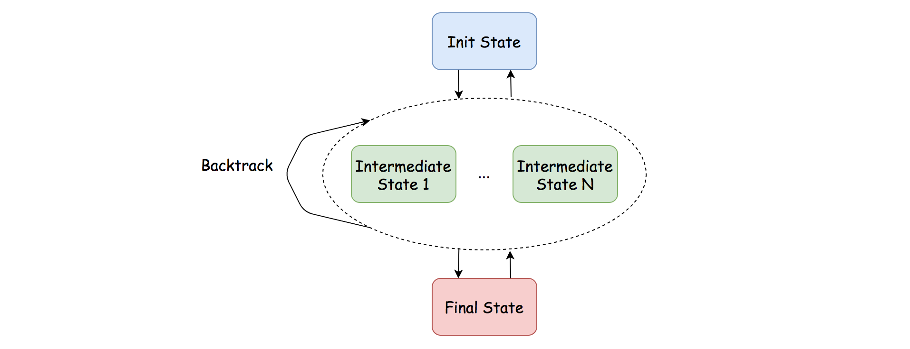

# LeetCode Unique Paths III
## Overview

Whenever we see the context of grid traversal, the technique of backtracking or DFS (Depth-First Search) should ring a bell.

In terms of this problem, it fits the bill perfectly, with a *canonical* setting, unlike another similar problem called [robot room cleaner](https://leetcode.com/problems/robot-room-cleaner/) which has certain twists.

>As a reminder, [backtracking](https://en.wikipedia.org/wiki/Backtracking) is a *general* algorithm for finding all (or some) solutions to some problems with constraints. It incrementally builds candidates to the solutions, and abandons a candidate as soon as it determines that the candidate cannot possibly lead to a solution.

In this article, we will showcase how to apply the backtracking algorithm to solve this problem.

## Approach 1: Backtracking
### Intuition

We can consider backtracking as a state machine, where we start off from an initial state, each action we take will move the state from one to another, and there should be some final state where we reach our goal.

As a result, let us first clarify the initial and the final states of the problem.

* **Initial State**

    * There are different types of squares/cells in a grid.

    * There are an origin and a destination cell, which are not given explicitly.

    * Initially, all the cells are not ***visited***.

* **Final State**

    * We reach the destination cell, *i.e.* cell filled with the value **2**.

    * We have visited all the non-obstacle cells, including the empty cells (*i.e.* filled with **0**) and the initial cell (*i.e.* **1**).

> With the above definition, we can then translate the problem as finding all paths that can lead us from the initial state to the final state.



More specifically, we could summarise the steps to implement the backtracking algorithm for this problem in the following pseudo code.

```python
def backtrack(cell):
        1. if we arrive at the final state:
             path_count ++
             return

        2. mark the current cell as visited

        3. for next_cell in 4 directions:
             if next_cell is not visited and non-obstacle:
                 backtrack(next_cell)

        4. unmark the current cell
```


### Algorithm

As one can see, backtracking is more of a methodology to solve a specific type of problems. For a backtracking problem, it would not be exaggerating to say that there are a thousand backtracking implementations in a thousand people's eyes, as one would find out in the implementation later.

Here we would simply show one example of implementation, following the pseudo code shown in the intuition section.

**Java**
```java
class Solution {
    int rows, cols;
    int[][] grid;
    int path_count;

    protected void backtrack(int row, int col, int remain) {
        // base case for the termination of backtracking
        if (this.grid[row][col] == 2 && remain == 1) {
            // reach the destination
            this.path_count += 1;
            return;
        }

        // mark the square as visited. case: 0, 1, 2
        int temp = grid[row][col];
        grid[row][col] = -4;
        remain -= 1; // we now have one less square to visit

        // explore the 4 potential directions around
        int[] row_offsets = {0, 0, 1, -1};
        int[] col_offsets = {1, -1, 0, 0};
        for (int i = 0; i < 4; ++i) {
            int next_row = row + row_offsets[i];
            int next_col = col + col_offsets[i];

            if (0 > next_row || next_row >= this.rows ||
                0 > next_col || next_col >= this.cols)
                // invalid coordinate
                continue;

            if (grid[next_row][next_col] < 0)
                // either obstacle or visited square
                continue;

            backtrack(next_row, next_col, remain);
        }

        // unmark the square after the visit
        grid[row][col] = temp;
    }

    public int uniquePathsIII(int[][] grid) {
        int non_obstacles = 0, start_row = 0, start_col = 0;

        this.rows = grid.length;
        this.cols = grid[0].length;

        // step 1). initialize the conditions for backtracking
        //   i.e. initial state and final state
        for (int row = 0; row < rows; ++row)
            for (int col = 0; col < cols; ++col) {
                int cell = grid[row][col];
                if (cell >= 0)
                    non_obstacles += 1;
                if (cell == 1) {
                    start_row = row;
                    start_col = col;
                }
            }

        this.path_count = 0;
        this.grid = grid;

        // kick-off the backtracking
        backtrack(start_row, start_col, non_obstacles);

        return this.path_count;
    }
}
```

**Python**
```python
class Solution:
    def uniquePathsIII(self, grid: List[List[int]]) -> int:
        rows, cols = len(grid), len(grid[0])

        # step 1). initialize the conditions for backtracking
        #   i.e. initial state and final state
        non_obstacles = 0
        start_row, start_col = 0, 0
        for row in range(0, rows):
            for col in range(0, cols):
                cell = grid[row][col] 
                if  cell >= 0:
                    non_obstacles += 1
                if cell == 1:
                    start_row, start_col = row, col

        # count of paths as the final result
        path_count = 0

        # step 2). backtrack on the grid
        def backtrack(row, col, remain):
            # we need to modify this external variable
            nonlocal path_count

            # base case for the termination of backtracking
            if grid[row][col] == 2 and remain == 1:
                # reach the destination
                path_count += 1
                return

            # mark the square as visited. case: 0, 1, 2 
            temp = grid[row][col] 
            grid[row][col] = -4
            remain -= 1   # we now have one less square to visit

            # explore the 4 potential directions around
            for ro, co in [(0, 1), (0, -1), (1, 0), (-1, 0)]:
                next_row, next_col = row + ro, col + co

                if not (0 <= next_row < rows and 0 <= next_col < cols):
                    # invalid coordinate
                    continue
                if grid[next_row][next_col] < 0:
                    # either obstacle or visited square
                    continue

                backtrack(next_row, next_col, remain)

            # unmark the square after the visit
            grid[row][col] = temp

        backtrack(start_row, start_col, non_obstacles)

        return path_count
```

Here we would like to highlight some important design decisions we took in the above implementation. As one can imagine, with different decisions, one would have variations of backtracking implementations.

* **In-place Modification**

    * This is an important technique that allows us to save some space in the algorithm.

    * In order to mark the cell as **visited**, often the case we use some matrix or hashtable with boolean values to keep track of the state of each cell, *i.e.* whether it is visited or not.

    * With the in-place technique, we simply assign a *specific* value to the cell in the grid, rather than creating an additional matrix or hashtable.

* **Boundary Check**

    * There are several boundary conditions that we could check during the backtracking, namely whether the coordinate of a cell is *valid* or not and whether the current cell is *visited* or not.

    * We could do the checking right before we make the recursive call, or at the beginning of the **backtrack** function.

    * We decided to go with the former one, which could save us some recursive calls when the boundary check does not pass.

### Complexity Analysis

Let ***N*** be the total number of cells in the input grid.

* Time Complexity: ***O(3^N)***

    * Although technically we have 4 directions to explore at each step, we have *at most* 3 directions to try at any moment except the first step. The last direction is the direction where we came from, therefore we don't need to explore it, since we have been there before.

    * In the worst case where none of the cells is an obstacle, we have to explore each cell. Hence, the time complexity of the algorithm is O(4∗3^(N−1))=O(3^N).

* Space Complexity: ***O(N)***

    * Thanks to the in-place technique, we did not use any additional memory to keep track of the state.

    * On the other hand, we apply recursion in the algorithm, which could incur ***O(N)*** space in the function call stack.

    * Hence, the overall space complexity of the algorithm is ***O(N)***.

## [Python] simple dfs/backtracking, explained

If you look carefully at your problem constraints: **m*n <= 20**, where **m** and **n** your grid sizes, we can guess, that we need to use dfs in this problem: that is try to check all possible options. So, we need to do several steps:

1. Find our starting point: traverse all grid and find cell with value **1**. Also count number of cells we need to visit, I denoted them **empty**.
2. Now, use recursive **dfs(x,y, rest)** function, where **x** and **y** are current coordinates in our cell and **rest** is how many empty cells we need to traverse.
    1. First we check if we can move to the current cell: if it is outside our grid and it is already visited or have obstacle, we return
    2. If current cell is end cell and we already visited all cells, we add **1** to **self.ans**.
    3. Define list of neighbours and for each of them run our **dfs**: mark visited cell with **-2** and then mark it back when we go outside recursion. It is important to do this, because in python **grid** is global variable and we need to change it back.
3. Finally, we just run **dfs(sx, sy, empty - 1)**, where **(sx, sy)** is coordinates of starting cell and return **self.ans**.

**Complexity:** Space complexity is **O(mn)**, this is the possible biggest length of our recursion stack. Time complexity is **O(3^(mn))**, because on each step (except first) we have no more than **3** options to go: all directions except direction we came from. In practice however it will work much faster than this estimate because of big number of dead-ends

```python
class Solution:
    def uniquePathsIII(self, grid):
        self.ans, empty = 0, 0
        m, n = len(grid[0]), len(grid)
        def dfs(x, y, rest):
            if x < 0 or x >= n or y < 0 or y >= m or  grid[x][y] < 0: return
            if grid[x][y] == 2 and rest == 0:
                self.ans += 1
            
            neibs = [[0,1],[0,-1],[1,0],[-1,0]]
            for dx, dy in neibs:
                save = grid[x][y]
                grid[x][y] = -2
                dfs(x+dx, y+dy, rest - 1)
                grid[x][y] = save
            
        for i,j in product(range(n), range(m)):
            if grid[i][j] == 1: (sx, sy) = (i,j)
            empty += (grid[i][j] != -1)

        dfs(sx, sy, empty-1)
        return self.ans
```

[Link to original post](https://leetcode.com/problems/unique-paths-iii/discuss/855647/Python-simple-dfsbacktracking-explained)

## [C++] Simple DFS-solution Explained, 100% Time, ~50% Space

I have to admit I "wasted" some time over-optimising (or trying to), since I read that the maximum breadth and width of the map might both be 20, so I was more concerned about performance than a mere map with max 20 overall elements.

Lesson learnt: take more time to review the specs carefully.

But I digress; going back to business, I knew I had to move with a dfs approach and plenty of backtracking, which is what I did, first of all creating a few class variables (in order to have less memory wasted passing data to my recursive calls:

* **x** and **y** will keep track of the initial starting point for the calls (I somehow ended up still passing them in the recursive calls, but in the end at least they still store the starting point);
* **xLen** and **yLen** will store the map size and thus also the upper limit (excluded) for our **x** and **y** value;
* **countZeros** will keep track of how many "walkable" cells we have already visited, while **totalZeros** will keep track of the overall amount of them on the map;
* **res** will keep the count of the viable paths found going over all the cells;
* **cell** is just a temporary variable to store the value of the currently visited map slot - I might have avoided it with little pain, but still felt it made things a bit more readable; or maybe not - you tell me.

In our main function we first of all proceed to give the right value to most of those class variables at once, starting with the upper limits, and then using nested loops to go at once both finding the starting point (the only **1** on the map) and the total of all the walkable cells (marked with **0**).

Remember that in matrixes your first index is the **y**, since they are organised as arrays of rows.

Now, a tricky part: you might be tempted (or at least I was) to go and call your **dfs** routine directly on the starting point, but that is a bit of a pain in the ass, since you would need some extra logic in order NOT to backtrack on it (and turn it into a **0**); in order to avoid that, I just called my **dfs** on all the 4 adjacent squares and never looked back - much simpler and moore convenient.

But what does this dfs helper function?

Well, for starters it checks if we are out of bonds with either **x** or **y** and if so, it just **return**s.

If we are in a valid slot, it gives its value to **cell**, then it checks if it is not a **0** (with **!cell**) and if so it increases **res** IFF the current **cell** is **2** and if we have actually touched all the available slots (**cell == 2** and **countZeros == totalZeros**, respectively) and in any other case it **return**s out of the recursive calls as well, as in the previous example.

If instead we are still on a valid path, then we flag our current cell a visited with **-1**, increase **countZeros** by **1** (since we have walked another unwalked valid cell) and then proceeds to call itself recurisively to all the adjacent cells.

Finally, it backtracks restoring the previous values of **grid[y][x]** and **countZeros**.

After all the **dfs** calls are done, we go back to the main function and just return **res** :)

The code:
```c++
class Solution {
public:
    int x, y, xLen, yLen, countZeros = 0, totalZeros = 0, res = 0, cell;
    void dfs(vector<vector<int>>& grid, int x, int y) {
        // exit condition: out of bonds
        if (x < 0 || y < 0 || x == xLen || y == yLen) return;
        cell = grid[y][x];
        if (cell) {
            // increasing res if we reached the goal and touched all available cell
            res += cell == 2 && countZeros == totalZeros;
            return;
        }
        // marking cell as visited
        grid[y][x] = -1;
        countZeros++;
        // exploring north, east, south, west
        dfs(grid, x, y - 1);
        dfs(grid, x + 1, y);
        dfs(grid, x, y + 1);
        dfs(grid, x - 1, y);
        // backtracking cell as visitable
        grid[y][x] = 0;
        countZeros--;
    }
    int uniquePathsIII(vector<vector<int>>& grid) {
        // setting class variable right
        yLen = grid.size();
        xLen = grid[0].size();
        for (int _y = 0; _y < yLen; _y++) {
            for (int _x = 0; _x < xLen; _x++) {
                cell = grid[_y][_x];
                // finding the starting point
                if (cell == 1) {
                    x = _x;
                    y = _y;
                }
                // increasing countZeros for each cell == 0
                totalZeros += !cell;
            }
        }
        // exploring north, east, south, west of the starting point
        dfs(grid, x, y - 1);
        dfs(grid, x + 1, y);
        dfs(grid, x, y + 1);
        dfs(grid, x - 1, y);
        return res;
    }
};
```

Oh, it just occurred to me I did not really need **countZeros**; well, alternative, slightly more efficient version of it, as food for thought:
``` c++
class Solution {
public:
    int x, y, xLen, yLen, totalZeros = 0, res = 0, cell;
    void dfs(vector<vector<int>>& grid, int x, int y) {
        // exit condition: out of bonds
        if (x < 0 || y < 0 || x == xLen || y == yLen) return;
        cell = grid[y][x];
        if (cell) {
            // increasing res if we reached the goal and touched all available cell
            res += cell == 2 && !totalZeros;
            return;
        }
        // marking cell as visited
        grid[y][x] = -1;
        totalZeros--;
        // exploring north, east, south, west
        dfs(grid, x, y - 1);
        dfs(grid, x + 1, y);
        dfs(grid, x, y + 1);
        dfs(grid, x - 1, y);
        // backtracking cell as visitable
        grid[y][x] = 0;
        totalZeros++;
    }
    int uniquePathsIII(vector<vector<int>>& grid) {
        // setting class variable right
        yLen = grid.size();
        xLen = grid[0].size();
        for (int _y = 0; _y < yLen; _y++) {
            for (int _x = 0; _x < xLen; _x++) {
                cell = grid[_y][_x];
                // finding the starting point
                if (cell == 1) {
                    x = _x;
                    y = _y;
                }
                // increasing countZeros for each cell == 0
                totalZeros += !cell;
            }
        }
        // exploring north, east, south, west of the starting point
        dfs(grid, x, y - 1);
        dfs(grid, x + 1, y);
        dfs(grid, x, y + 1);
        dfs(grid, x - 1, y);
        return res;
    }
};
```

[Link to original post](https://leetcode.com/problems/unique-paths-iii/discuss/855922/C%2B%2B-Simple-DFS-solution-Explained-100-Time-~50-Space)