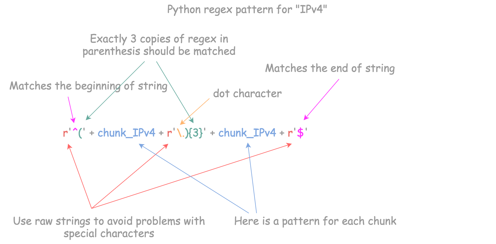
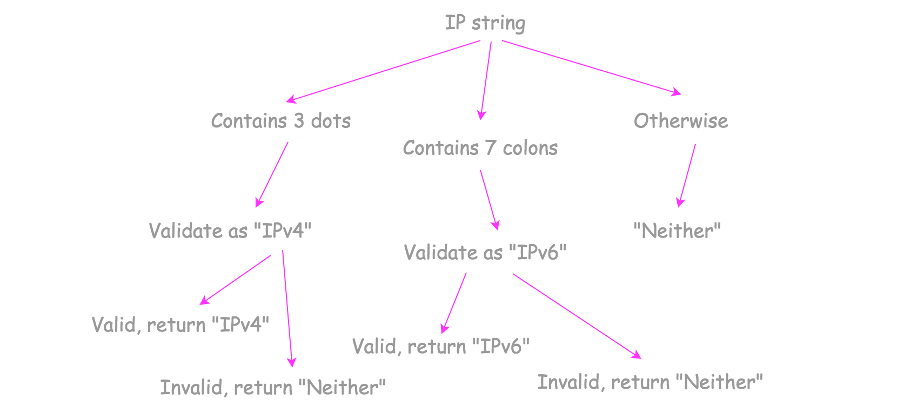

# Solution Validate IP Address

## Overview
The most straightforward way is to use try/catch construct with built-in facilities: [ipaddress](https://docs.python.org/3/library/ipaddress.html) lib in Python and [InetAddress](https://docs.oracle.com/javase/7/docs/api/java/net/InetAddress.html) class in Java.

**Java**
```java
import java.net.*;
class Solution {
  public String validIPAddress(String IP) {
    try {
      return (InetAddress.getByName(IP) instanceof Inet6Address) ? "IPv6": "IPv4";
    } catch(Exception e) {}
    return "Neither";
  }
}
```

**Python**
```python
from ipaddress import ip_address, IPv6Address
class Solution:
    def validIPAddress(self, IP: str) -> str:
        try:
            return "IPv6" if type(ip_address(IP)) is IPv6Address else "IPv4"
        except ValueError:
            return "Neither"
```

Note that these facilities both refer to [POSIX-compatible](https://linux.die.net/man/3/inet_addr) **inet-addr()** routine for parsing addresses. That's why they consider chunks with leading zeros not as an error, but as an octal representation.

>>Components of the dotted address can be specified in decimal, octal (with a leading 0), or hexadecimal, with a leading 0X).

As a result, **01.01.01.012** will be a valid IP address in octal representation, as it should be. To check this behaviour, one can run the command **ping 01.01.01.012** in the console. The address **01.01.01.012** will be considered as the one in octal representation, converted into its decimal representation **1.1.1.10**, therefore the ping command would be executed without errors.

By contrary, problem description directly states that *leading zeros in the IPv4 is invalid*. That's not a real-life case, but probably done for the sake of simplicity. Imho, that makes the problem to be a bit schoolish and less fun. Though let's deal with it anyway, since the problem is very popular recently in Microsoft and Amazon.

There are three main ways to solve it:

* Regex (i.e. regular expression). Less performing one, though it's a good way to demonstrate your knowledge of regex.

* Divide and Conquer, the simplest one.

Mix of "Divide and Conquer" and "Try/Catch with built-in facilities", this time with ones to convert string to integer. Try/catch in this situation is a sort of "dirty" solution because [usually the code inside try blocks is not optimized as it'd otherwise be by the compiler](https://blogs.msmvps.com/peterritchie/2007/06/22/performance-implications-of-try-catch-finally/), and it's better not to use it during the interview.

## Approach 1: Regex
Let's construct step by step regex for "IPv4" as it's described in the problem description. Note, that it's not a real-life IPv4 because of leading zeros problem as we've discussed above.

Anyway, we start to construct regex pattern by using raw string in Python **r''** and standard string **""** in Java. Here is how its skeleton looks like for Python



and here is for Java


Now the problem is reduced to the construction of pattern to match each chunk. It's an integer in range (0, 255), and the leading zeros are not allowed. That results in five possible situations:

1. Chunk contains only one digit, from 0 to 9.

2. Chunk contains two digits. The first one could be from 1 to 9, and the second one from 0 to 9.

3. Chunk contains three digits, and the first one is **1**. The second and the third ones could be from 0 to 9.

4. Chunk contains three digits, the first one is **2** and the second one is from 0 to 4. Then the third one could be from 0 to 9.

5. Chunk contains three digits, the first one is **2**, and the second one is **5**. Then the third one could be from 0 to 5.

Let's use pipe to create a regular expression that will match either case 1, or case 2, ..., or case 5.


The job is done. The same logic could be used to construct "IPv6" regex pattern.

### Implementation

**Java**
```java
import java.util.regex.Pattern;
class Solution {
  String chunkIPv4 = "([0-9]|[1-9][0-9]|1[0-9][0-9]|2[0-4][0-9]|25[0-5])";
  Pattern pattenIPv4 =
          Pattern.compile("^(" + chunkIPv4 + "\\.){3}" + chunkIPv4 + "$");

  String chunkIPv6 = "([0-9a-fA-F]{1,4})";
  Pattern pattenIPv6 =
          Pattern.compile("^(" + chunkIPv6 + "\\:){7}" + chunkIPv6 + "$");

  public String validIPAddress(String IP) {
    if (pattenIPv4.matcher(IP).matches()) return "IPv4";
    return (pattenIPv6.matcher(IP).matches()) ? "IPv6" : "Neither";
  }
}
```

**Python**
```python
import re
class Solution:
    chunk_IPv4 = r'([0-9]|[1-9][0-9]|1[0-9][0-9]|2[0-4][0-9]|25[0-5])'
    patten_IPv4 = re.compile(r'^(' + chunk_IPv4 + r'\.){3}' + chunk_IPv4 + r'$')
    
    chunk_IPv6 = r'([0-9a-fA-F]{1,4})'
    patten_IPv6 = re.compile(r'^(' + chunk_IPv6 + r'\:){7}' + chunk_IPv6 + r'$')

    def validIPAddress(self, IP: str) -> str:        
        if self.patten_IPv4.match(IP):
            return "IPv4"
        return "IPv6" if self.patten_IPv6.match(IP) else "Neither" 
```

### Complexity Analysis

* Time complexity: **O(1)** because the patterns to match have constant length.

* Space complexity: **O(1)**.

## Approach 2: Divide and Conquer
### Intuition

Both IPv4 and IPv6 addresses are composed of several substrings separated by certain delimiter, and each of the substrings is of the same format.



Therefore, intuitively, we could break down the address into chunks, and then verify them one by one.

The address is valid *if and only if* each of the chunks is valid. We can call this methodology *divide* and *conquer*.

### Algorithm

* For the IPv4 address, we split IP into four chunks by the delimiter **.**, while for IPv6 address, we split IP into eight chunks by the delimiter **:**.

* For each substring of "IPv4" address, we check if it is an integer between **0 - 255**, and there is no leading zeros.

For each substring of "IPv6" address, we check if it's a hexadecimal number of length **1 - 4**.

### Implementation

**Java**
```java
class Solution {
  public String validateIPv4(String IP) {
    String[] nums = IP.split("\\.", -1);
    for (String x : nums) {
      // Validate integer in range (0, 255):
      // 1. length of chunk is between 1 and 3
      if (x.length() == 0 || x.length() > 3) return "Neither";
      // 2. no extra leading zeros
      if (x.charAt(0) == '0' && x.length() != 1) return "Neither";
      // 3. only digits are allowed
      for (char ch : x.toCharArray()) {
        if (! Character.isDigit(ch)) return "Neither";
      }
      // 4. less than 255
      if (Integer.parseInt(x) > 255) return "Neither";
    }
    return "IPv4";
  }

  public String validateIPv6(String IP) {
    String[] nums = IP.split(":", -1);
    String hexdigits = "0123456789abcdefABCDEF";
    for (String x : nums) {
      // Validate hexadecimal in range (0, 2**16):
      // 1. at least one and not more than 4 hexdigits in one chunk
      if (x.length() == 0 || x.length() > 4) return "Neither";
      // 2. only hexdigits are allowed: 0-9, a-f, A-F
      for (Character ch : x.toCharArray()) {
        if (hexdigits.indexOf(ch) == -1) return "Neither";
      }
    }
    return "IPv6";
  }

  public String validIPAddress(String IP) {
    if (IP.chars().filter(ch -> ch == '.').count() == 3) {
      return validateIPv4(IP);
    }
    else if (IP.chars().filter(ch -> ch == ':').count() == 7) {
      return validateIPv6(IP);
    }
    else return "Neither";
  }
}
```

**Python**
```python
class Solution:
    def validate_IPv4(self, IP: str) -> str:
        nums = IP.split('.')
        for x in nums:
            # Validate integer in range (0, 255):
            # 1. length of chunk is between 1 and 3
            if len(x) == 0 or len(x) > 3:
                return "Neither"
            # 2. no extra leading zeros
            # 3. only digits are allowed
            # 4. less than 255
            if x[0] == '0' and len(x) != 1 or not x.isdigit() or int(x) > 255:
                return "Neither"
        return "IPv4"
    
    def validate_IPv6(self, IP: str) -> str:
        nums = IP.split(':')
        hexdigits = '0123456789abcdefABCDEF'
        for x in nums:
            # Validate hexadecimal in range (0, 2**16):
            # 1. at least one and not more than 4 hexdigits in one chunk
            # 2. only hexdigits are allowed: 0-9, a-f, A-F
            if len(x) == 0 or len(x) > 4 or not all(c in hexdigits for c in x):
                return "Neither"
        return "IPv6"
        
    def validIPAddress(self, IP: str) -> str:
        if IP.count('.') == 3:
            return self.validate_IPv4(IP)
        elif IP.count(':') == 7:
            return self.validate_IPv6(IP)
        else:
            return "Neither"
```

### Complexity Analysis

* Time complexity: **O(N)** because to count number of dots requires to parse the entire input string.

* Space complexity: **O(1)**.

