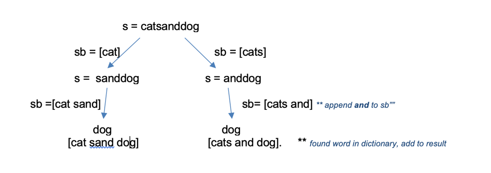

#

It can be solved by DFS Traversal. We have to try all the possible combination until we reach the end of String s.
Let's take the example -
Input:
s =**"catsanddog"**
wordDict = **["cat", "cats", "and", "sand", "dog"]**



Initially s = "catsanddog"

* Iterate over all the words in the **wordDict** and try to match it with the start of string s. We found 2 matches cat and cats.
So we perform depth first search over both matches [cat and cats] .
* In case of **cat**, we remove cat from start of string s using **s.substring(word.length())** Hence, for next recursive call s becomes **sanddog**.
* Additionally, we have to also maintain a subList of type StringBuilder (because we have to do lot of appends). This keeps track of which word we choose in each recursive call. In this case, we append cat in subList.
* If we do not find any matching word for a particular s, we simply backtrack.
```java
class Solution {
public List<String> wordBreak(String s, List<String> wordDict) {
		if (s.length() > 100) return new ArrayList();

		List<String> result = new ArrayList<String> ();
		wordBreakUtil(s, wordDict, result, new StringBuilder());
		return result;
	}
public void wordBreakUtil(String s, List<String> wordDict, List<String> result, StringBuilder subList) {
        // add " " between 2 words in subList
		if (subList.length() != 0) {
			subList.append(" ");
		}
		// iterate over all the words in wordDict
        for (String word: wordDict) {
			
			if (s.startsWith(word)) {
				StringBuilder sb = new StringBuilder(subList);
			    // append current match in sb
				sb.append(word); 
			    // if this is last word to be matched
				if (s.equals(word)) {
					result.add(new String(sb));
				} else {
					wordBreakUtil(s.substring(word.length()), wordDict, result, sb);
				}
            }
		}
	}
}
```

[Link to original post](https://leetcode.com/problems/word-break-ii/discuss/763239/Java-Simple-DFS-1ms-Solution-Explained)